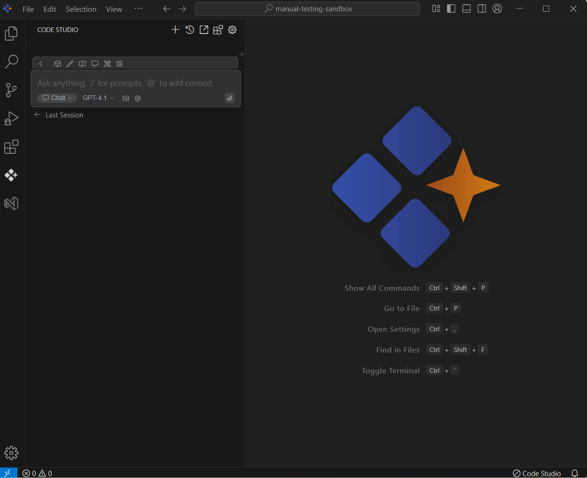

 
# Clipboard
 
## Purpose
The Clipboard context option in the Syncfusion Code Studio enables users to easily incorporate recently copied content from editor files into their AI conversations, improving context and productivity.

## When to Use
- You recently copied code, logs, or text and want the assistant to use it without pasting manually.  
- You need quick answers about a snippet, config block, or error stack you just copied.

## Prerequisites
- Syncfusion Code Studio open with a project.

## Steps

### 1. Select Clipboard Context
- In the Code Studio chat window, click the @ button. A menu will appear—select Clipboard.  
- Pick the clipboard item you want to ask the query about. The provider shows a short list of your most recent copied contents.  
> **Note:** If you cannot locate the Clipboard context option in the list, you will need to add it manually to include this context provider in the config.yaml file.

### 2. Use Clipboard Context with Query
- After selecting the copied content, input relevant details about the copied content in the chat window and click Enter.  
- The assistant uses the selected clipboard content as context for this message only.  
- Limitations: Only the last 10 recently copied items are shown to keep latency low.  
> **Note:** If you cannot locate the Clipboard context option in the list, you will need to add it manually to include this context provider. Please follow the steps outlined in this [link](/code-studio/features/context-providers/add-more-contextproviders/how-to-configure-more-contextproviders) to do so.

## Validation
- Copy a short function, choose @Clipboard, select the item, and ask for a refactor; verify the reply references your copied code.  
- Restart Code Studio and confirm the clipboard list is empty.

## Troubleshooting
- **Clipboard option missing**: add the clipboard provider in config.yaml and reload.  
- **No items listed**: confirm you copied text recently.
