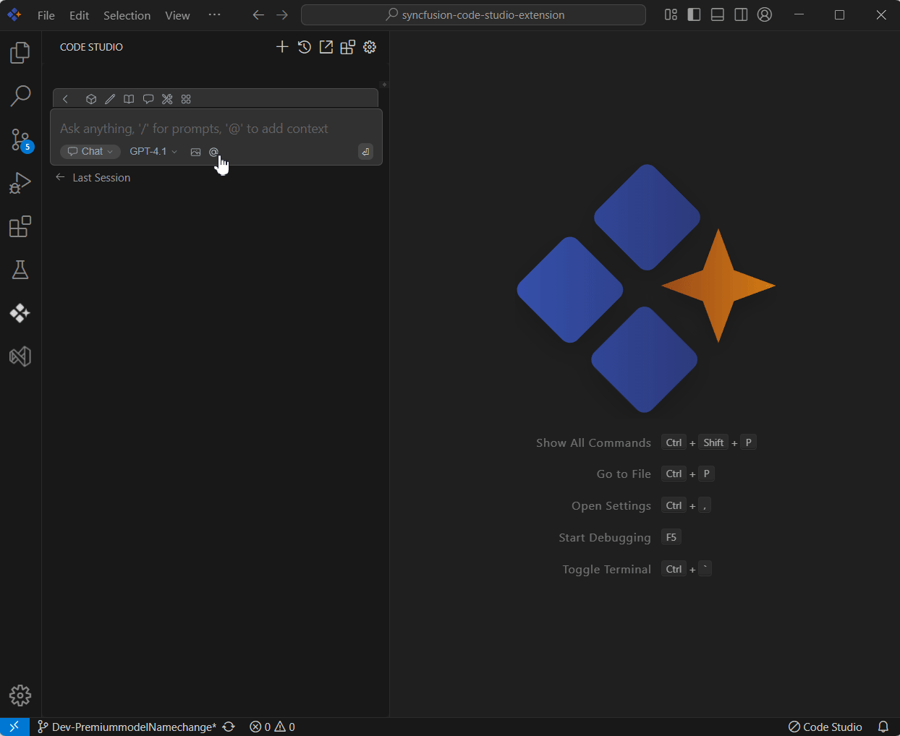

# Commit

## Purpose
The Commit context in Syncfusion Code Studio lets you bring recent Git commit information into your AI conversations. This helps the AI provide targeted assistance based on recent changes in your code, such as reviewing a commit, explaining what was modified, or verifying the impact of a change.

## When to Use
- You want the assistant to analyze a specific Git commit for review, summarization, impact assessment, or regression checks.  
- You need context-aware help that references exactly what changed, not the whole branch.  
- You prefer quick access to recent commits with size/rate safeguards for fast responses.

## Prerequisites
- Syncfusion Code Studio open in a Git-enabled workspace.

## Steps

### 1. Select Commit Context
- In the Code Studio chat window, click the @ button. A menu will appear—select Commits.  
- Choose the specific commit you want to ask about from the dropdown list that appears. You can also choose the last 10 commits combine option.  
- This provides the AI with access to the details of that commit.  
> **Note:** If you cannot locate the Commit context option in the list, you will need to add it manually to include this context provider. Please follow the steps outlined in this [link](/code-studio/features/context-providers/add-more-contextproviders/how-to-configure-more-contextproviders) to do so.

### 2. Use Commit Context with Query
- Once the commit is selected, enter a relevant query in the chat window. You can ask the AI to:  
  - Summarize what changed in the commit  
  - Explain the purpose of the modifications  
  - Check for potential issues introduced in the commit  
- The AI will analyze the commit content and respond with helpful insights.  
- Limitations: Only a limited number of recent commits are listed for performance.

## Validation
- Select a small commit and ask for a summary; confirm the answer references files changed in that commit.  
- Choose a larger commit and request “summarize the key changes”; verify the response.

## Troubleshooting
- **Commits option missing**: add the provider in config.yaml and reload.  
- **Commit list empty**: verify the folder is a Git repo with recent commits.

