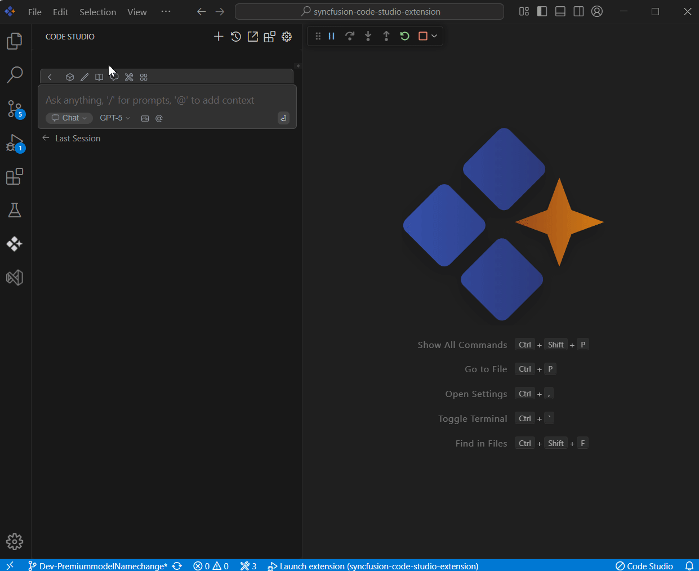

 
# GitHub Issues
 
## Purpose
The GitHub Issues context option in Syncfusion Code Studio allows users to bring GitHub issue data directly into the chat, enabling quick access to issue details and improving collaboration without switching context.

## When to Use
- You want the assistant to reason over a specific GitHub issue without leaving the editor.
- You need quick summaries, planning a fix, or writing an implementation plan tied to an issue.

## Prerequisites
- Syncfusion Code Studio open with chat.
- Github repo name, owner name and github token

## Steps

### 1. Select Github Issue Context
- In the Code Studio chat window, click the @ button. A menu will appear—select Github Issues.
- A list of your GitHub issues will be displayed. Click on the desired issue to insert it into the chat.
> **Note:** If you cannot locate the Github Issues context option in the list, you will need to add it manually to include this context provider. Please follow the steps outlined in this [link](/code-studio/features/context-providers/add-more-contextproviders/how-to-configure-more-contextproviders) to do so.

### 2. Use Github Issue Context with Query
- Once inserted type a relevant query and click Enter, the AI will provide responses based on the GitHub issue context.
- limitations: By default, only the first 30 open issues will be shown in the chat.

## Validation
- Select an issue and ask for a summary; confirm details are reflected.
- Pick a different issue and ask query,check that suggestions align with the repo.

## Troubleshooting
- **GitHub Issues not in @ menu**: enable the provider in config.yaml and reload;
- **Issue list empty or incomplete**: verify GitHub credentials/token, repo selection.