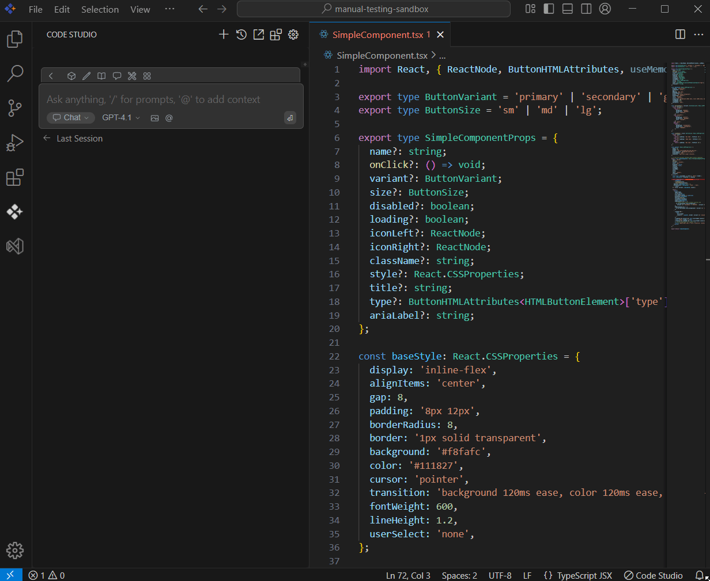

 
# OpenFiles 
 
## Purpose
The OpenFiles context provider in Syncfusion Code Studio helps you work more efficiently by allowing the AI to automatically access and use the content from all currently open files in your editor.

## When to Use
- You want the assistant to reason over exactly what you’re working on right now—every file currently open in your editor.  
- You’re fixing cross-file issues, reviewing side-by-side edits, or asking for a refactor that touches multiple open tabs.  
- You prefer automatic context gathering without manually attaching files.

## Prerequisites
- Syncfusion Code Studio open with a project.

## Steps

### 1. Select OpenFile Context
- In the Code Studio chat window, click the @ button. A menu will appear—select Open Files.  
- This will allow the AI to access and understand the content of the files you have currently opened.  
> **Note:** If you cannot locate the OpenFiles context option in the list, you will need to add it manually to include this context provider. Please follow the steps outlined in this [link](/code-studio/features/context-providers/add-more-contextproviders/how-to-configure-more-contextproviders) to do so.

### 2. Use OpenFile Context with Query
- After choosing openfile context, to receive the most relevant assistance, describe your query or issue in detail and then press Enter.  
- The AI will use the context of your open files to generate more precise and relevant responses to your query.  
- Closing tabs or reducing file size lowers latency and token; open only what you need for best performance.

## Validation
- Open two related files, choose @OpenFiles, and ask for a consistency check; confirm the reply references both files.  
- Close one tab, re-run the query, and verify the answer no longer cites the closed file.

## Troubleshooting
- **OpenFiles not in @ menu**: enable it in config.yaml and reload.  
- **No files detected**: ensure tabs are actually open and belong to the current workspace; switch focus back to the editor.
