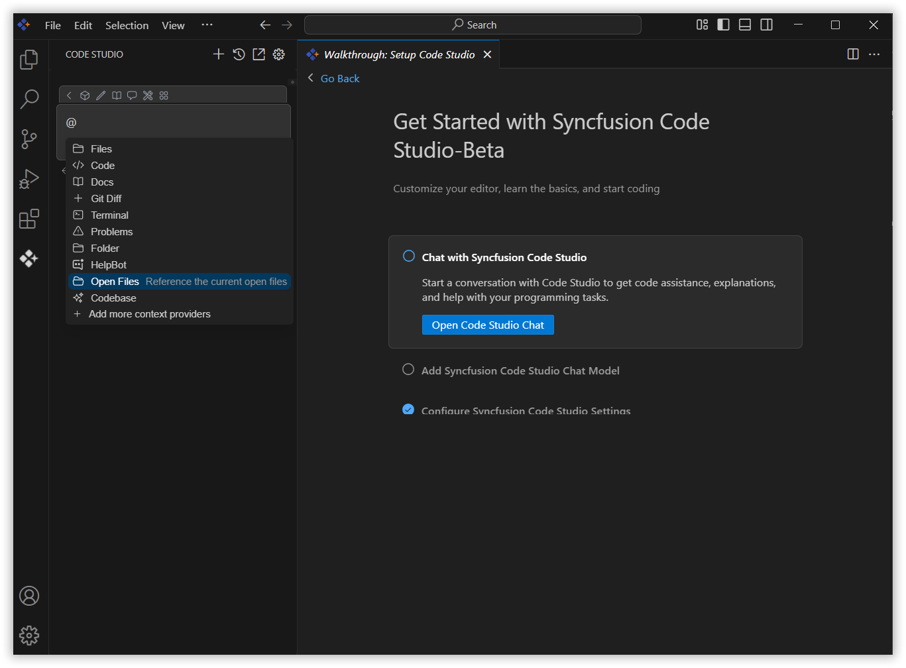
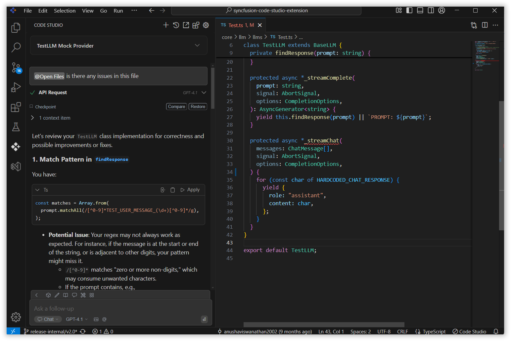

 
# OpenFiles 
 
The OpenFiles context provider in Syncfusion Code Studio helps you work more efficiently by allowing the AI to automatically access and use the content from all currently open files in your editor.
 
## How to Use the OpenFiles context
 
### 1. Open the Syncfusion Code Studio
 
In the Syncfusion Code Studio, the chat interface is located on the left-hand side. This is where you can interact with AI and ask questions or get assistance.

 
### 2. Select OpenFiles context
 
In the chat window, click the `@` button.  
> **Note:** If you cannot locate the OpenFiles context option in the list, you will need to add it manually to include this context provider. Please follow the steps outlined in this [link](/code-studio/features/context-providers/add-more-contextproviders/how-to-configure-more-contextproviders) to do so.

 
A menu will appear—select OpenFiles.
 
This will allow the AI to access and understand the content of the files you have currently opened.

 
### 3. Use OpenFiles context with query
 
To receive the most relevant assistance, describe your query or issue in detail and then press Enter.  
The AI will use the context of your open files to generate more precise and relevant responses to your query.

