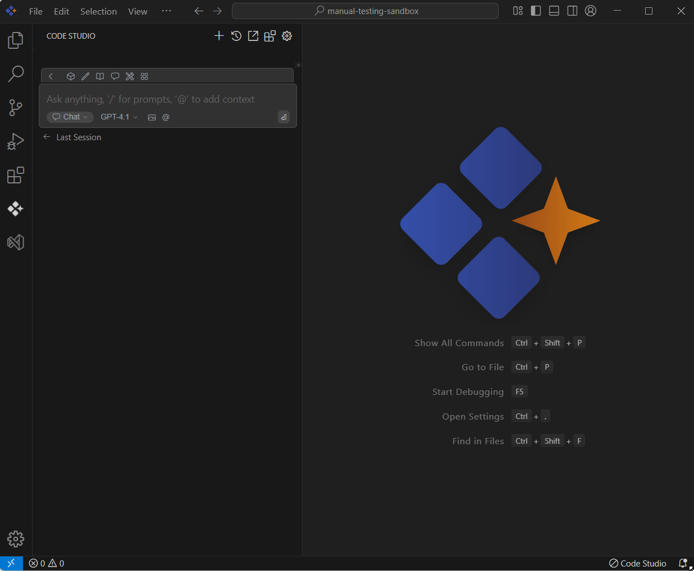

 
# URL 
 
## Purpose
The URL context option in Syncfusion Code Studio allows you to bring content from a web page directly into your conversation with the AI. By processing the page’s information, the AI provides more accurate and relevant responses based on the linked content.

## When to Use
- You want the assistant to answer using a specific web page (docs, blog) without pasting its content.  
- You need quick, link-driven context for explanations, examples, or comparisons.

## Prerequisites
- Syncfusion Code Studio open with chat.

## Steps

### 1. Select URL Context
- In the Code Studio chat window, click the @ button. A menu will appear—select URL.  
> **Note:** If you cannot locate the URL context option in the list, you will need to add it manually to include this context provider. Please follow the steps outlined in this [link](/code-studio/features/context-providers/add-more-contextproviders/how-to-configure-more-contextproviders) to do so.

### 2. Use URL Context with Query
- After selecting URL, a text box will appear. Paste the link to the webpage that contains the information you want the AI to consider.  
- After you submit a URL, AI retrieves and processes the webpage content, extracting and summarizing relevant information.

## Validation
- Provide a short documentation URL and request a summary; verify the answer cites details from that page.  
- Ask for a code sample from a tutorial page; confirm the snippet aligns with the article.

## Troubleshooting
- **URL option missing**: enable the provider in config.yaml and reload.  
- **Answer seems generic**: point to a more specific page section or add a clarifying question about what to extract.
