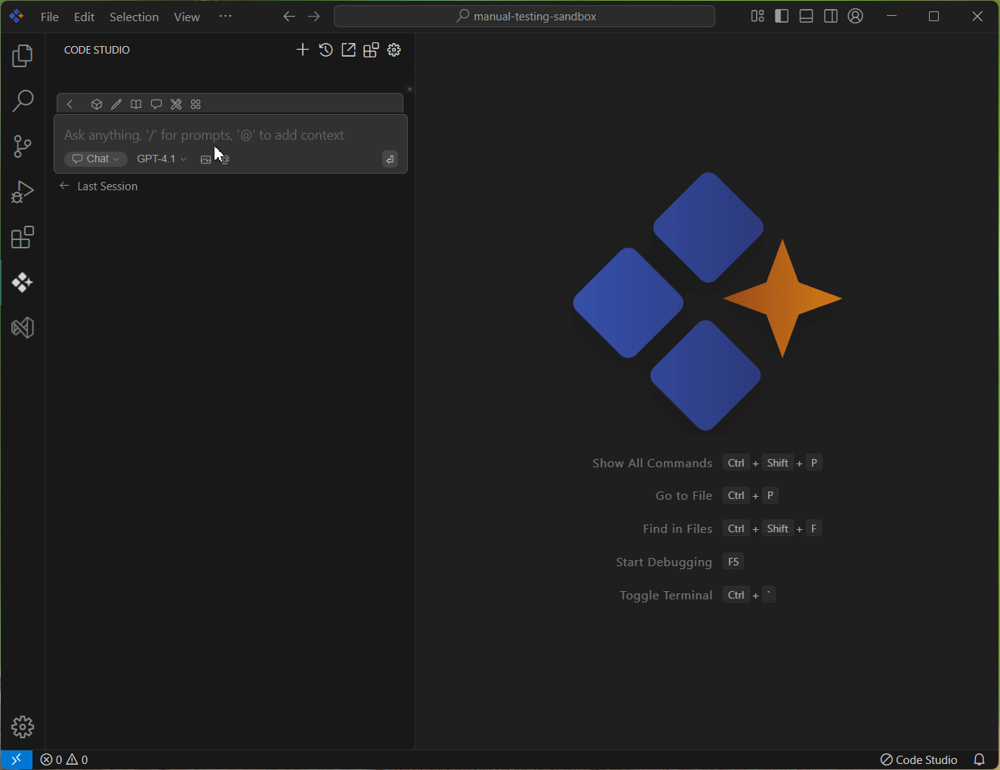

# Code

## Purpose
The Code context option in the Syncfusion Code Studio lets you reference specific code from your project directly in the chat. This helps you quickly troubleshoot, edit, or review code without copying it manually.

## When to Use
- You want the assistant to consider only a specific part of your code instead of the whole repo.  
- You need focused help for a bug, review, or refactor with precise scope control and minimal noise.  
- You prefer fast responses and lower token usage by sharing the smallest necessary context.

## Prerequisites
- Syncfusion Code Studio open with a project.  

## Steps

### 1. Select Code Context
- In the Code Studio chat window, click the @ button. A menu will appear—select Code.  
- Now choose the code which you want to ask the query about.
> **Note:** If you cannot locate the Code context option in the list, you will need to add it manually by including this context provider in the config.yaml file. Please follow the steps outlined in this [link](/code-studio/features/context-providers/add-more-contextproviders/how-to-configure-more-contextproviders) to do so.

### 2. Use Code Context with Query
- The Syncfusion Code Studio analyzes the selected code and offers help based on its content.  
- It can point out issues, suggest improvements, or guide you in making specific changes.  
- This makes reviewing and editing code faster and more efficient.

## Validation
- Choose @Code context, and ask for an explanation; confirm the response references only those code lines.

## Troubleshooting
- **Responses feel generic**: narrow scope to the most relevant code; restate your goal.  
