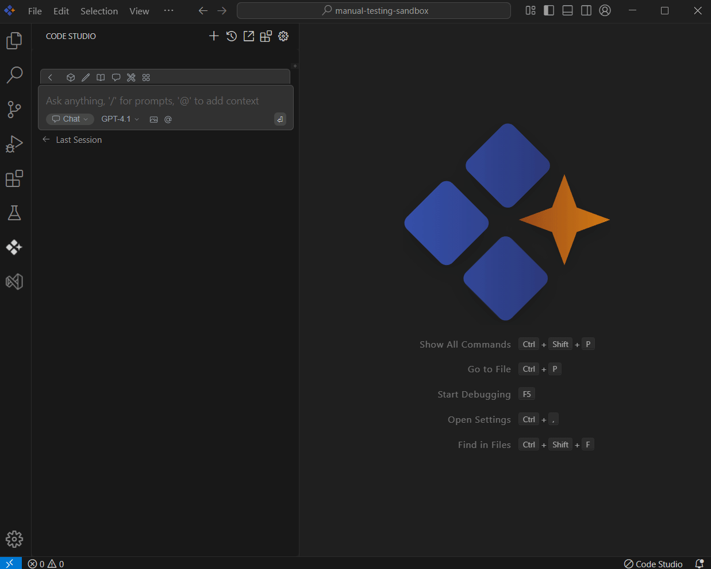

# Codebase

## Purpose
The Codebase context in Syncfusion Code Studio lets you share your codebase with the AI so it can understand your project better. You can ask it to explain a file, help with an error, or guide you in adding new features. Just mention codebase with the relevant query, and it will give you useful answers based on that.

## When to Use
- You want the assistant to reason over your whole project structure rather than just a single file.  
- You’re diagnosing cross-file issues, planning a refactor, or adding a feature that touches multiple layers.  
- You need focused control over how much of the repository is shared.

## Prerequisites
- Syncfusion Code Studio open with a project. 

## Steps

### 1. Select Codebase Context
- In the Code Studio chat window, click the @ button. A menu will appear—select Codebase.
> **Note:** If you cannot locate the Codebase context option in the list, you will need to add it manually by including this context provider in the config.yaml file. Please follow the steps outlined in this [link](/code-studio/features/context-providers/add-more-contextproviders/how-to-configure-more-contextproviders) to do so.

### 2. Use Codebase Context with Query
- When asking about your code, try to include details like:  
  - Which file you need help with  
  - The part of the code causing the issue  
  - Details for a new feature you want to add  
  - Specific functions, methods, or classes you’re working on  
- This helps the AI understand your problem better and give you the right solution. Once you add the details, press Enter.  
- The Syncfusion Code Studio will use that info to give more accurate and helpful answers.  
- Larger scopes cost more tokens and slow responses.For long monorepos, use a specific query (e.g., packages/ui, services/api) to keep context tight.

## Validation
- Ask for an architecture summary; confirm the reply references files from that workspace.  
- Ask for an integration plan; verify cross-file references are accurate.

## Troubleshooting
- **Slow or truncated responses**: reduce scope, split the task into smaller questions, or analyze one package at a time.
