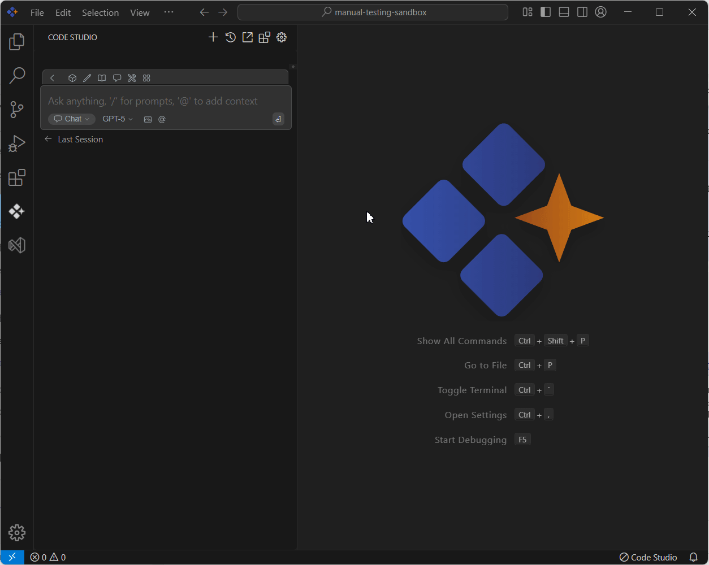
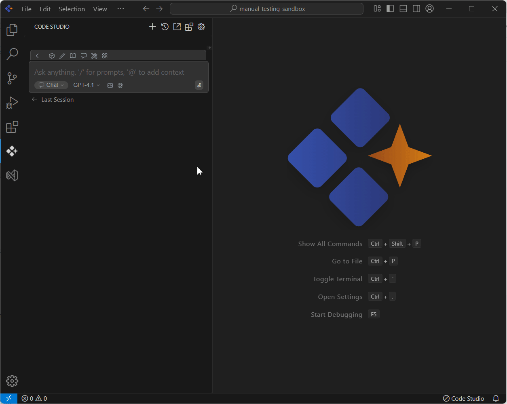

# Docs 

## Purpose
The Docs context provider lets you easily reference content from any documentation site directly within Syncfusion Code Studio, making it more efficient to get help and insights based on the documents you’re working with.

## When to Use
- You want the assistant to answer using specific external documentation (framework guides, API refs) without pasting text.  
- You need focused, doc-aware help tied to chosen pages rather than the whole web.  
- You prefer tight scope control and predictable performance.

## Prerequisites
- Syncfusion Code Studio open with a project.    
- URLs for the docs you want to reference

## Steps

### 1. Index the Documentation
- In the chat window, click the @ button and select Docs from the menu.  
> **Note:** If you cannot locate the Docs context option in the list, you will need to add it manually by including this context provider in the config.yaml file. Please follow the steps outlined in this [link](/code-studio/features/context-providers/add-more-contextproviders/how-to-configure-more-contextproviders) to do so.

- Click Add Docs, enter the title and URL, then click Add to save it.  
- The added docs entry will be shown in the config.yaml file after indexing.  
- Syncfusion Code Studio generates embeddings from chunked content and stores them locally.

### 2. Use Docs Context with Query
- The document will appear in the list—select the one you want to use.  
- Type a relevant query about the selected doc in the chat box and press Enter.The AI will respond based on the selected documentation and query.  
- Large or many pages increase indexing time, token usage, and latency.Prefer concise pages; add more only if the assistant requests additional context.

## Validation
- Add one doc page and ask for a summary; confirm the answer cites concepts from that page.  
- Add a second page and ask for a code sample; verify details come from both.

## Troubleshooting
- **Page not indexing or slow**: check network; try a smaller page or wait for indexing to complete.  
- **Response too slow/expensive**: reduce the number of URLs or pick shorter pages; avoid whole-site imports.
