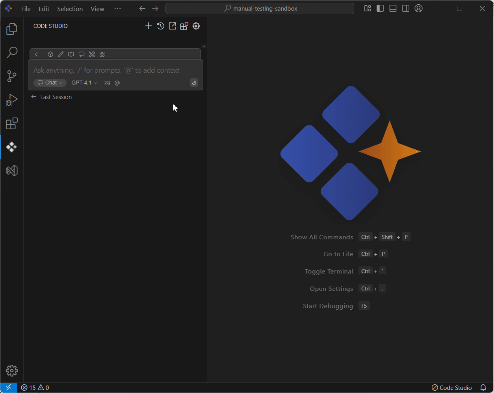

# Files 

## Purpose
The Files context feature in Syncfusion Code Studio allows you to enhance collaboration by including relevant file content in chat, enabling AI-assisted responses that are more accurate and aligned with your project files.

## When to Use
- You want the assistant to consider content from specific files without pasting text into chat.  
- You need focused, file-aware answers tied to the files you select, not the whole repo.  
- You prefer quick results with tight scope control to reduce latency and token usage.

## Prerequisites
- Syncfusion Code Studio open with a project. 

## Steps

### 1. Select File Context
- In the Code Studio chat window, click the @ button. A menu will appear—select Files.  
- Now choose the file which you want to ask the query about.
> **Note:** If you cannot locate the File context option in the list, you will need to add it manually by including this context provider in the config.yaml file. Please follow the steps outlined in this [link](/code-studio/features/context-providers/add-more-contextproviders/how-to-configure-more-contextproviders) to do so.

### 2. Use File Context with Query
- Type a relevant query about the selected file in the chat box and press Enter.  
- Syncfusion Code Studio will read and analyze the selected file(s), allowing the AI to provide more context-aware and helpful responses based on the content of your files and the query you’ve submitted.
- Larger or many files increase token usage and response time.If the reply asks for more details, add one more file rather than multiple files.

## Validation
- Choose @Files context, and ask for an explanation or bug fix; confirm the response references only those selected file.

## Troubleshooting
- **Responses feel generic**: narrow scope to the most relevant file or specific section; restate your goal.  
- **Slow responses**: reduce the number/size of files.
