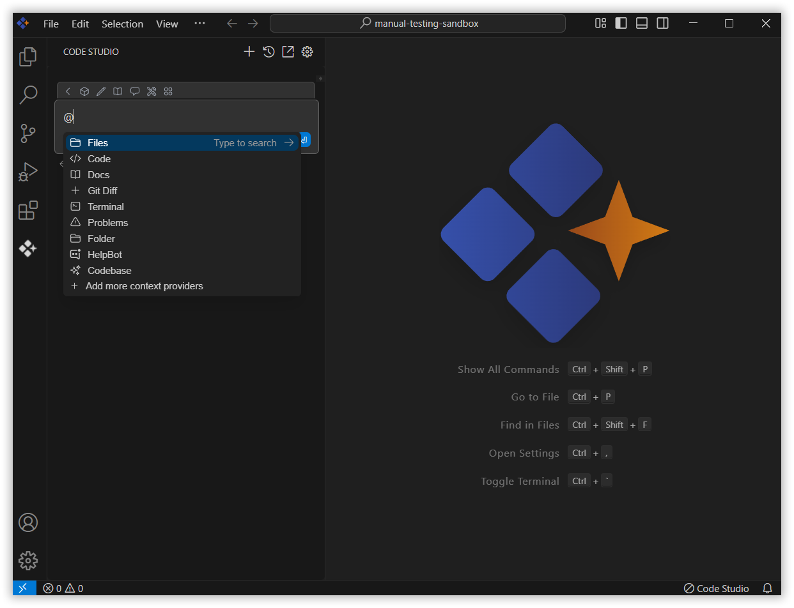
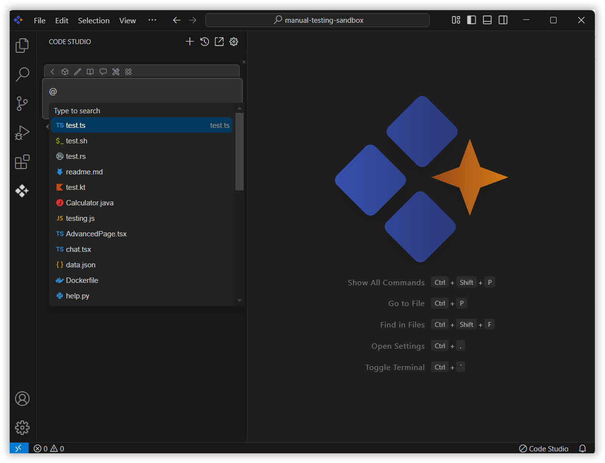
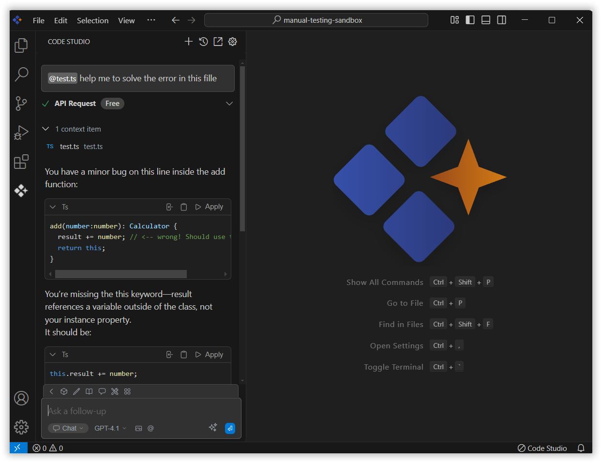

# Files 

The Files context feature is a key component of Syncfusion Code Studio. It allows you to include relevant content from selected documents directly in the chat, enabling the AI to deliver responses that are more accurate and aligned with your files.

##  How to Use the Files context

### 1. Open Syncfusion Code Studio

In the  Syncfusion Code Studio, the chat interface is located on the left-hand side of the screen, where you can interact with the AI and get assistance.

### 2. Select Files context

In the chat window, click the `@` button.
> **Note:** If you cannot locate the files context option in the list, you will need to add it manually to include this context provider in config.yaml file. Please follow the steps outlined in this [link](/code-studio/features/context-providers/add-more-contextproviders/how-to-configure-more-contextproviders) to do so.

A menu will appear—select Files from the list.

### 3. Choose the File

After selecting Files, choose the document you want to include in context. 

### 4. Use file Context with Query

Type a relevant query about the selected file in the chat box and press Enter.
Syncfusion Code Studio will read and analyze the selected file(s), allowing the AI to provide more context-aware and helpful responses based on the content of your files and the query you've submitted.

