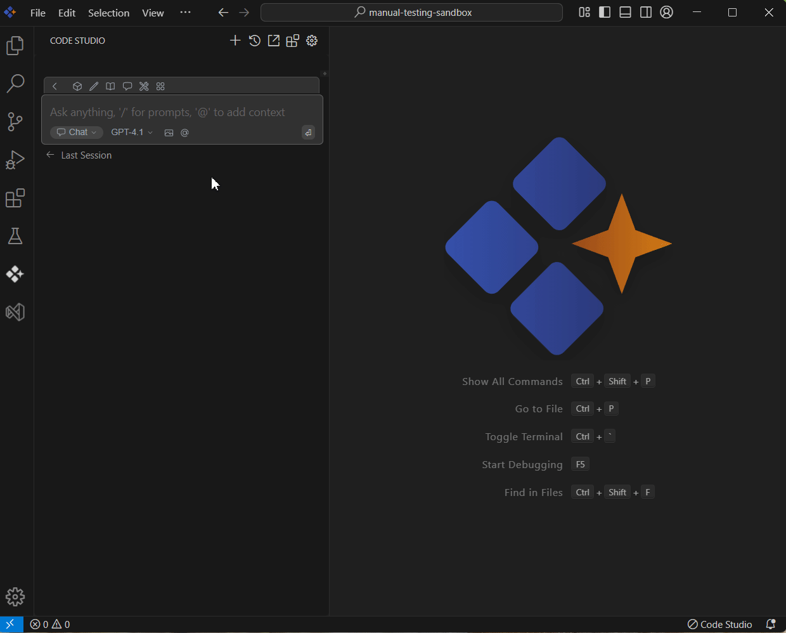

# Folder 

## Purpose
The Folder context in Syncfusion Code Studio lets you select an entire folder so the AI can understand and reference all files within it. This is ideal for multi-file features or projects, enabling cross-file reasoning, targeted questions about specific files in the folder, and more accurate, holistic assistance.

## When to Use
- You want the assistant to reason over all files in a specific folder of the directory instead of a single file.  
- You’re facing cross-file issues, reviewing a multi-file change, or asking for a refactor that spans a folder.  
- You need clear scope control (pick one folder, subfolders).

## Prerequisites
- Syncfusion Code Studio open with a project.  

## Steps

### 1. Select Folder Context
- In the Code Studio chat window, click the @ button. A menu will appear—select Folder.  
- Now choose the folder which you want to ask the query about.
> **Note:** If you cannot locate the Folder context option in the list, you will need to add it manually by including this context provider in the config.yaml file. Please follow the steps outlined in this [link](/code-studio/features/context-providers/add-more-contextproviders/how-to-configure-more-contextproviders) to do so.

### 2. Use Folder Context with Query
- After selecting a folder in the context, enter a relevant query about the folder and press Enter.  
- The AI will analyze the contents of all the files within that folder. It will then use this information to improve the accuracy and relevance of its responses.  
- Larger folders mean higher token usage and slower replies.Narrow the scope to a more specific subfolder and mention key files or entry points in your prompt.

## Validation
- Select a folder and ask for an overview; confirm the answer references files inside that folder.  
- Ask for a plan across two files in the folder; verify cross-file relationships are correctly identified.

## Troubleshooting
- **Responses are generic**: narrow the scope to a more specific subfolder and mention key files or entry points in your prompt.  
- **Slow or truncated responses**: split the task into multiple questions.
