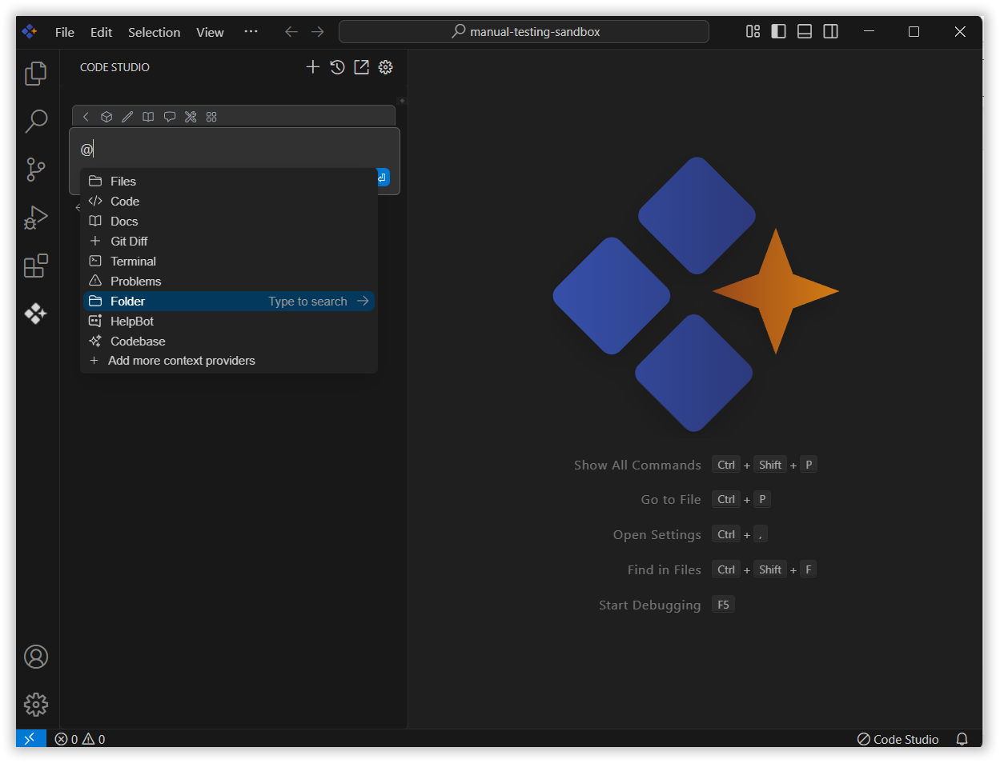
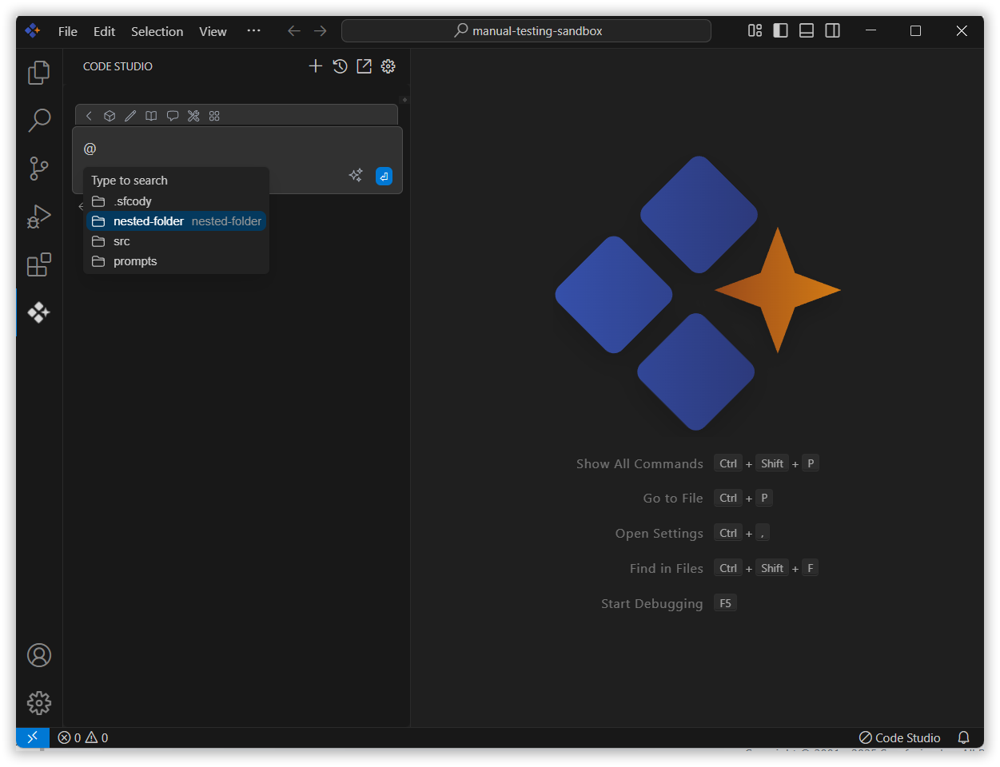
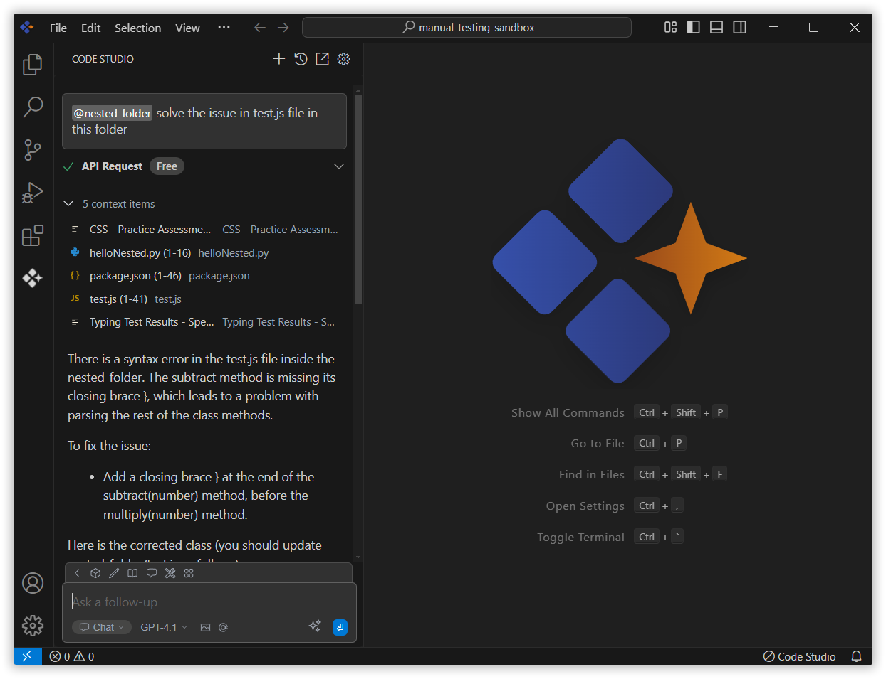

# Folder 

The Folder context in Syncfusion Code Studio lets you select a whole folder so the AI can check all the files inside it. It’s helpful when your work is split across many files, like a project or a feature. You can also ask a query about a particular file inside that selected folder. This way, the AI can understand everything better and give you more accurate help.

## How to Use Folder context

### 1. Open the Chat Window

Click the Syncfusion Code Studio icon on the left toolbar to open the Syncfusion Code Studio chat window.

### 2. Select Folder context

In the chat window, click the `@` button.
> **Note:**  If you cannot locate the folder context option in the list, you will need to add it manually by including this context provider in the config.yaml file. Please follow the steps outlined in this [link](/code-studio/features/context-providers/add-more-contextproviders/How-to-configure-more-contextproviders) to do so.

From the context menu that appears, choose folder.

### 3. Choose the Folder

Now select the folder you want to ask about.

### 4. Use folder Context with Query

After selecting a folder in the context, enter a relevant query about the folder and press Enter.

The AI will analyze the contents of all the files within that folder. It will then use this information to improve the accuracy and relevance of its responses.

