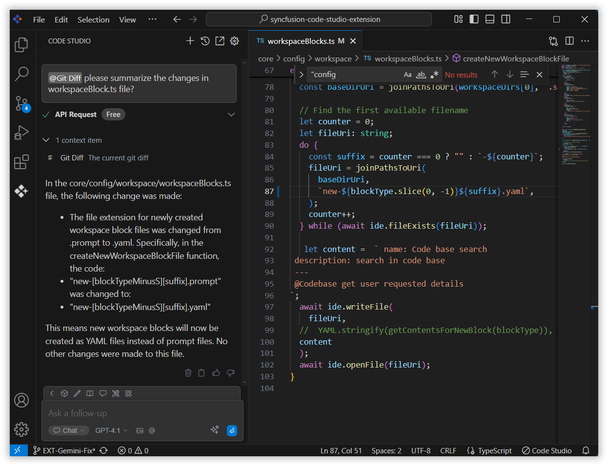

# Git Diff

The Git Diff Context provider lets you reference all changes made in your current branch to get a summary of your work or request a general review. This is especially useful for reviewing progress, identifying improvements, or preparing for a commit by ensuring the modifications align with project goals and coding standards.

## How to Use the Git Diff context
### 1. Open the Syncfusion Code Studio

In the Syncfusion Code Studio, the chat interface is located on the left-hand side. This is where you can interact with AI and ask questions or get assistance.

### 2. Select Git Diff context

In the chat window, click the `@` button.  	
> **Note:** If you cannot locate the GitDiff context option in the list, you will need to add it manually to include this context provider in config.yaml file. Please follow the steps outlined in this [link](/code-studio/features/context-providers/add-more-contextproviders/how-to-configure-more-contextproviders) to do so.

A menu will appear—select GitDiff. 

### 3. Use Git Diff Context with Query

Git Diff Context allows you to programmatically gather and reference all code changes made in your current Git branch. It is especially helpful when you want to:  
- Summarize your work before creating a commit or pull request.   
- Request a review of recent modifications.   
- Generate AI-assisted documentation, commit messages, or release notes.   
- Verify the scope and impact of changes to ensure they align with the intended feature or fix.
