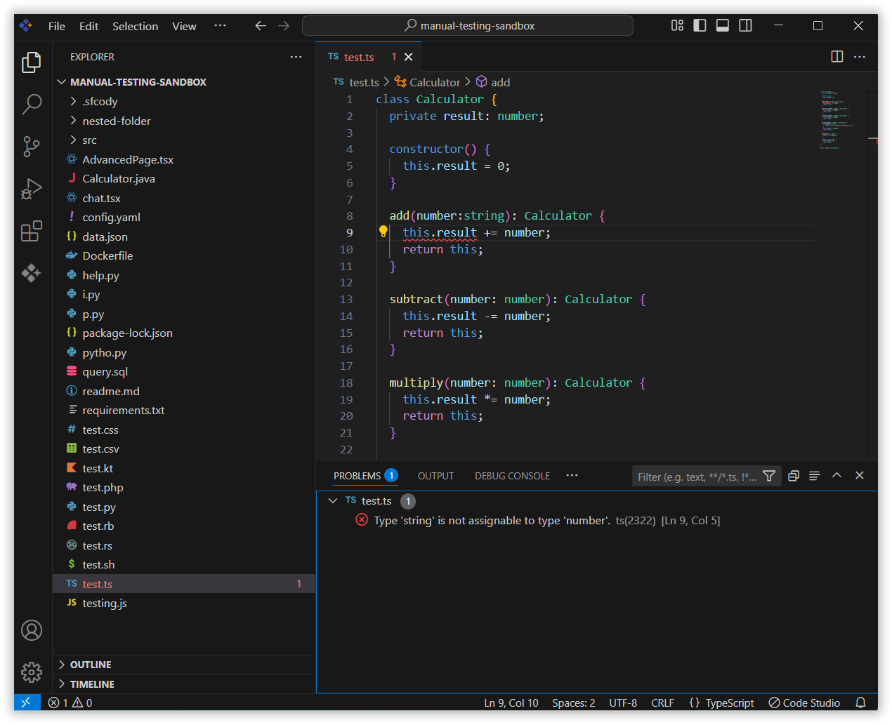
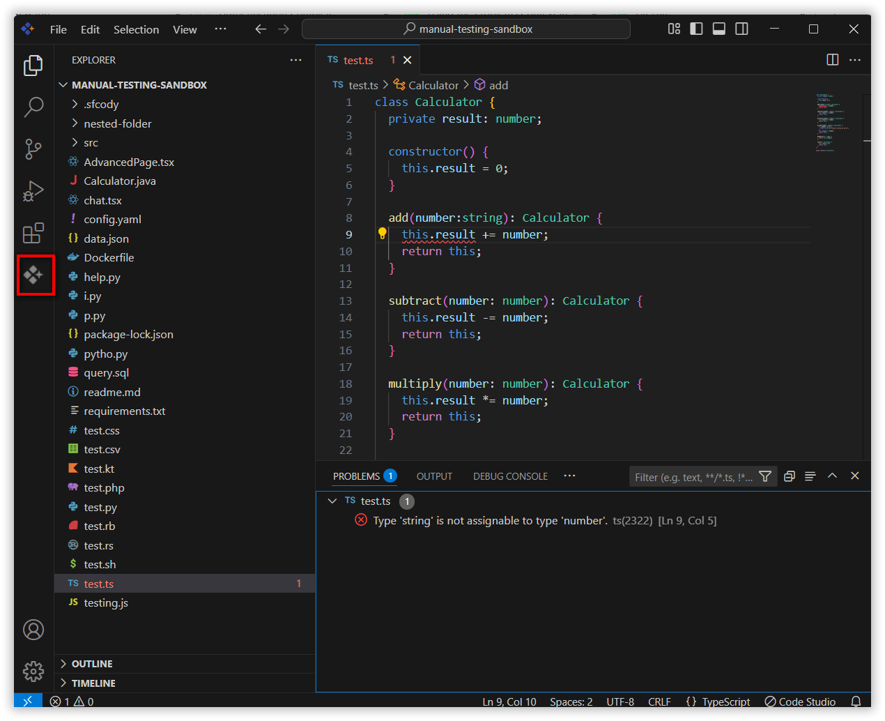
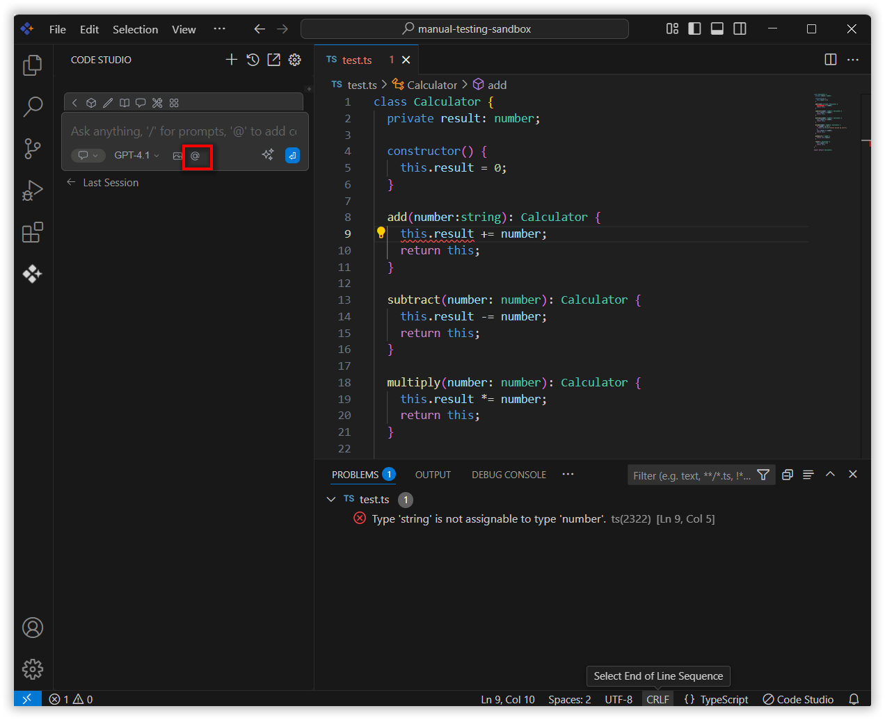
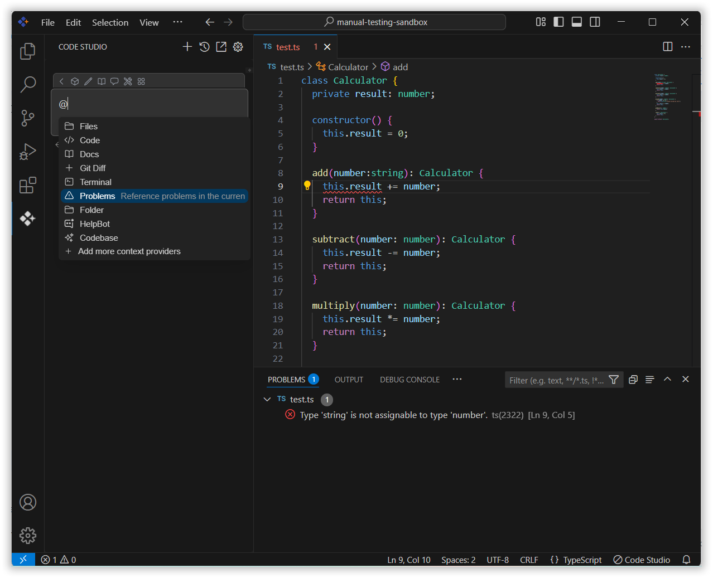
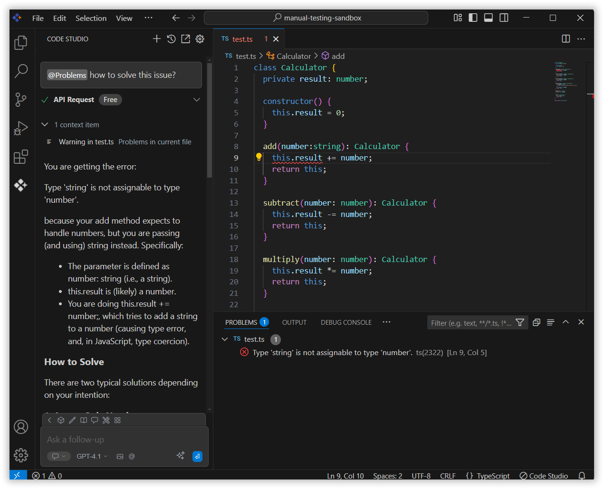

# Problems

The problems context in Syncfusion Code Studio makes it easier to fix problems in your code. With the problems context, you can quickly correct specific issues found in your project. This is useful when you need help with a particular error or bug. It shows file-specific problems and allows the AI to provide better suggestions based on the code you are currently looking at.

## How to Use the Problems Context

### 1. Open the File

Ensure the file with the problem is open in your Code Studio editor.

### 2. Access the Chat Window

Open the chat model window of the Syncfusion Code Studio by clicking the Syncfusion Code Studio icon on the left toolbar.

### 3. Select Problems Context

In the chat window, click the `@` button.
> **Note:** If you cannot locate the problems context option in the list, you will need to add it manually by including this context provider in the config.yaml file. Please follow the steps outlined in this [link](/code-studio/features/context-providers/add-more-contextproviders/how-to-configure-more-contextproviders) to do so.

From the context menu that appears, choose **Problems**.

### 4. Use Problems Context with Query

Input relevant details about the issue in the chat model window and press Enter.

The AI will analyze the problems data and offer suggestions or solutions for issues in the currently opened file directly in the chat window. This will help you resolve issues in the file you're working on in the Code Studio editor.

