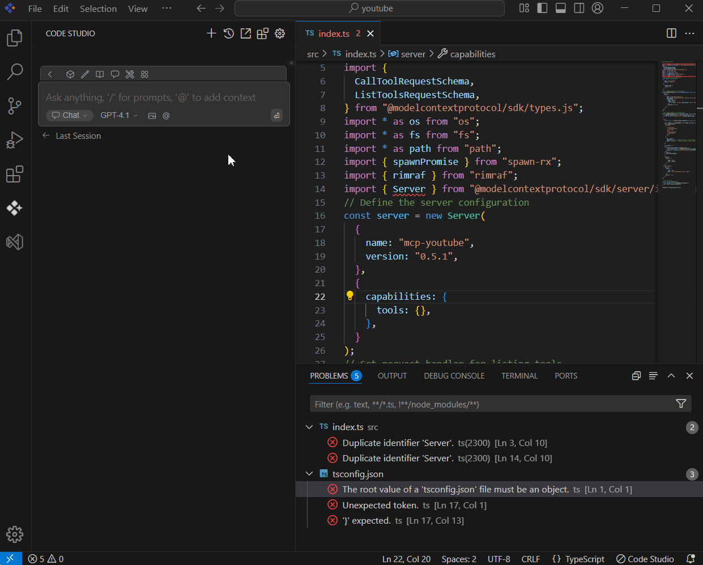

# Problems

## Purpose
The problems context in Syncfusion Code Studio makes it easier to fix problems in your code. With the problems context, you can quickly focus on specific issues found in your project. This is useful when you need help with a particular error or bug. It shows file-specific problems and lets the AI give better support based on the code you are currently looking at.

## When to Use
- You want the assistant to focus on specific errors, warnings, or bugs identified in your project—without manually describing every problem.  
- You’re actively working on a file and want targeted fixes for the issues.

## Prerequisites
- Syncfusion Code Studio open with a project. 

## Steps

### 1. Select Problems Context
- Ensure the file with the problem is open in your Code Studio editor.  
- In the Code Studio chat window, click the @ button. A menu will appear—select Problems.
> **Note:** If you cannot locate the Problems context option in the list, you will need to add it manually by including this context provider in the config.yaml file. Please follow the steps outlined in this [link](/code-studio/features/context-providers/add-more-contextproviders/how-to-configure-more-contextproviders) to do so.

### 2. Use Problems Context with Query
- After selecting problems context provider, input relevant details about the issue in the chat model window and click Enter.  
- The AI will analyze the problems data and offer suggestions or solutions for issues in the currently opened file directly in the chat window. This will help you resolve issues in the file you’re working on in the VS Code editor.  
- Too many issues in a file or folder may increase token usage and response time. Prioritize a few key problems or files at a time for the best results.

## Validation
- With a problem in a file, use @Problems and ask for a fix; confirm the response references the correct diagnostic(s).  
- Try with another file with issues; verify the suggestions align with current code and problem list.

## Troubleshooting
- **No suggestions or generic answers**: be sure problems are flagged in the file first (from linter, type checker, etc.); specify the file and issue in your message.  
- **Slow or incomplete responses**: focus on one file at a time to control performance impacts.
