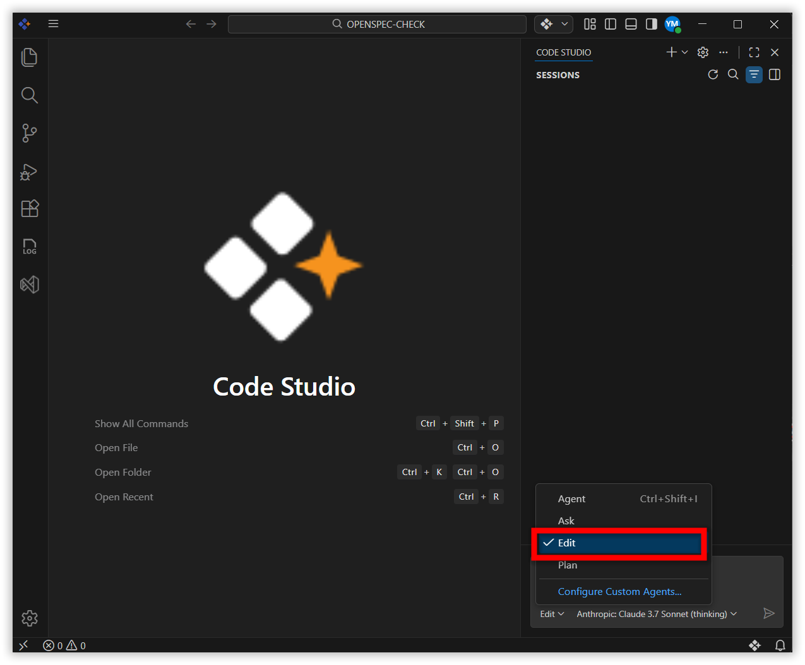
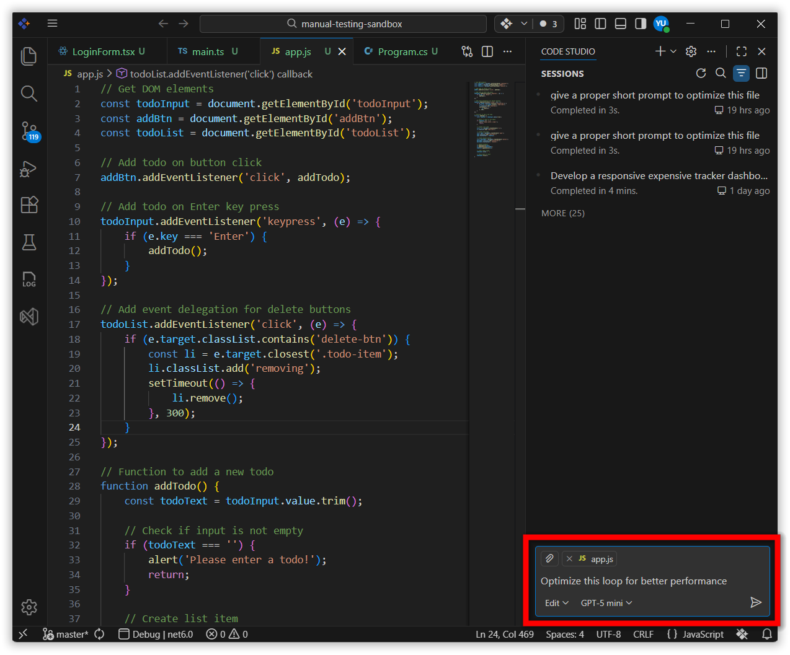
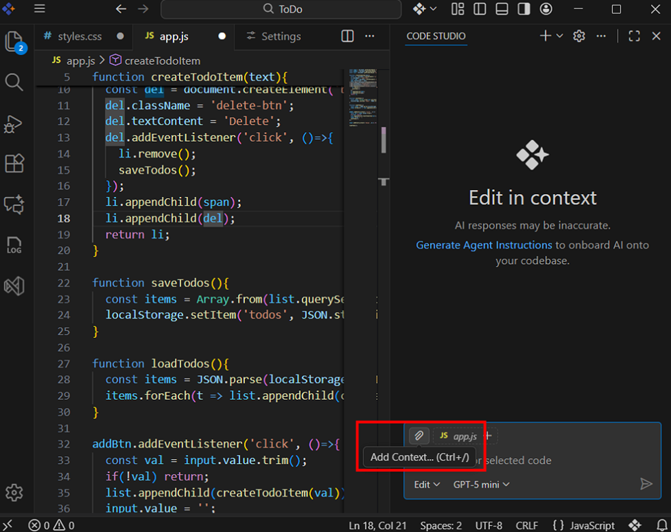
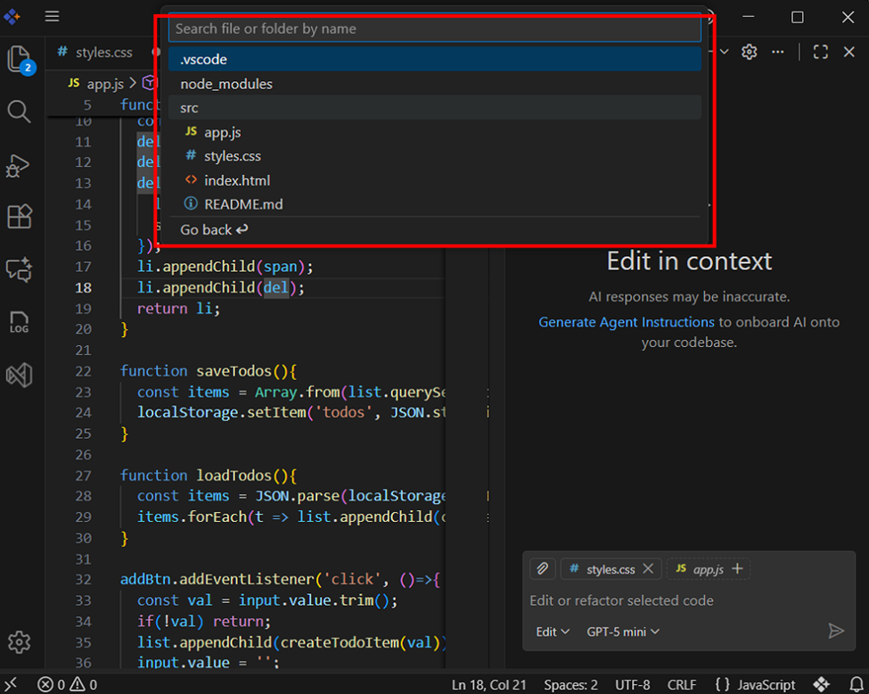
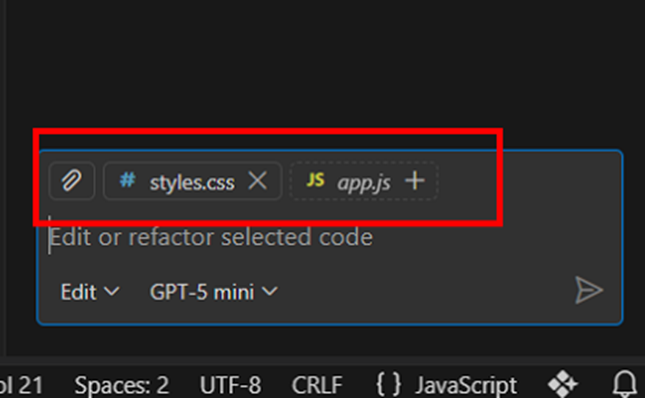
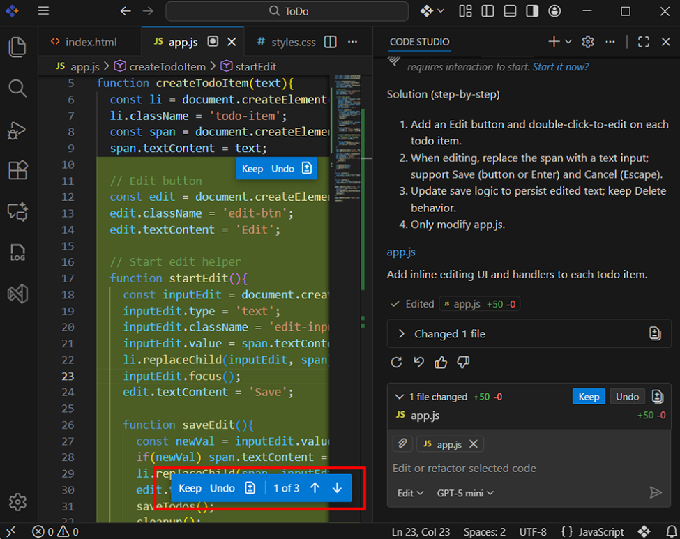

# Edit

Edit is an AI-powered feature, to help developers modify source code using prompts. It provides a consistent workflow where users can preview, keep, or undo each suggested change. This ensures high accuracy and full control over your codebase.

## Key Benefits

• Faster edits, apply bulk or repetitive changes in seconds.

• Precise control over changes we can Keep or Undo each modifications.

## How to use Edit mode?

**Step 1** : Switch to Edit mode in chat panel.

**Step 2** : In the chat input box, type the instruction you want the AI to perform. For example, “Optimize this loop for better performance.” After typing your prompt, click the “Send” button. The agent will treat this instruction as an edit request and start editing.

**Step 3** : Once you send the prompt, the AI interprets the instruction and applies the necessary changes to the currently active file in your editor.
Note: Before entering a prompt in Edit Mode, make sure the correct file is selected and active in the editor.

**Step 4** : If your instruction involves additional files – for example, editing helper functions, updating shared components, or modifying logic across modules—you can include those files by clicking “Add Context”. This option allows you to provide more context so the AI understands how different files relate to your request.

**Step 4** : After clicking “Add Context”, choose the files you want the AI to refer to or modify.

**Step 5** : Once the files are added, take a moment to confirm that the correct files appear in the chat panel.

## Edit previews and Change indicators

• Suggested changes are displayed with highlights for added or removed lines. This allows precise control over all modifications.
  Each block includes:
  1. **Keep**: Click to apply suggested changes in file
  2. **Undo**: Click to remove suggested changes.

• Each file includes navigation arrows that allow you to jump directly between edited lines. Instead of scrolling, you can use the Up and Down arrows to navigate between changes within the file.

## Best Practices

• **Write short, clear prompts** – Clear and concise prompts help the AI understand your exact intention, resulting in more accurate edits. Avoid long or vague instructions for better outcomes.

• **Add only relevant files for context** – Providing only necessary files through Add Context keeps the AI focused and prevents unrelated or incorrect edits.

• **Review all changes thoroughly** – Even with AI assistance, it’s important to verify each suggested change to ensure the modifications match your expectations and maintain code quality.

