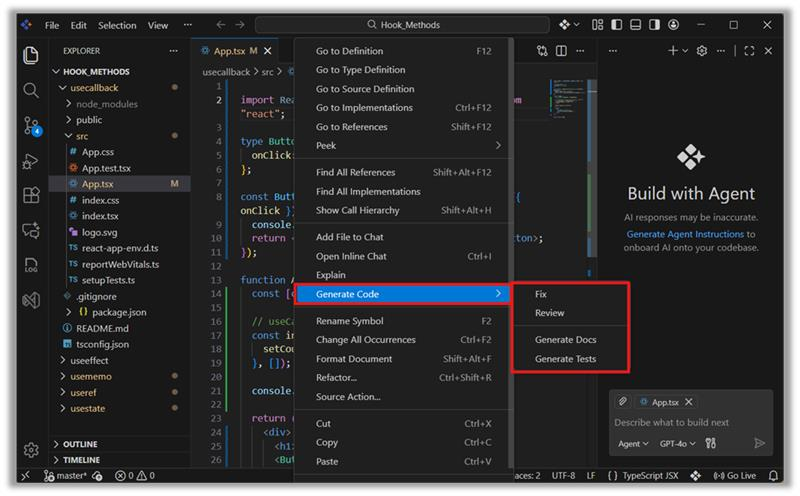
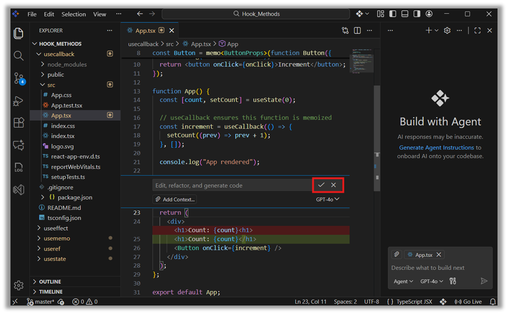
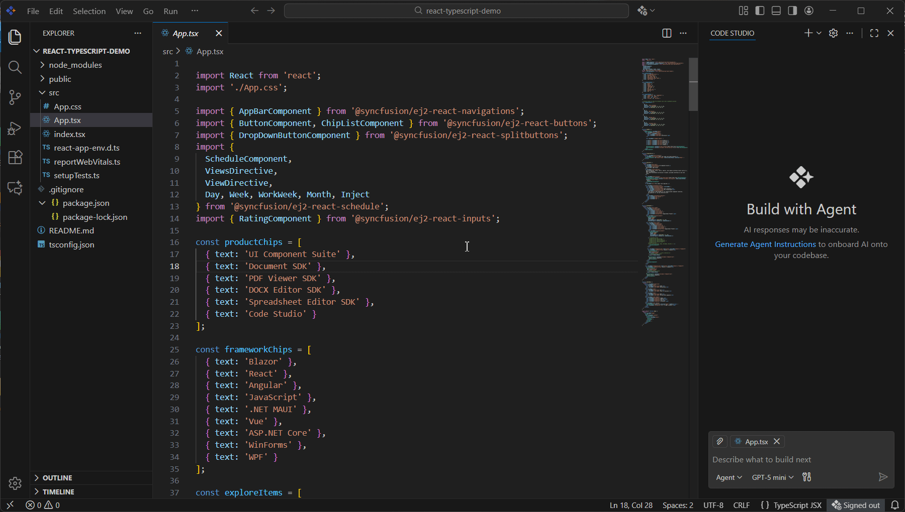
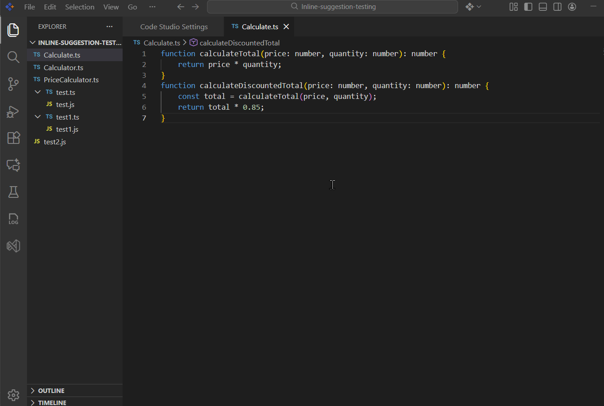
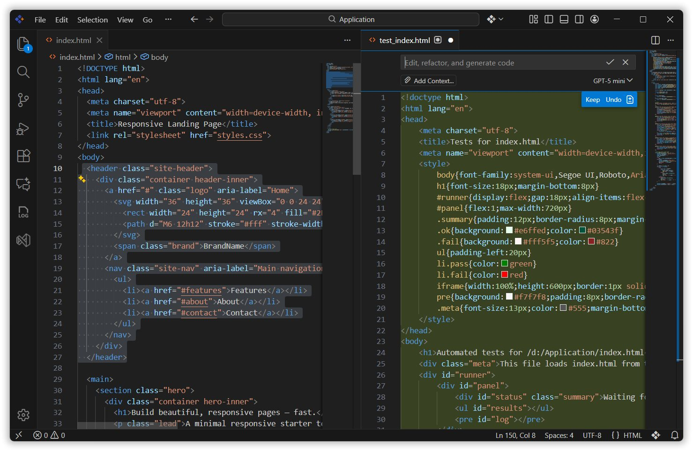

# Generate Code

The **Generate Code** feature helps developers work faster by automating common coding tasks.
It reduces repetitive work, improves code quality, and provides instant AI assistance directly inside your editor.

## Use cases

- Speeds up development  
- Improve code quality  
- Learn better coding practices  
- Remove repetitive tasks  
- Get instant help inside your editor  

It’s like having a **junior developer**, a **senior reviewer**, a **documentation writer**, and a **test engineer — all in one**.

## Prerequisites 

- Syncfusion Code Studio installed and configured on your system. If you have not yet downloaded Code Studio, please refer to this link [Install and Configure](/code-studio/getting-started/install-and-configuration) for step-by-step instructions on downloading and configuring Code Studio.

## How to Use Generate Code

1. **Right‑click** on the code you want help with.  
2. Select **Generate Code**.  
3. Choose what you want the AI to do:
   - **Fix**  
   - **Review**  
   - **Generate Docs**  
   - **Generate Tests**  

The AI generates results directly in your editor, where you can **accept, reject, or modify** them.

## Fix

**Fix** automatically suggests and applies corrections to common coding issues or errors.

When you choose **Generate Code → Fix**, the AI:

- Scans the selected code  
- Detects mistakes (syntax errors, logic issues, missing parts, formatting issues)  
- Proposes corrected code  
- Shows a preview of changes  
- Allows you to **Accept** or **Reject** fixes before applying them  

## Review

**Review** analyzes your code and provides improvement suggestions.  
This feature works like a mini code reviewer inside your editor.

When you choose **Generate Code → Review**, the AI:

- Reads the selected code  
- Identifies areas for improvement  
- Suggests refactoring for cleaner structure  
- Points out performance issues  
- Highlights unused variables or repeated logic  
- Provides best‑practice recommendations  

## Generate Docs

**Generate Docs** automatically creates documentation to make your code easier to understand and maintain.

When you choose **Generate Code → Generate Docs**, the AI:

- Reads your function, component, or class  
- Generates clear comments and explanations  
- Adds documentation for:
  - What the function does  
  - What each parameter means  
  - What the function returns  
  - Important logic details  
- Helps you follow documentation best practices  

## Generate Tests

**Generate Tests** creates automated test cases to ensure your code works correctly and catches bugs early.

When you choose **Generate Code → Generate Tests**, the AI:

- Understands your function or component  
- Determines expected behavior  
- Creates a test file (e.g., `App.test.tsx`)  
- Writes meaningful test cases using testing libraries (such as Jest or React Testing Library)  
- Inserts the tests into a new or existing test file  

This saves time and helps ensure your application behaves as expected.

