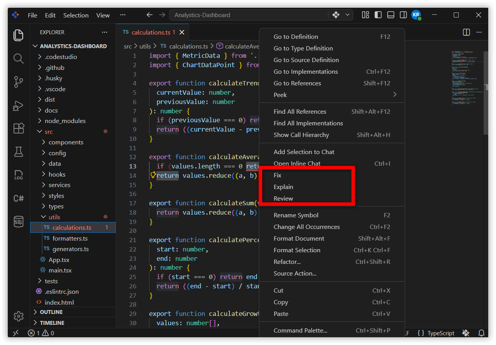
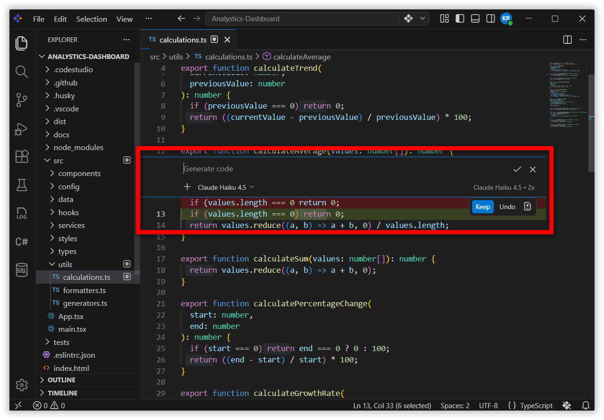
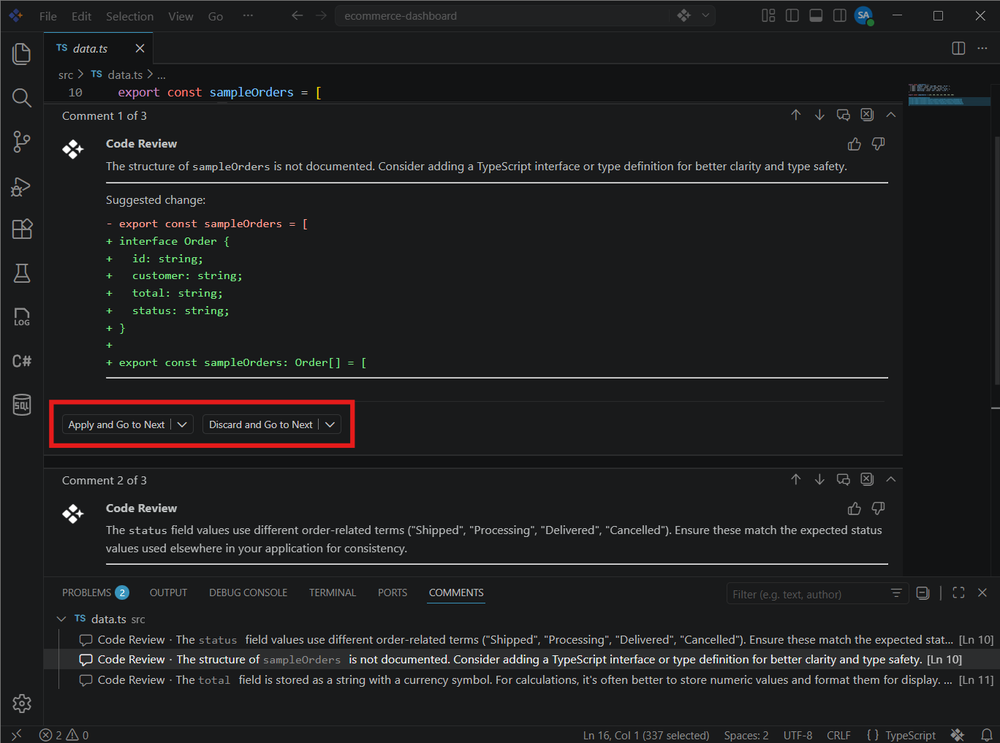

# Automate Code Fixes and Reviews

## Overview 

This feature helps developers work faster by automating common coding tasks.
It reduces repetitive work, improves code quality, and provides instant AI assistance directly inside your editor.

## Use cases

- Speeds up development  
- Improve code quality  
- Learn better coding practices  
- Remove repetitive tasks  
- Get instant help inside your editor  

It’s like having a **junior developer**, and a **senior reviewer**.

## How to Use Automate Code Fixes and Reviews

1. **Right‑click** on the code you want help with.   
3. Choose what you want the AI to do:
   - **Fix**  
   - **Review**  

The AI generates results directly in your editor, where you can **accept, reject, or modify** them.

## Fix

**Fix** automatically suggests and applies corrections to common coding issues or errors.

When you choose **Fix**, the AI:

- Scans the selected code  
- Detects mistakes (syntax errors, logic issues, missing parts, formatting issues)  
- Proposes corrected code  
- Shows a preview of changes  
- Allows you to **Accept** or **Reject** fixes before applying them  

## Review

**Review** analyzes your code and provides improvement suggestions.  
This feature works like a mini code reviewer inside your editor.

When you choose **Review**, the AI:

- Reads the selected code  
- Identifies areas for improvement  
- Suggests refactoring for cleaner structure  
- Points out performance issues  
- Highlights unused variables or repeated logic  
- Provides best‑practice recommendations  

## Releted Features
 - [Inline Chat](/code-studio/features/inlinechat) Inline Chat in Syncfusion Code Studio lets you talk to AI directly inside your code or terminal without switching screens.
 - [Autocomplete](/code-studio/features/autocomplete) Syncfusion Code Studio’s AI Autocomplete speeds up development by giving smart inline suggestions, completing code from context, generating code from comments, and offering style‑aware alternatives for faster, cleaner coding.