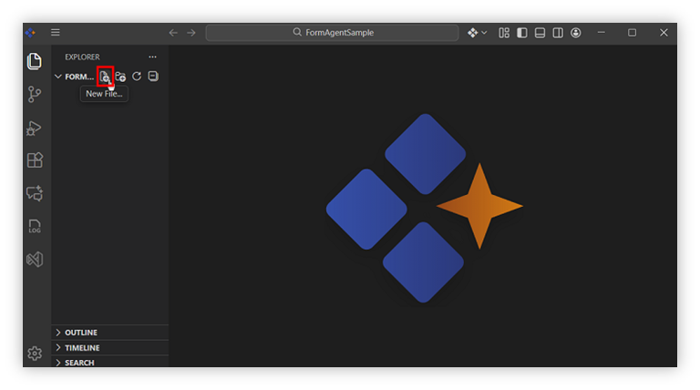
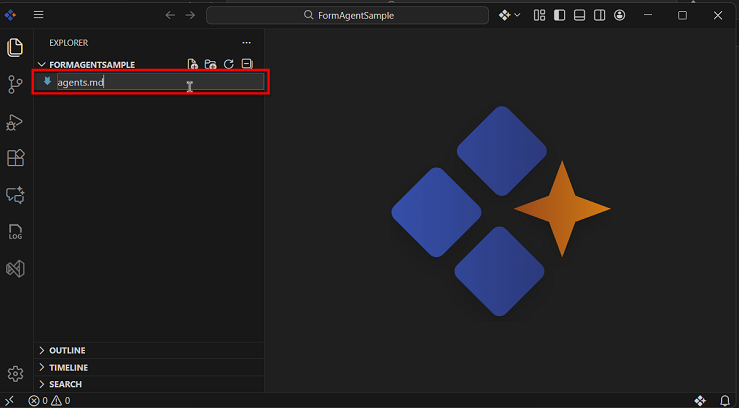
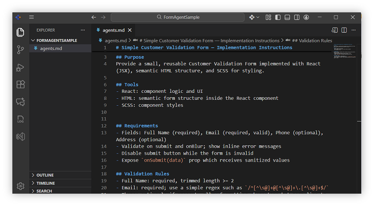
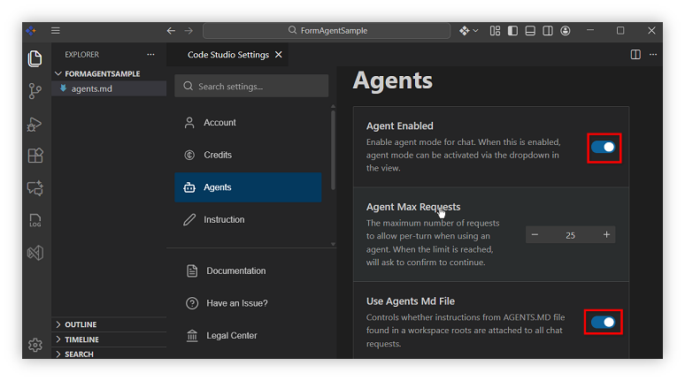
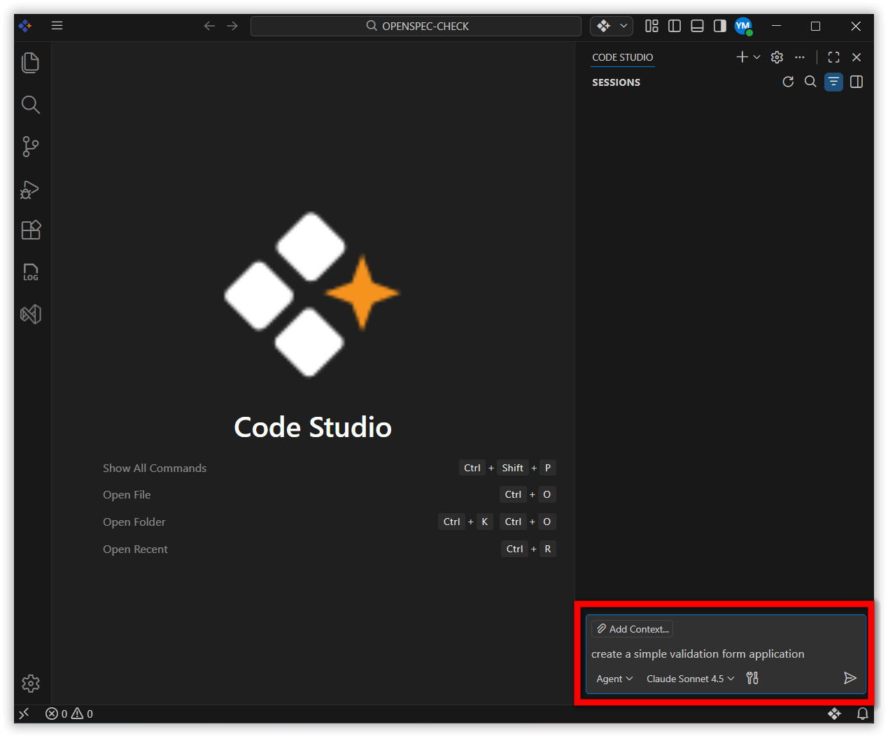
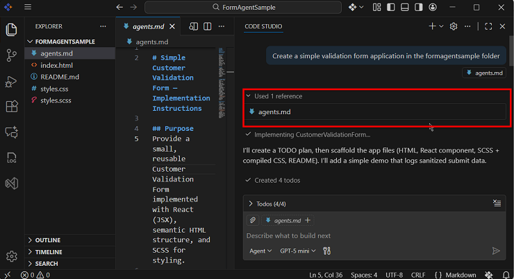

# Global Agents

## Overview
Global Agent refers to agents.md, an open-source, standardized file format designed to streamline collaboration between AI coding agents in **Syncfusion® Code Studio**. It serves as a centralized instruction manual, similar to a `README.md`, but specifically tailored for machine interpretation and execution. By consolidating setup instructions, testing protocols, and coding guidelines into a single file, Global Agent simplifies workflows and ensures consistency across projects.  

> **Note**: Enable the **Use Agent MD File** option under Agents in the settings.

## Purpose
The goal of Global Agent is to give developers a clear and consistent way to guide AI code generation and tasks.

- Provide durable, project specific rules the assistant automatically follows.  
- Avoid repeating instructions by defining default behavior, style, and tool usage.  
- Keep outputs consistent across the team.   

## How to Configure
Using Global Agent in Code Studio is straightforward:

1. Click Create File

    

2. Create an `agents.md` file in the root folder.

    

3. Add the proper instructions inside the `agents.md` file.

    

4. Go to Settings and click the Code Studio Settings option.

    

5. Enable the **Agent Enabled** and **Use Agent MD File** option under Agents in the settings

    

7. Open a chat and send message.

    

8. The `agents.md` file will then be used as a reference.

    

## Validation
- Verify **Agent Enabled** is enabled under Agents.
- Verify **Use Agent MD File** is enabled under Agents.
- Check that the file is named `agents.md` and placed in the project root.
- Verify that Code Studio references `agents.md` when responding

## Troubleshoot
**`agents.md` file is not referenced.**  
-   Ensure the file exists in the root directory and is not in a subfolder.
-	Confirm the extension is exactly .md.
-	Ensure the file name as agents.md.

**Agent not Responding in Chat.**
- Re-check that Agent Enabled and Use Agent MD File are toggled ON in Settings.

**Instruction Recognition Problems.**
- Review the document for clear, AI parsable rules and Check clarity of rules.

**Slow suggestions.**
- Ensure a stable network connection. 
