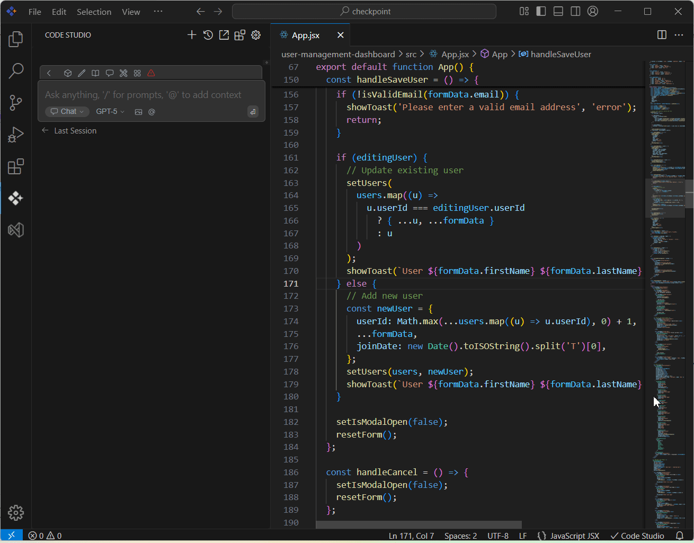

#  Inline Edit

## Purpose

Syncfusion Code Studio's Inline Edit feature delivers **instant AI-powered code improvements** directly within your editor. This intelligent system enables developers to enhance code quality, fix issues, and optimize performance through contextual right-click actions.Its key purposes are to:

- **Increase Efficiency**: Quickly fix issues, write documentation, or optimize code with a single click.
- **Maintain Focus**: Keep developers in the flow by providing AI assistance directly in the editor.
- **Standardize Code Quality**: Ensure consistent code quality and documentation across the team.

## When to Use
- You want instant, contextual AI-powered code improvements without leaving the editor. 
- You need to fix errors, optimize performance, or enhance code quality on demand. 
- You prefer a right-click workflow for quick refactoring and standardization across your team

## Prerequisites
- Syncfusion Code Studio editor open with code visible. 

## Steps

1. **Select** code in your editor by highlighting the section you want to improve. 
2. **Right-click** on the selection to open the context menu. 
3. **Choose** "Code Studio" from the menu options. 
4. **Select** an action from the dropdown: 

<table border="1" cellpadding="8" cellspacing="0">
  <thead>
    <tr>
      <th>Action</th>
      <th>Purpose</th>
      <th>Use Case</th>
    </tr>
  </thead>
  <tbody>
    <tr>
      <td><strong>Add to context</strong></td>
      <td>Custom analysis of code</td>
      <td>Send to chat for detailed help, Flexible problem-solving</td>
    </tr>
    <tr>
      <td><strong>Fix this code</strong></td>
      <td>Error resolution</td>
      <td>Debug syntax/logic issues, Reduced debugging time</td>
    </tr>
    <tr>
      <td><strong>Optimize this code</strong></td>
      <td>Performance enhancement</td>
      <td>Improve efficiency, Better application performance</td>
    </tr>
    <tr>
      <td><strong>Write docstring</strong></td>
      <td>Documentation generation</td>
      <td>Add comprehensive comments, Improved code maintainability</td>
    </tr>
    <tr>
      <td><strong>Write comments</strong></td>
      <td>Comments generation</td>
      <td>Develop clear comments in the code to enhance developer maintainability</td>
    </tr>
  </tbody>
</table>
  

5. **Review** AI suggestions and accept/reject changes

## Validation
- Highlight a simple function and select "Write docstring"; confirm docstrings appears correctly. 
- Try "Fix this code" on code with an obvious error; verify the suggestion resolves it. 
- Use "Optimize this code" on a loop or query; check that the output is more efficient. 

## Troubleshooting
- **Context menu doesn't appear**: ensure you've highlighted code and right-clicked within the selection.
- **Suggestions don't apply**: click "Accept" in the diff view; if still stuck, reload the editor.

