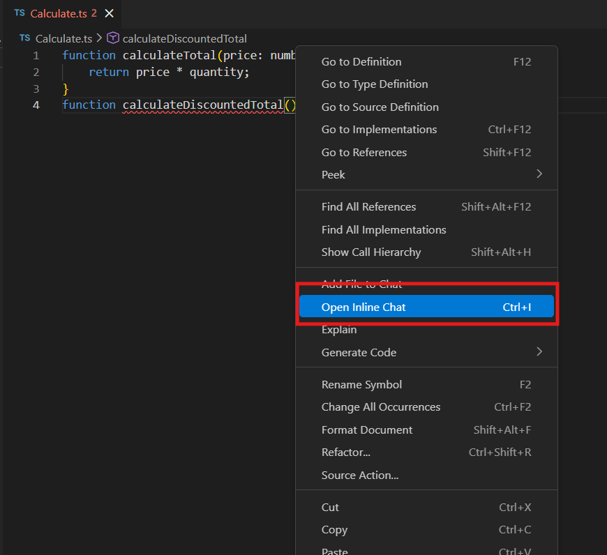
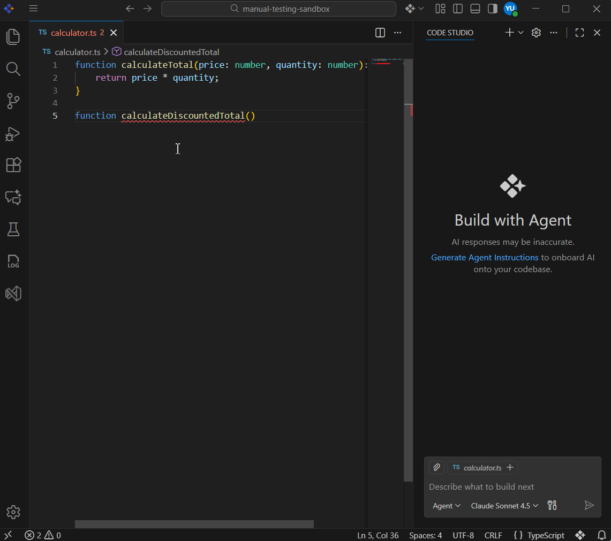
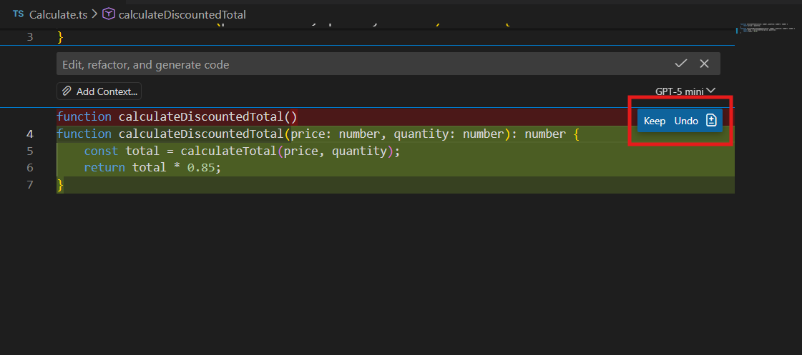
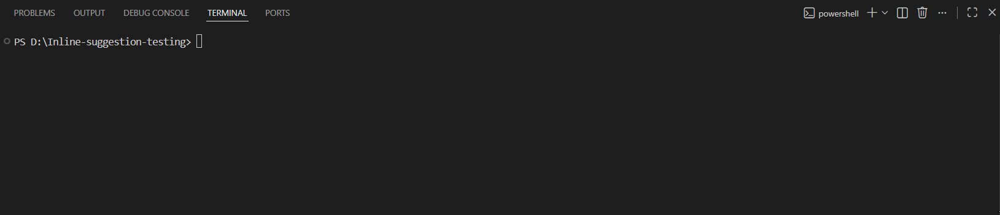
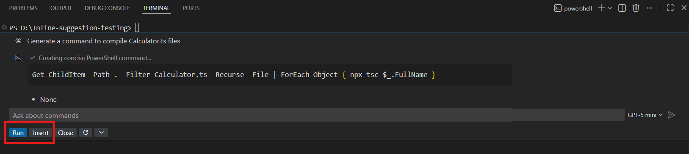

# Inline Chat in Syncfusion Code Studio

Inline Chat in **Syncfusion Code Studio** allows you to request code generation and make inline edits directly inside the editor—without switching to the Chat panel. This keeps you focused and reduces context switching while working on your code.

Inline Chat works both in the editor and the integrated terminal, giving you quick access to AI assistance exactly where you need it.

## Purpose
The purpose of Inline Chat is to provide an efficient, in-context way to work with AI assistance. Instead of navigating to a separate chat window, you can trigger AI guidance exactly where you need it. This ensures:
- Speeding up coding and edits
- Giving more accurate code suggestions
- Helping with terminal commands instantly
- Reducing interruptions while you work

## Prerequisites
1. **Create and sign in** to your Syncfusion Code Studio account, visit: [Syncfusion Code Studio](https://app.sfcodestudio.com)
2. **Download and open Syncfusion Code Studio**, visit: [Install and Configuration](/code-studio/getting-started/install-and-configuration)

## Using Inline Chat in the Editor
When you use Inline Chat inside the editor, Code Studio scopes your request to the content in the active file. It may also use related files in your workspace to provide more accurate suggestions.

### How to Use Editor Inline Chat
**Steps:**
1. **Open a file** in the Code Studio editor.
2. Open Inline Chat by doing one of the following:
   - Press `Ctrl + I`
   - Or **Right-click** inside the editor → **Open Inline Chat**

   
   

3. Type your request in the inline chat input box and press **Enter** to submit.

   

> **Tip:** Select a block of code before opening Inline Chat if you want AI to focus on that part.

### Reviewing Suggestions
After processing your request, Code Studio shows an inline diff view. You can:
- **Keep** the changes
- **Undo** the changes

  


## Using Inline Chat in the Terminal
Terminal Inline Chat helps you work with shell commands, scripts, and terminal workflows directly inside Code Studio’s integrated terminal.

### How to Use Terminal Inline Chat
**Steps:**
1. Open the terminal (**View → Terminal** or `Ctrl + ```).
2. Start Terminal Inline Chat using `Ctrl + I`.
3. Type your command request and press **Enter**.

   

### Running or Inserting Commands
After Code Studio generates a shell command:
- Select **Run (Ctrl + Enter)** to execute immediately
- Select **Insert (Alt + Enter)** to add it into the terminal for editing

   

## Best Practices
- Select a specific piece of code before opening Inline Chat to get more accurate suggestions.  
- Keep your prompts short and clear so the AI understands exactly what you need.  
- Always review the inline changes before accepting them to ensure they match your intention. 


