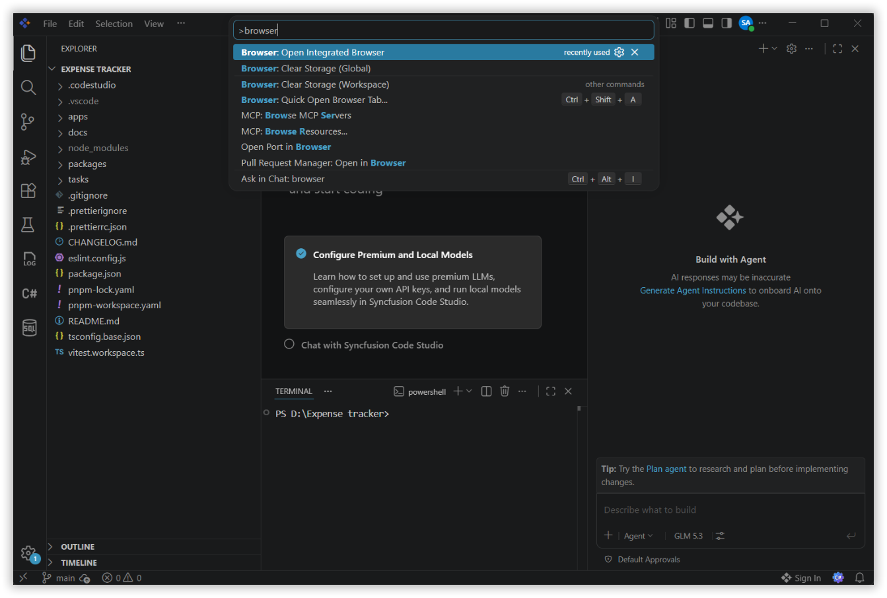
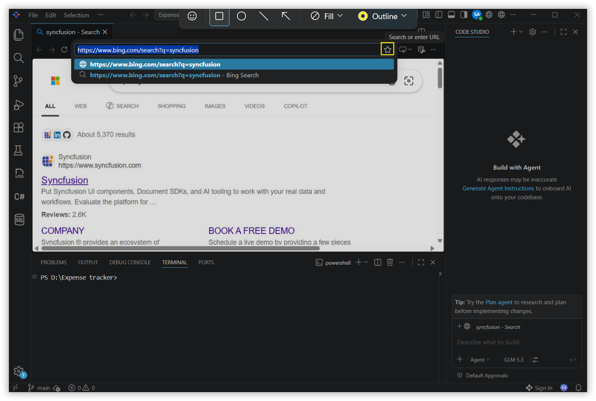
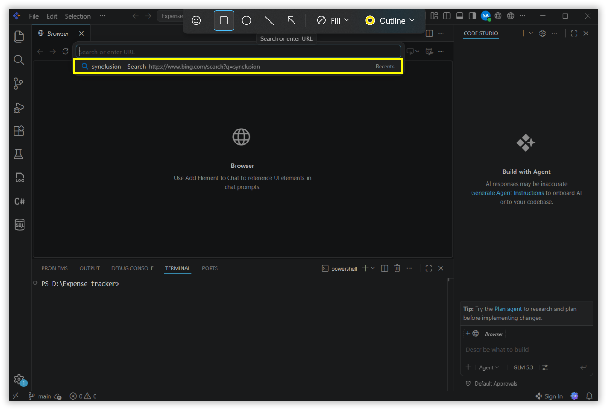
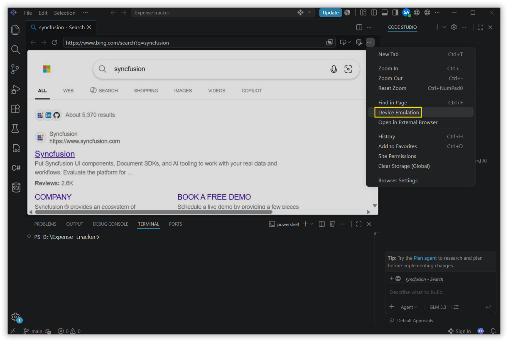
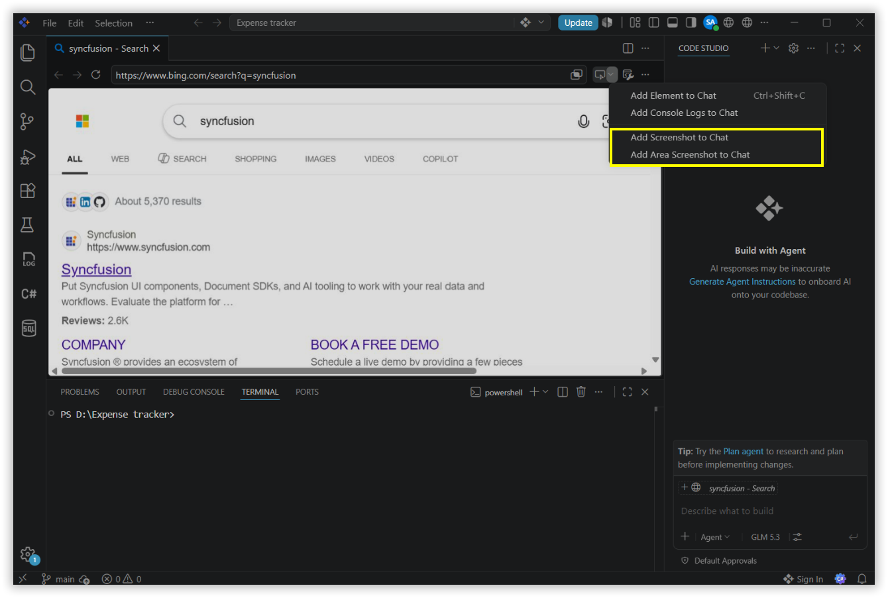
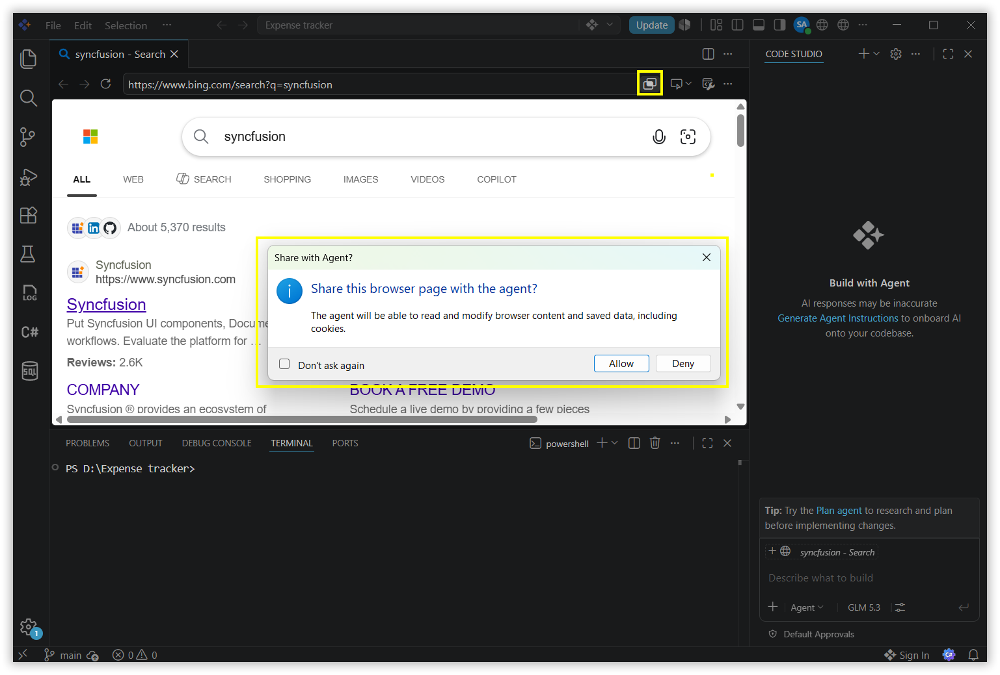
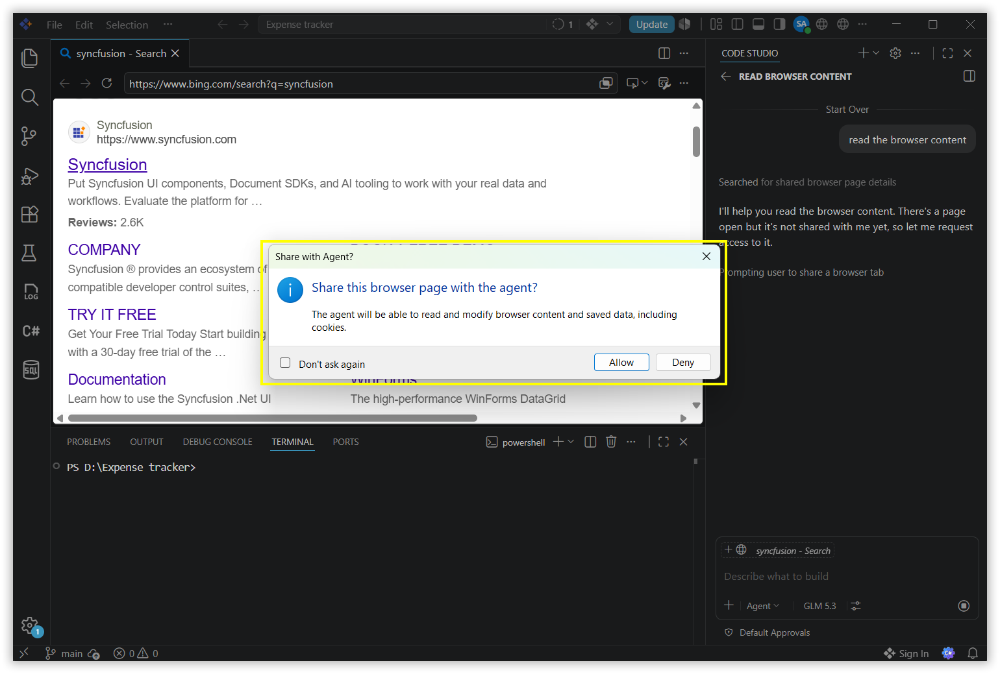
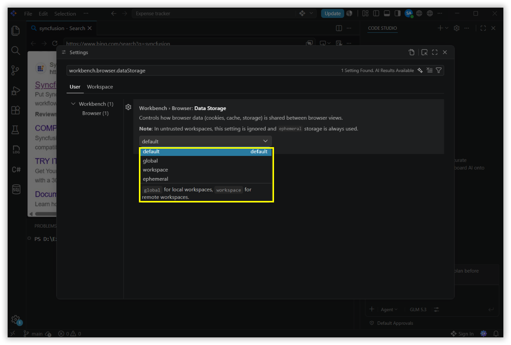
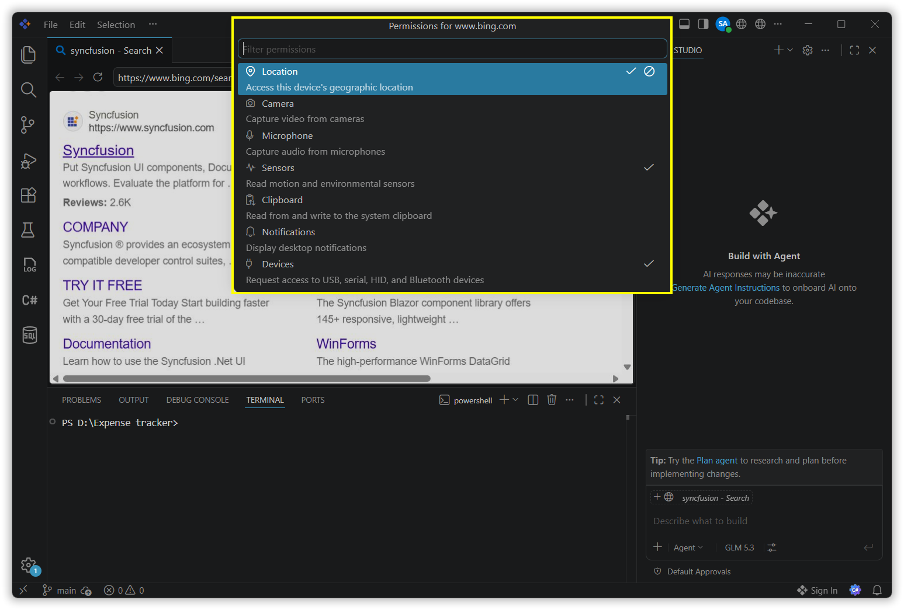

# Integrated Browser

## Overview

The Integrated Browser lets you open and interact with web pages directly inside Code Studio. Use it to preview web applications, search the web, test authentication flows, emulate devices for responsive testing, attach browser content to AI chat, and share live pages with agents so they can validate and iterate on your work without switching to an external browser.

## Use Cases

- Preview a local web app running on `localhost` in a Code Studio tab without opening an external browser.
- Test a page's mobile responsiveness using built-in device emulation.
- Capture a screenshot or selected element from the browser and attach it to chat to give the AI visual context.
- Share an open browser page with an agent so it can read content, click through flows, and verify its own changes autonomously.
- Debug front-end JavaScript directly from the browser's Developer Tools or via Code Studio's debugger.
- Open and preview a local HTML file instantly, without installing a separate preview extension.

## How to Use the Integrated Browser

### Step 1: Open the Integrated Browser

There are several ways to open the Integrated Browser in Code Studio:

- **Command Palette:** Press `Ctrl+Shift+P`, type `Browser: Open Integrated Browser`, and press **Enter**.
- **Menu:** Select **View > Browser**, or press `Ctrl+Alt+/`.
- **Title bar:** Select the globe button in the Code Studio title bar. Use the `workbench.browser.showInTitleBar` setting to control whether the globe button is visible.
- **Localhost links:** Select any `localhost`, `127.0.0.1`, or `0.0.0.0` link in the terminal or chat — it opens automatically in the Integrated Browser. To use an external browser instead, disable `workbench.browser.openLocalhostLinks`.
- **HTML file:** Right-click an HTML file in the Explorer or editor tab and select **Open in Integrated Browser**, or select the preview icon in the editor title bar when an HTML file is active.

> **Note:** You can open multiple browser instances simultaneously, each in its own editor tab. Use the `workbench.browser.newTabPlacement` setting to control where new tabs open — in the active editor group (`activeGroup`, the default), a dedicated side group (`sideGroup`), or a separate auxiliary window (`window`).

### Step 2: Navigate, Search, and Manage History

The Integrated Browser supports `http://`, `https://`, and `file://` URLs. Use the address bar to navigate to any URL, or follow in-page links to navigate within a site.

**Address bar and suggestions**

Select the address bar to open the suggestions picker. As you type, the picker filters your favorites, open tabs, and history. Press **Enter** to navigate. Press `Ctrl+click` (or `Cmd+click` on macOS) to open links in a new browser tab. Popups are blocked, but new tabs opened via links are allowed.

**Web search**

Type a search phrase in the address bar to search the web directly. Use the `workbench.browser.searchEngine` setting to choose your preferred search engine: **Bing**, **Google**, **Yahoo**, or **DuckDuckGo**. The default value `none` disables web search and treats all input as a URL.

**Favorites**

To favorite the current page, select the star icon in the address bar. Favorited pages appear in the suggestions picker and filter as you type. Select a favorite to navigate to it.

**Browser history**

The Integrated Browser keeps a history of pages you visit. Press `Ctrl+H` or run **Browser: History** from the Command Palette to open the history view. Pages are grouped by day, with the most recent first. Type in the input field to filter by title or URL, and select an entry to navigate to it. Remove individual entries or clear all history from within the view.

Use the `workbench.browser.maxHistoryEntries` setting to adjust the maximum number of history items (default: 200). Set it to `0` to disable history entirely.

### Step 3: Emulate Devices for Responsive Testing

The Integrated Browser includes built-in device emulation to help you test your web app's responsiveness across different screen sizes and device types without switching to an external browser.

To enable device emulation from an open browser tab:

1. Select the overflow menu (⋯) in the browser toolbar.
2. Select **Device Emulation**.
3. Choose a device preset, or set a custom screen width, height, and user-agent string. Enable touch emulation to test mobile interactions.

For example, if you are building a responsive dashboard and want to verify its layout on a mobile screen, select a phone preset from the toolbar. The page immediately reflows to the target viewport.

> **Note:** Agents can also trigger device emulation programmatically via Playwright code. This is useful in agentic workflows where the agent needs to catch mobile responsiveness issues and iterate automatically.

### Step 4: Add Browser Content to Chat

The browser toolbar provides an **Add to Chat** split button with actions that let you attach different types of browser content to your chat prompt, giving the AI precise visual context about your web app.

**Add a screenshot**

Open the **Add to Chat** dropdown in the browser toolbar and choose one of three capture modes:

- **Add Screenshot to Chat** — captures the current browser viewport.
- **Add Area Screenshot to Chat** — drag to select a rectangular region of the page, then capture only that area.

**Add elements**

Select the **Add Element to Chat** button in the toolbar to enter selection mode. Hover over elements and click to add them to your chat prompt. Click and drag to select a range of elements that share a container. You can also right-click anywhere on the page and select **Add Element to Chat** from the context menu.

Use the following settings to control what is included with each element:

- `chat.sendElementsToChat.attachCSS` — include CSS styles for selected elements.
- `chat.sendElementsToChat.attachImages` — include screenshots of selected elements.

### Step 5: Share the Browser with Agents

Agents do not automatically have access to the Integrated Browser — you must explicitly share a page before an agent can read and interact with it. This keeps sensitive browser data private.

**Share a page manually**

Select the **Share with Agent** button in the browser toolbar. A confirmation dialog asks you to approve sharing before the agent gets access. A visual indicator on the browser tab shows when a page is currently being shared. Select the button again to stop sharing and immediately revoke the agent's access.

**Agent-initiated share requests**

Agents are aware of how many browser tabs you have open but have not shared. When an agent needs to interact with a page, it can request access and you approve or deny the request in a prompt. When an agent tries to open a new tab on the same domain as an existing unshared tab, a prompt appears offering to reuse the existing tab instead of opening a new one.

### Step 6: Configure Session Storage and Permissions

**Session storage**

Use the `workbench.browser.dataStorage` setting to control how the Integrated Browser stores cookies, logins, localStorage, and cache:

| Value | Behavior |
|-------|----------|
| `global` | Data persists and is shared across all browser tabs and workspaces. |
| `workspace` | Data persists within the current workspace but is isolated from other workspaces. |
| `ephemeral` | Data is not persisted or shared between tabs. Similar to incognito mode. |

To clear stored data, select the browser toolbar menu and choose **Clear Storage (Global)** or **Clear Storage (Workspace)**. Reload the tab after clearing storage to apply the changes.

> **Note:** In untrusted workspaces, the browser always uses ephemeral storage regardless of the setting.

**Per-site permissions**

When a page requests access to a hardware or OS API, Code Studio prompts you to allow or deny the request for that specific site — the same way a traditional browser does. Supported APIs include:

- Geolocation
- Camera and microphone
- Sensors (such as accelerometer and gyroscope)
- Clipboard
- Devices (Bluetooth, USB, serial, and HID)

To review or change permissions for the current site, select the browser toolbar menu and choose **Site Permissions**.

## Best Practices

### 1. Configure tab placement to keep browser and code organized

By default, new browser tabs open in the active editor group. Set `workbench.browser.newTabPlacement` to `sideGroup` or `window` to keep browser tabs in a dedicated space, reducing clutter when you are switching between code and a running web app.

### 2. Share browser pages with agents explicitly

Agents cannot access browser tabs unless you share them. Share pages deliberately using the **Share with Agent** button or by attaching the tab as context in chat. This protects sensitive data such as login sessions or personal browsing history from being exposed unintentionally.

### 3. Test device responsiveness before deploying

Use the device emulation toolbar to verify your web app's layout on phone and tablet viewports before pushing changes. Running a quick emulation check in Code Studio is faster than switching to a standalone browser and reproducing the same state.

### 4. Use web search to look up references without switching context

Configure `workbench.browser.searchEngine` to your preferred engine so you can search documentation, Stack Overflow answers, or any web resource directly from the address bar — keeping your flow uninterrupted.

## Related Features

- [Agent Mode](/code-studio/features/agent) — Share the Integrated Browser with an agent in Agent Mode to give it a live feedback loop: the agent can open pages, take screenshots, and validate its own web changes in a closed build-test-fix cycle.
- [Add Context](/code-studio/features/add-context) — Attach screenshots, elements, and console logs captured from the Integrated Browser to chat alongside other workspace context such as files, symbols, and terminal output.
