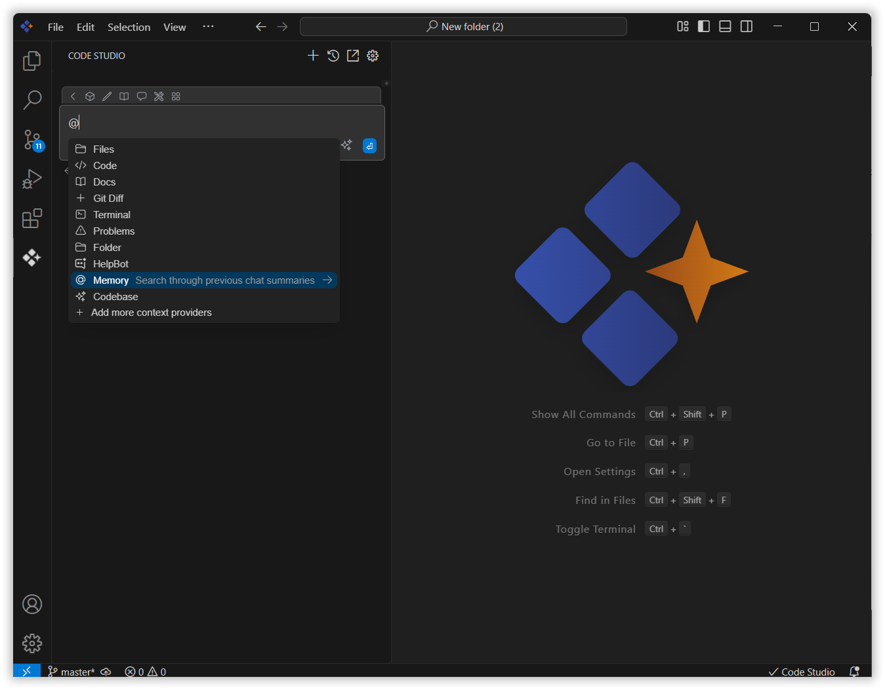
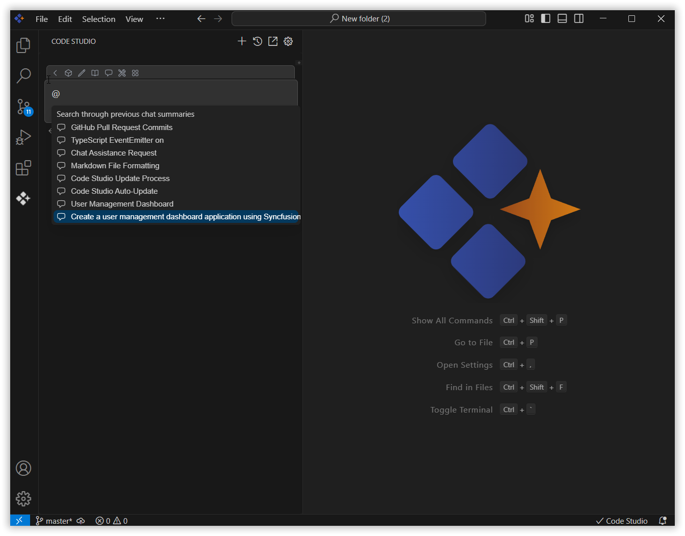
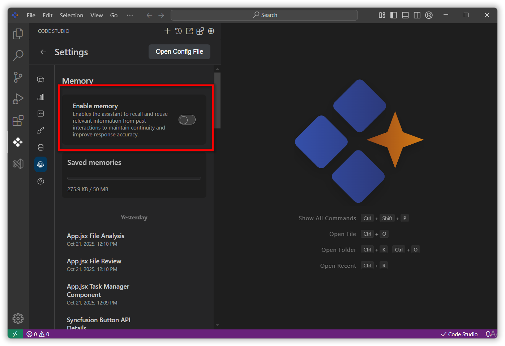
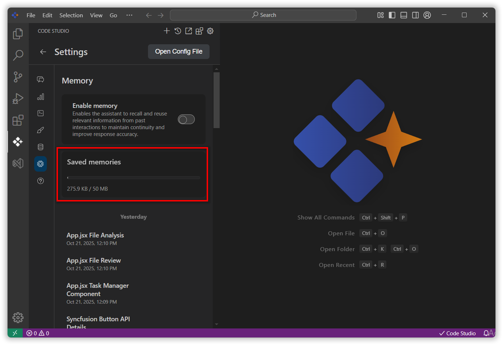

# Memory

The Memory feature in Syncfusion Code Studio enhances your AI chat experience by allowing the assistant to recall and reuse relevant information from past interactions. This ensures continuity, improves response accuracy, and supports complex or multi-step workflows.

## Memory Context Provider
Memory Context Provider gives you full control over which past conversations are referenced in your current session.

### How to Use:
1. Open Syncfusion Code Studio.
2. Click the Syncfusion Code Studio icon in the left-hand toolbar to open the AI chat interface.

3. In the chat window, click the @ button.

4. Select Memory from the menu.

5. Browse the list of saved memory summaries.

6. Choose the memory you want to include in your current session.

Once selected, the memory is added to your context, helping the assistant respond with greater relevance.

## Managing Memories
You can edit or delete memories to keep your workspace organized and up to date. Click on the open settings icon and navigate to the Memory section.

- Edit: Click the edit icon next to a memory to update its summary.
- Delete: Click the trash icon to remove a memory that's no longer needed.

> **Note:**  All memories are stored locally on your machine. Syncfusion values your privacy and does not upload memory data to the cloud. 

You can also toggle the Memory feature on or off anytime from the User Settings page.

## Progress bar
The progress bar is based on the saved memories storage. When the saved memories increase the size of the progress bar will also increase simultaneously. When you delete the saved memories the size of the progress bar will decrease. If the progress bar limit is full the storage is over(50mb). After that the memories will not be saved. You need to delete the memories to store new ones.

