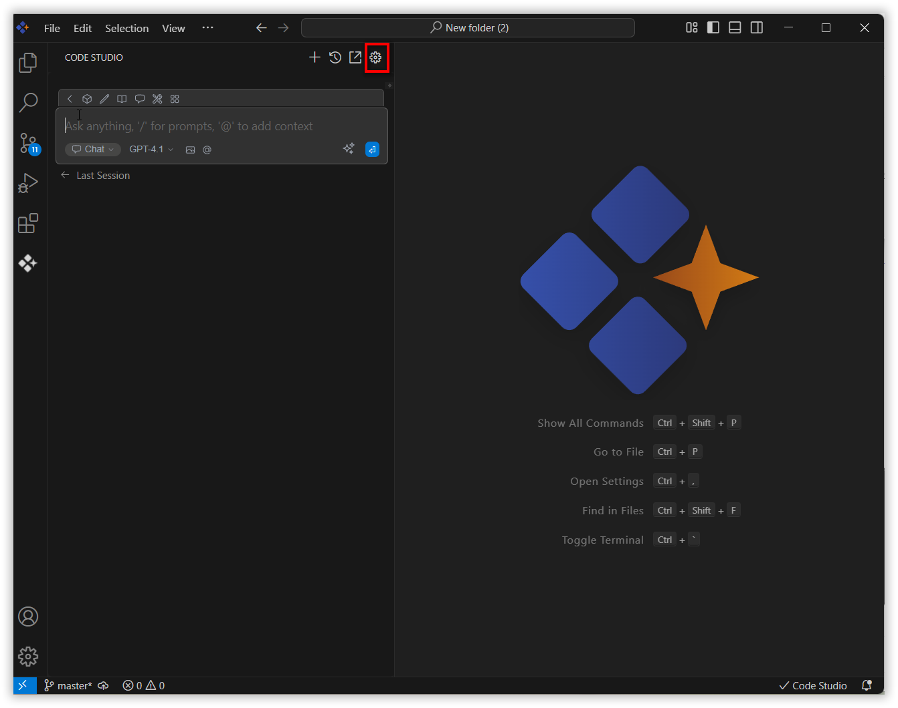

# Memory

## Purpose
The Memory feature in Syncfusion Code Studio enhances your AI chat experience by allowing the assistant to recall and reuse relevant information from past interactions. This ensures continuity, improves response accuracy, and supports complex or multi-step workflows.

## When to Use
- You want the AI assistant to recall and reuse relevant information from past interactions to maintain continuity across sessions.  
- You're working on multi-step projects and need context-aware responses that reference previous conversations.  
- You prefer organized, searchable access to conversation history without losing important details.

## Prerequisites
- Syncfusion Code Studio open with a workspace. 
- Memory feature toggled on in User Settings (default is enabled).  
- Local storage available on your machine (memories are stored locally).

## Steps

### 1. Enable Memory
- Go to **Settings > Memory** and toggle "Enable memory" on.  
- This will allow the assistant to recall and reuse relevant information from past interactions to maintain continuity and improve response accuracy.

### 2. Add Memory Context Provider
- In the chat window, click the @ button and select **Memory** from the menu.  
- Browse saved memory summaries grouped by date (e.g., "Yesterday", "Last Week").  
- Select the memory or conversation you want to include in your current session; it will be added as context for more relevant responses.

### 3. Manage Saved Memories
- Hover over any saved memory entry to reveal edit and delete icons.  
  - **Edit**: Click the pencil icon to update a memory summary or notes.  
  - **Delete**: Click the trash icon to delete the memories.

### 4. Monitor Storage
- The progress bar below "Saved memories" tracks your local storage usage (based on total size of saved memories).  
- When usage approaches the 50 MB limit, delete unnecessary memories to free space.  
- Once full, new memories won't be saved until you clear space.

### 5. Scope of the Memory
- **User-level**: Useful for storing recurring coding patterns, preferences, or general best practices that apply across all your development work.  
- **Project-level**: Memories tied to a specific project for focused context. These memories help the assistant understand project-specific architectures, coding standards, dependencies, and prior decisions. Project-level memories are isolated from other projects, reducing noise and keeping context relevant to current work.

## Validation
- Enable Memory in Settings and run a chat query; confirm a memory entry appears in the Saved memories list.  
- Click @ in chat and select a previous memory; verify the assistant references it in its response.  
- Edit a memory by clicking the pencil icon and updating the summary; confirm changes are saved.  
- Delete a memory using the trash icon and verify the progress bar storage decreases.

## Troubleshooting
- **Memories not in @ menu**: check User Settings > Memory and toggle it on.  
- **Storage is full in progress bar (50 MB)**: delete unused memories via the trash icon; the progress bar will decrease accordingly.