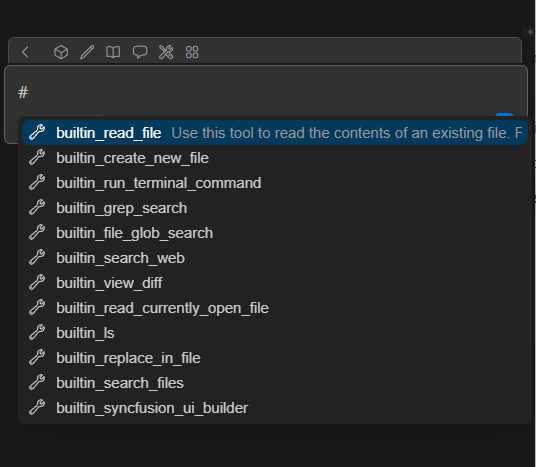

# Tool Mentions

## Overview
Tool Mentions is a powerful feature in **Syncfusion® Code Studio** that allows you to explicitly reference specific tools in your prompts using the `#` symbol. This feature enables precise control over which tools the AI uses to accomplish your tasks, ensuring more targeted and accurate responses.

When you type `#` in the chat input field, Code Studio displays a comprehensive list of available tools, including built-in tools and MCP (Model Context Protocol) tools from installed servers. This makes it easy to discover and utilize the full range of capabilities available in your development environment.

## Purpose
The goal of Tool Mentions is to provide developers with granular control over AI tool selection and enhance the precision of AI-driven development workflows.

- They enable explicit tool selection for specific tasks, ensuring the AI uses the most appropriate tools for your needs.
- They provide discoverability of available tools through the interactive `#` menu, helping you explore Code Studio's capabilities.
- They enhance the accuracy and relevance of AI responses by allowing direct tool specification.
- They streamline complex workflows by combining multiple tools in a single prompt.

## How to Use
Using Tool Mentions in Code Studio is intuitive and straightforward:

### 1. Access Available Tools
- Type the `#` symbol in the chat input field.
- A dropdown menu will appear showing all available tools.
- Browse through built-in tools and MCP tools from installed servers.

### 2. Select and Reference Tools
- Click on a tool from the dropdown to add it to your prompt.
- Alternatively, type `#` followed by the tool name directly.
- Tools are referenced using the format: `#tool_name`

### 3. Use Tools in Your Prompts
When using agent mode, the agent automatically determines which tools to use from the enabled tools based on your prompt and context. However, you can also explicitly reference tools to ensure specific functionality is utilized.

#### Examples of Explicit Tool References:
- **UI Generation:** `"Create me a dashboard application in react #builtin_syncfusion_ui_builder"`
- **Code Review:** `"Review the changes in my PR https://github.com/syncfusion/maui-toolkit/pull/300 #mcp_Get_PullRequest_Files_Changed_Data"`
- **File Analysis:** `"Analyze the structure of my project #files and suggest improvements"`
- **Documentation:** `"Generate API documentation for my codebase #docs"`

### 4. Combine Multiple Tools
You can reference multiple tools in a single prompt for complex workflows:
- `"Create a React component #builtin_syncfusion_ui_builder and document it #docs"`
- `"Analyze my git changes #gitdiff and create unit tests #code"`

## Available Tool Categories

### Built-in Tools
Code Studio includes several built-in tools that are always available:
- **UI Builder:** `#builtin_syncfusion_ui_builder` - Generate UI components and applications
- **Code Analysis:** `#code` - Analyze and understand code structure
- **File Operations:** `#files` - Work with project files and directories
- **Documentation:** `#docs` - Generate and manage documentation

### MCP Tools
MCP (Model Context Protocol) tools are provided by installed servers and extend Code Studio's capabilities:
- **GitHub Integration:** `#mcp_Get_PullRequest_Files_Changed_Data` - Access GitHub PR data
- **Database Tools:** `#mcp_database` - Interact with databases
- **Web Tools:** `#mcp_web` - Fetch and analyze web content
- **Custom Tools:** Additional tools based on your installed MCP servers

## Best Practices

### 1. Tool Discovery
- Use the `#` dropdown regularly to discover new tools and capabilities.
- Explore MCP tools that become available when you install new servers.

### 2. Specific Tool Usage
- Use explicit tool mentions when you need precise control over the AI's approach.
- Combine tool mentions with detailed prompts for optimal results.

### 3. Workflow Optimization
- Reference multiple tools in complex workflows to achieve comprehensive results.
- Use tool mentions to ensure consistency in repetitive tasks.

## Troubleshoot

### Tool Not Available
- If a tool doesn't appear in the `#` dropdown, ensure the corresponding MCP server is properly installed and configured.
- Check the **Settings** menu to verify that the required tools are enabled.

### Tool Not Working as Expected
- Verify that you're using the correct tool name format: `#tool_name`
- Ensure your prompt provides sufficient context for the tool to operate effectively.
- Check that any required permissions or configurations are properly set up.

### Performance Considerations
- While you can reference multiple tools, be mindful that complex tool combinations may take longer to process.
- Use specific tool mentions judiciously to maintain optimal response times.

## Integration with Agent Mode
Tool Mentions work seamlessly with Code Studio's agent mode:
- **Automatic Selection:** The agent chooses appropriate tools based on context when no explicit mentions are used.
- **Explicit Override:** Tool mentions override automatic selection, giving you direct control.
- **Hybrid Approach:** You can combine explicit mentions with automatic selection for optimal flexibility.

This feature enhances your development workflow by providing both the convenience of automatic tool selection and the precision of manual tool specification, ensuring that Code Studio adapts to your specific needs and preferences.