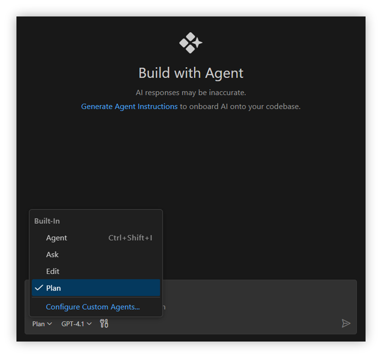
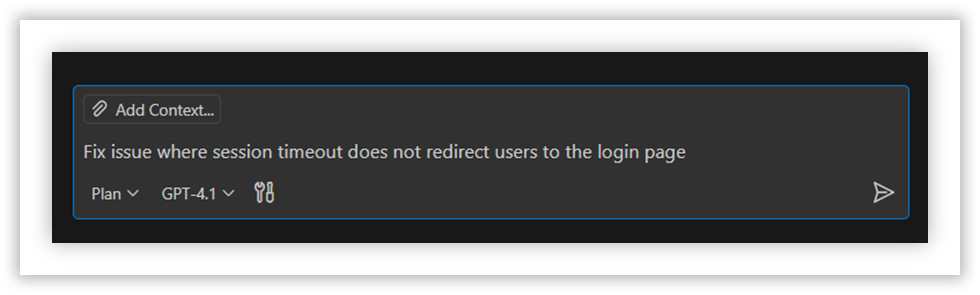
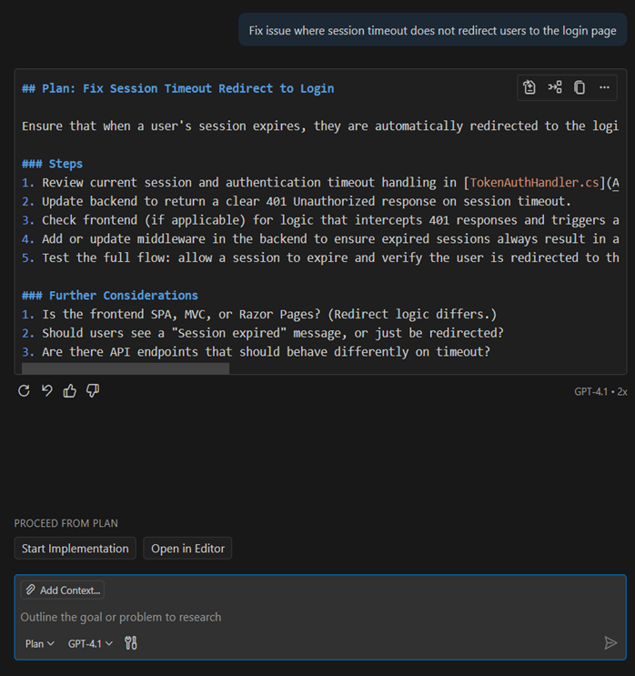
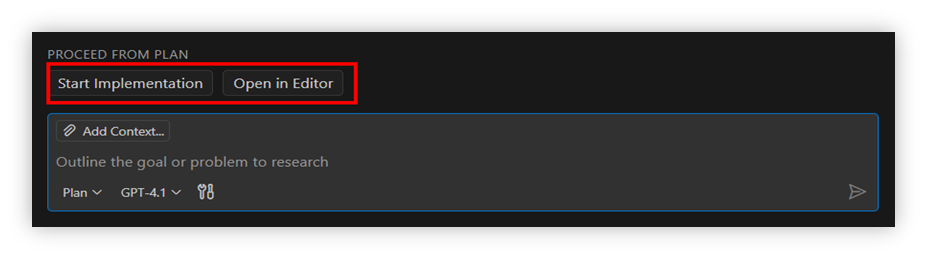
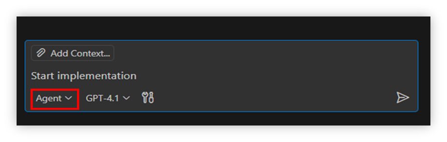
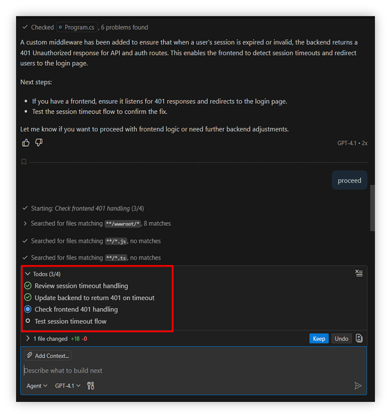
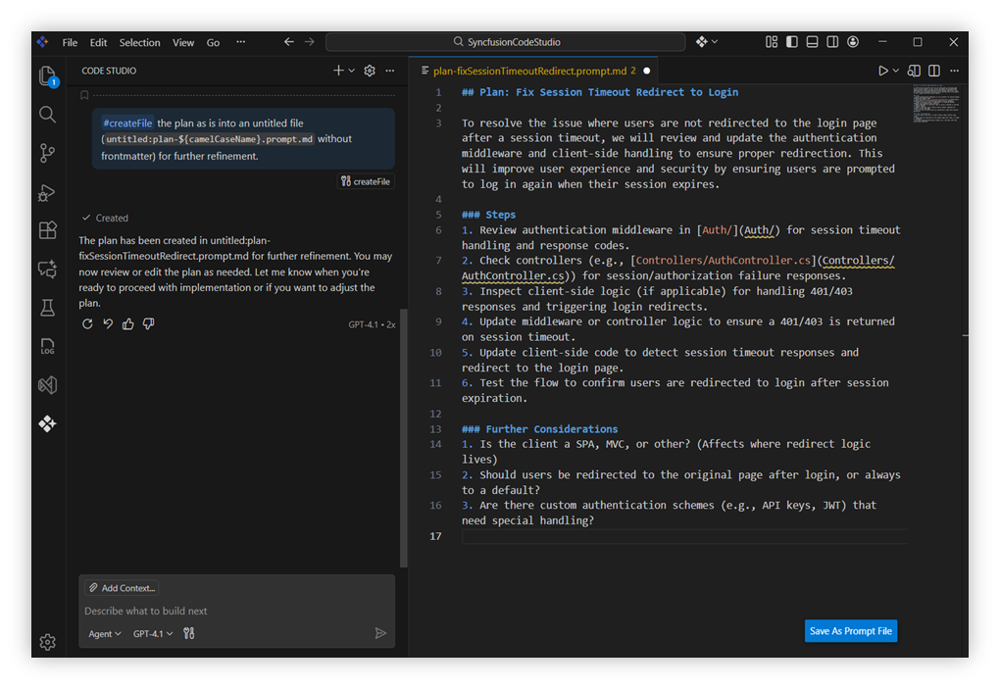

# Plan 

## Description
Plan Mode in Code Studio IDE is like a planning assistant that helps you prepare before writing any code.Instead of jumping straight into coding, it works with you to research the task, figure out what’s needed, and break the work into clear steps.  
It shows you a draft plan that you can review, edit, or approve. Nothing changes in your code until you decide the plan is ready.

## Purpose
The purpose of Plan Mode is to make coding safer and more reliable by starting with a clear plan.It helps you cover all requirements, organize tasks into simple steps, and stay focused on your goals.By reviewing the plan first, you avoid mistakes, reduce confusion, and make it easier to handle larger or more complex projects.

### The plan agent is designed to:
- Investigate tasks in detail using read-only tools and codebase analysis to uncover requirements and constraints  
- Divide the work into clear, actionable steps while raising open questions for any unclear requirements  
- Provide a concise draft plan, following a standardized format, for your review and refinement  

## How to plan a task?

### Step 1: Open the Chat View
- Open the Chat panel in Code Studio IDE.From the agents dropdown, select **Plan** to activate the plan agent. 

   

### Step 2: Enter a High-Level Task
- Type in a task you want to plan, such as a new feature, a refactoring, or a bug fix.  
**Examples:**

    - “Add automated integration tests for payment gateway workflows”  
    - “Fix issue where session timeout does not redirect users to the login page”  
    - “Optimize caching strategy to reduce response times for frequently accessed endpoints”

    

### Step 3: Submit Your Task
- After entering the task, submit it to the plan agent.  
- The agent will start preparing a draft plan based on your input.  

### Step 4: Preview the Draft Plan
- Review the proposed plan draft. It will include:
    - A high-level summary of the task  
    - A step-by-step breakdown of actions  
    - Any open questions for clarification 
     
    

### Step 5: Finalize and Start Implementation
- Once the plan is finalized, use the buttons to:  
    - **Start Implementation** directly, or  
    - **Open in Editor** for further review.  
     
    

- While the implementation is in progress, you can still provide clarifying directions such as:
    - “Focus on the UI first”
    - “Execute only step 1 and step 2”

## How to use?

### Start Implementation
- Select Start Implementation , it will appear in the chat box and execute that.  After selection of start implementation , the mode will automatically switch to Agent Mode. 
 
   

- After execution of start implementation, it begins progressing through the planned steps. You can monitor the process using the todo list, where each step is marked as completed one by one according to the plan.

     

### Open in Editor
- If you select **Open in Editor**, the plan details will appear in a new editor. There, you can review the plan, clarify details, iterate as needed, and finalize it for execution by typing **Start Implementation**. After selecting Open in Editor, the mode will automatically change to **Agent Mode**.
   

## Why use plan mode?
- Helps you research tasks thoroughly and identify requirements or constraints before coding  
- Breaks complex work into manageable, actionable steps for easier execution  
- Highlights open questions early, reducing ambiguity and misunderstandings  
- Provides a standardized draft plan for review, iteration, and team alignment  
- Builds a solid foundation that minimizes risks before any code changes are introduced  

## Best Practices
- Start with clear, high-level tasks so the agent understands your goal.  
- Review the draft plan carefully to ensure requirements and constraints are covered.  
- Refine and iterate on the plan before approving it for implementation.  
- Use the todo list to track progress and keep long tasks organized.  
- Give clarifying instructions during execution to guide the agent effectively.  
