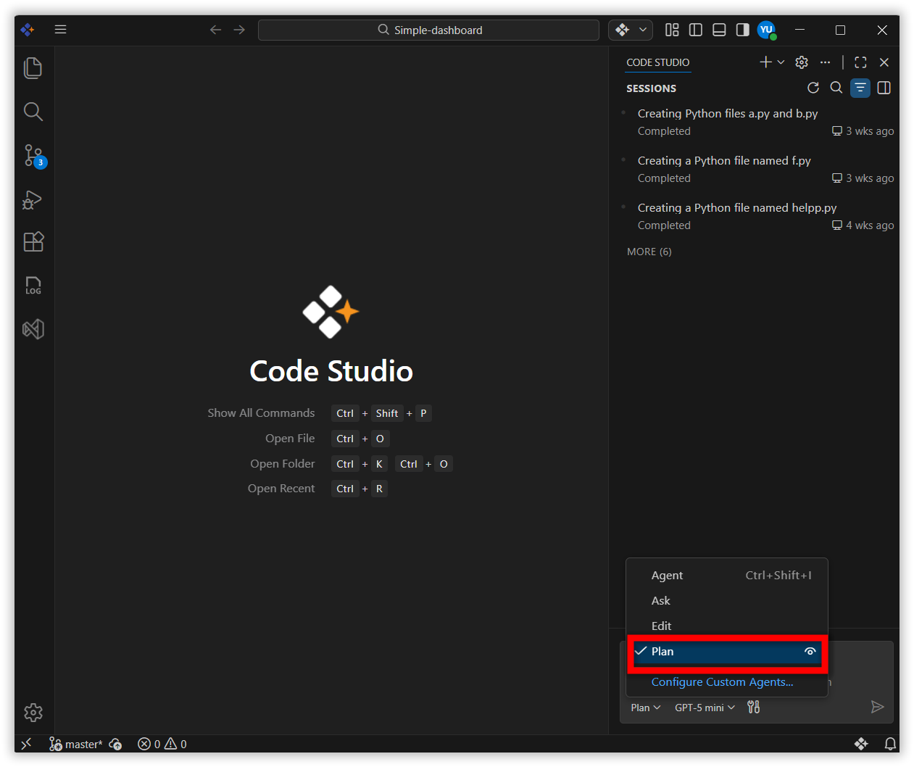
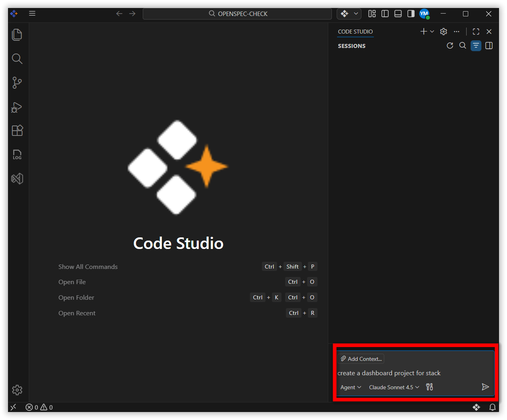
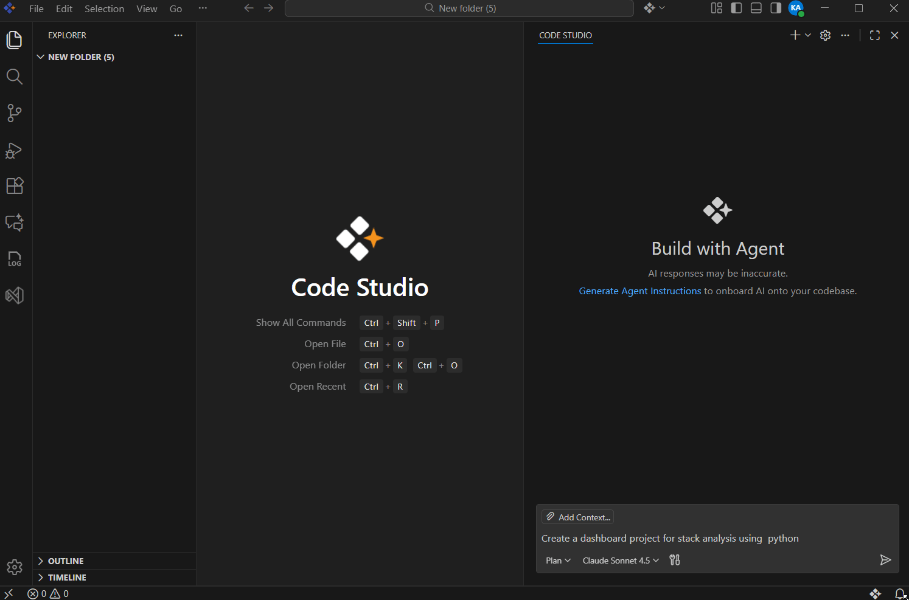
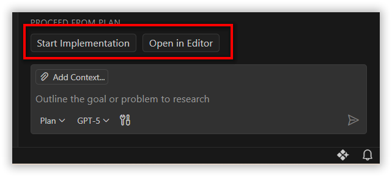
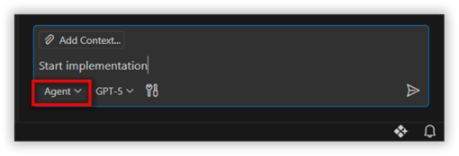
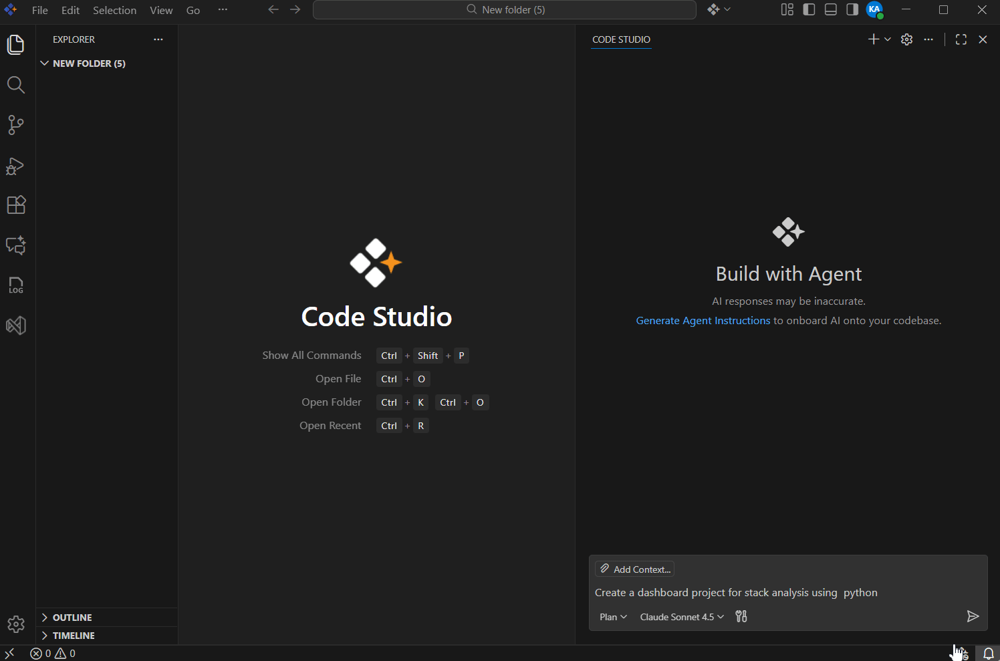

# Plan Mode

## Feature Overview

The Plan Agent is a powerful feature in Syncfusion Code Studio that helps you create detailed implementation plans before writing code. It analyzes your task, breaks it down into clear steps, and identifies any questions that need clarification without making code changes until you approve.

## Use Cases

Use the Plan Agent when you need to:
* Plan complex features or refactoring efforts
* Understand a task thoroughly before implementing it
* Break down large projects into actionable steps
* Design architecture for new features or components
* Validate requirements and identify potential issues early

## Prerequisites

Before you start, make sure you have:
* Syncfusion Code Studio is installed and configured on your system. If you have not yet downloaded Code Studio, refer to the [Syncfusion Code Studio Install and Configure](https://help.syncfusion.com/code-studio/getting-started/install-and-configuration)

## Getting Started with the Plan Feature

### Step 1: Open Chat

* Open the Chat view by pressing **Ctrl+Alt+I** and select **Plan** from the agent's dropdown.

    


### Step 2: Describe Your Task

* Type a clear description of what you want to accomplish.

    **Example:**
    ```
    Create a dashboard project for stack analysis using python
    ```
    

### Step 3: Review the Plan

The Plan Agent will show you:
* Summary of the task
* Step-by-step breakdown
* Questions that need answers

### Step 4: Refine (Optional)

* Provide feedback or ask questions and adjust the plan until it meets your requirements.

    
    

### Step 5: Implement or Save the plan

* Choose one of the following options:

    

#### Option A: Start Implementation

* Select **Start Implementation** button
* The command will appear in the chat box and execute automatically
* The mode will automatically switch to **Agent Mode** for execute your plan.

    **Note:** For more information, refer to the [Syncfusion Code Studio Agent Mode](https://help.syncfusion.com/code-studio/features/agent)

    

#### Option B: Open in Editor

* Select the Open in Editor button.
* The plan details will open in a new editor window.

* Review the plan, clarify details, and make iterations as needed.

* Choose Save as Prompt File.

* The file will be stored in your workspace or globally for future use.

    

## Related Features

### Agent Mode

* Executes the approved plan with AI-powered code generation
* Automatically activated after plan approval

    **Note:** For more information on agent mode features, visit the [Syncfusion Code Studio Agent Mode](https://help.syncfusion.com/code-studio/features/agent).

### Ask Mode

* Ask is optimized for answering questions about your codebase, coding, and general technology concepts
* Use Ask when you want to understand how something works, explore ideas, or get help with coding tasks

    **Note:** For more information on ask mode features, visit the [Syncfusion Code Studio Ask Mode](https://help.syncfusion.com/code-studio/features/ask).
