# Project Manager

## Overview

Project Manager is a built-in extension in Syncfusion Code Studio that helps you build software in a structured, step-by-step way with AI assistance. Instead of asking the agent to do everything at once, it breaks your work into clear stages such as defining requirements, planning tasks, writing code, and reviewing results, so nothing gets missed.

You describe what you want to build, and Project Manager figures out how much process is needed based on the type and complexity of your task. Simple fixes get a lightweight flow. Bigger or riskier changes get more review steps.

## Use Cases

Use Project Manager when you need to:

- Set up a new or existing project so the agent understands your codebase
- Start a guided workflow for a feature, bug fix, refactor, or security change
- Install plugins to give the agent expertise in specific frameworks or libraries
- Refresh project knowledge after making significant changes to your codebase
- Look back at completed or cancelled tasks and the artifacts they produced
- Control how thorough the workflow should be and who approves each step

## Getting Started with Project Manager

### Step 1: Open Project Manager

Click the **Settings** (gear) icon at the top of the Code Studio panel and select **Project Manager** from the dropdown menu.

 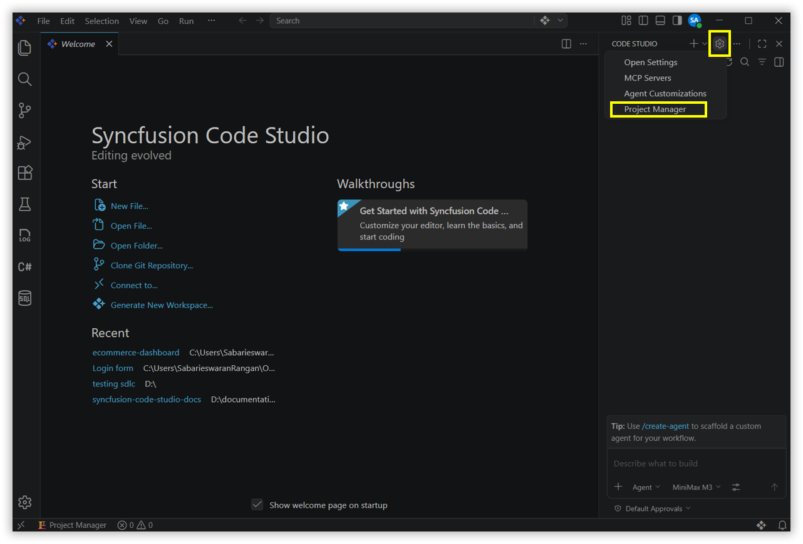

### Step 2: Open a Folder

Project Manager needs a workspace folder to store your workflow state and project files. If no folder is open, it will prompt you to open one before you can continue.

- Click **Open Folder** to browse for a project folder on your machine.
- Click **Open Recent** to quickly reopen a folder or workspace you used before.

> **Note:** If you already have a folder open in your workspace, this screen will not appear. Project Manager will skip directly to the Set Up Your Project screen.

 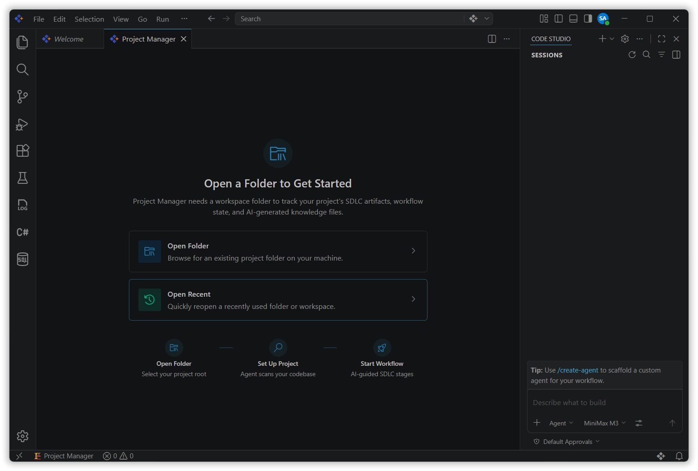

### Step 3: Set Up Your Project

Once a folder is open, Project Manager shows the **Welcome** screen if your project has not been configured yet. Choose how to set it up:

- **Start New Project:** Use this when the folder is empty and you want to build something from scratch. Describe what you want to build and the agent scaffolds the project structure and generates knowledge files for you. Once the setup is complete, the agent provides a suggested objective that you can paste directly into the **New Task** text box to get started.
- **Set Up Existing Project:** Use this when you already have code in the folder. The agent scans your codebase and automatically detects your tech stack, coding conventions, architecture, and boundaries.

 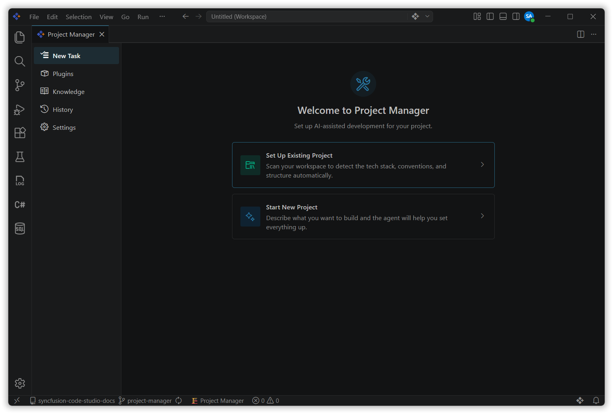

When you select **Start New Project**, a form appears with two fields: a required **Project Name** field and an optional **What are you building?** field where you can describe your app. The more detail you provide, the fewer questions the agent will need to ask. Click **Create Project** to let the agent scaffold the structure and generate the knowledge files.

 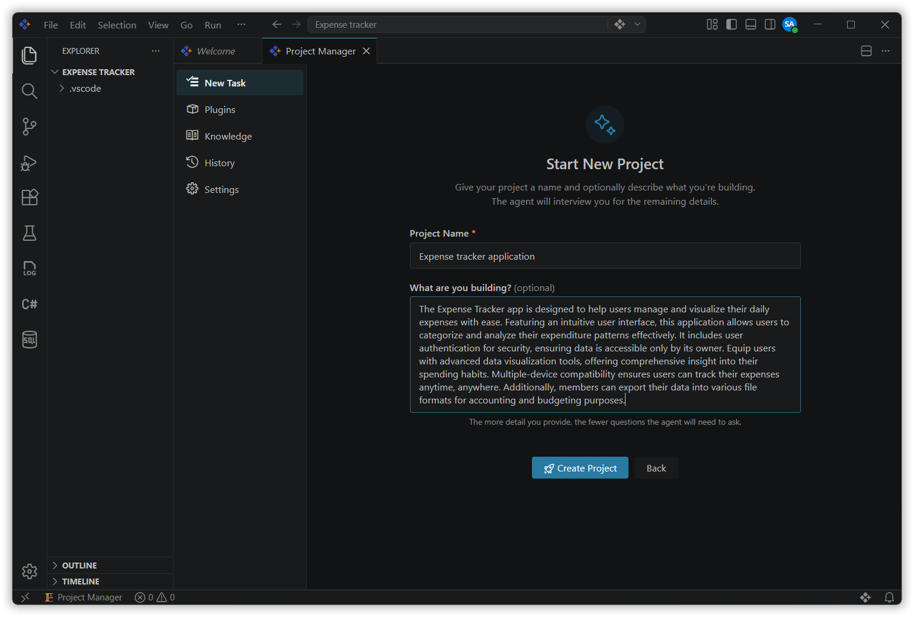

### Step 4: Start a Task

After setup, go to the **New Task** tab and describe your objective in the text area. If you used **Start New Project** in the previous step, the agent provides a ready-to-use objective at the end of setup — paste it into the text box to continue. Then click **Start Task**. The agent looks at your request and decides how many steps are needed based on how complex or risky the task is, then works through each stage on its own.

**Tips for writing a good objective:**
- Be specific about the feature, bug, or change
- Mention relevant APIs, libraries, or constraints
- Include acceptance criteria when possible

*Example AI provided prompt:* `Scaffold the Vite + React project with Syncfusion, set up routing, localStorage utility, and build the Dashboard page with a category pie chart and monthly bar chart using mock data.`

When your objective is long enough, a **Plugin Selector** appears so you can add plugins before the agent starts. To add a plugin before using it in a task, see [Using Plugins in a Task](#using-plugins-in-a-task).

> **Note:** For more information on plugins and how to install them, refer to the [Plugins](#plugins) section.

 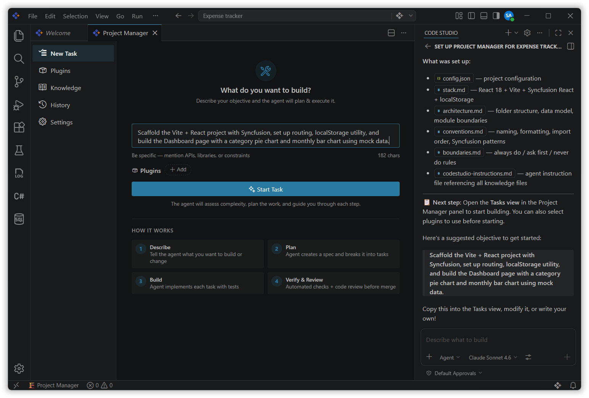

Once the task starts, the agent moves through a series of stages automatically. Each stage has a clear purpose, and the agent saves a document at the end of each one so you can see exactly what was decided or done. The most common workflow runs through five stages: **Define → Plan → Build → Verify → Review**. For Thorough and Maximum process levels, a sixth **Ship** stage is added after Review to run a pre-launch checklist before the task is marked done.

At the start of each stage, a **Send to Agent** button appears. Clicking it triggers the agent to begin its work for that stage.

Once the agent finishes, you will see the following action buttons at the bottom of the stage:

- **Approve & Continue** — confirms the stage is done and moves the workflow to the next stage. This button is available on every stage once the agent has finished its work.
- **Regenerate** — asks the agent to redo the current stage. A text box appears so you can describe what to change before the agent tries again.

#### Define

In this stage, the agent figures out exactly what needs to be built before writing any code.

- The agent asks you a few short questions to make sure it understands your goal.
- It writes a short document called a **spec** that describes what will be built, what files will be changed, and what counts as done.
- Once the spec is ready, it is shown to you for review.
- Click **Approve & Continue** to approve the spec and move to the Plan stage, where a **Send to Agent** button appears so the agent can start creating the task list.
- Click **Regenerate** to ask the agent to revise the spec before moving on.

 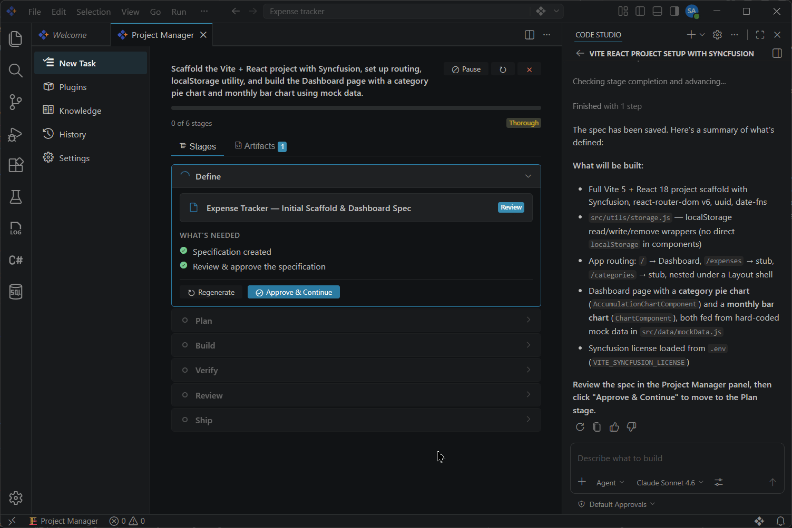

#### Plan

In this stage, the agent breaks the spec down into a list of smaller tasks.

- The agent reads the approved spec and creates a step-by-step task list.
- Each task is small enough to build and test on its own.
- The tasks are ordered so that the most important or risky ones come first.
- When the list is ready, it is shown to you for review.
- Click **Approve & Continue** to approve the plan and move to the Build stage, where the agent starts writing the code.
- Click **Regenerate** to describe what you want changed and have the agent rewrite the plan.

 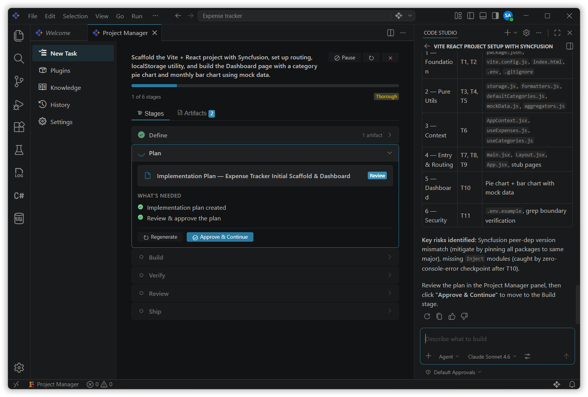

#### Build

In this stage, the agent works through the task list and writes the code.

- The agent takes one task at a time, writes the code for it, checks that it works, and then moves to the next task.
- It keeps going until all tasks in the plan are done.
- All changes are saved directly to your project files.
- A progress checklist is shown so you can follow along as each task is completed.
- Once all tasks are done, click **Approve & Continue** to move to the Verify stage.
- Click **Regenerate** to ask the agent to redo the build with updated instructions.

 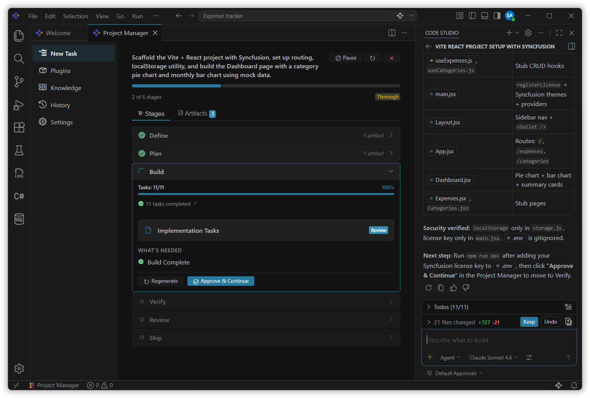

#### Verify

In this stage, the agent checks that everything it built actually works correctly.

- The agent runs all the tests in your project, checks that the code compiles without errors, and looks for any code style issues.
- It saves a short **report** that summarizes what passed and what failed.
- If something fails, the agent tries to fix it automatically. 
- Once the report looks good, click **Approve & Continue** to move to the Review stage.

 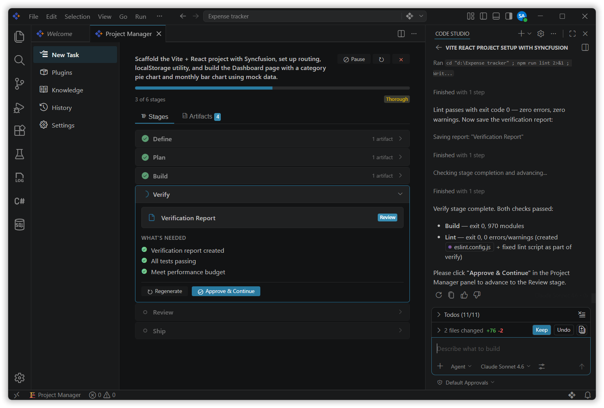

#### Review

In this stage, the agent reads through all the code it wrote and checks the quality.

- The agent looks at the changed code from several angles — whether it does what the spec said, whether it is easy to read and maintain, whether it could cause any security problems, and whether the important cases are covered by tests.
- The agent saves a **review document** with all its findings and presents it to you.
- Any must-fix issues need to be resolved before the task can be marked as done.
- Once you are happy with the review, click **Approve & Continue** to complete the task.

 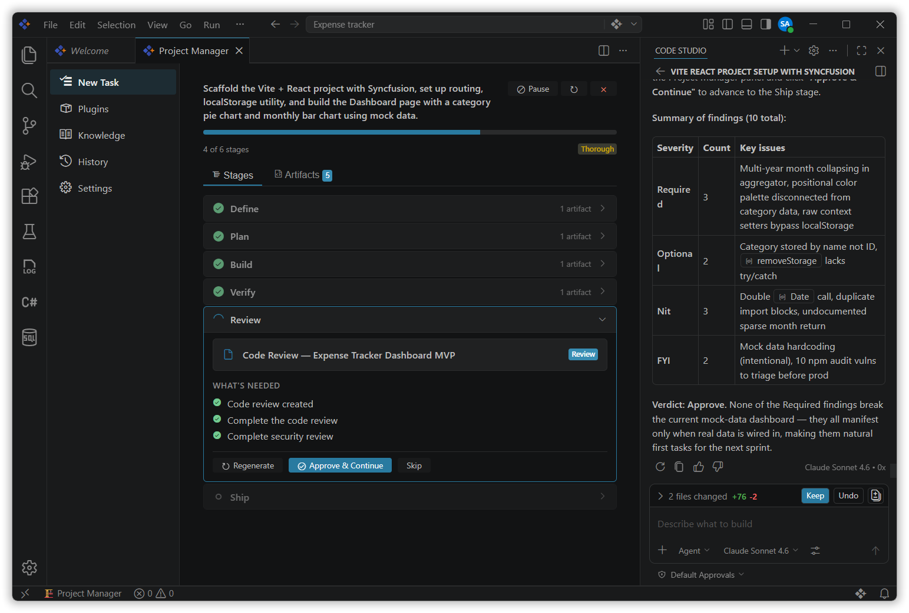

#### Ship

In this stage, the agent runs through a pre-launch checklist to make sure the change is ready to go out.

- The agent checks that all must-fix issues from the Review stage have been resolved.
- It verifies that documentation, release notes, and any deployment steps are in order.
- A **ship checklist report** is saved summarizing the readiness status.
- Once the checklist is complete, click **Approve & Continue** to finish the task.

Once all stages are complete, the task is marked as done. You can view it along with all the artifacts produced during the workflow in the [History](#history) tab.

 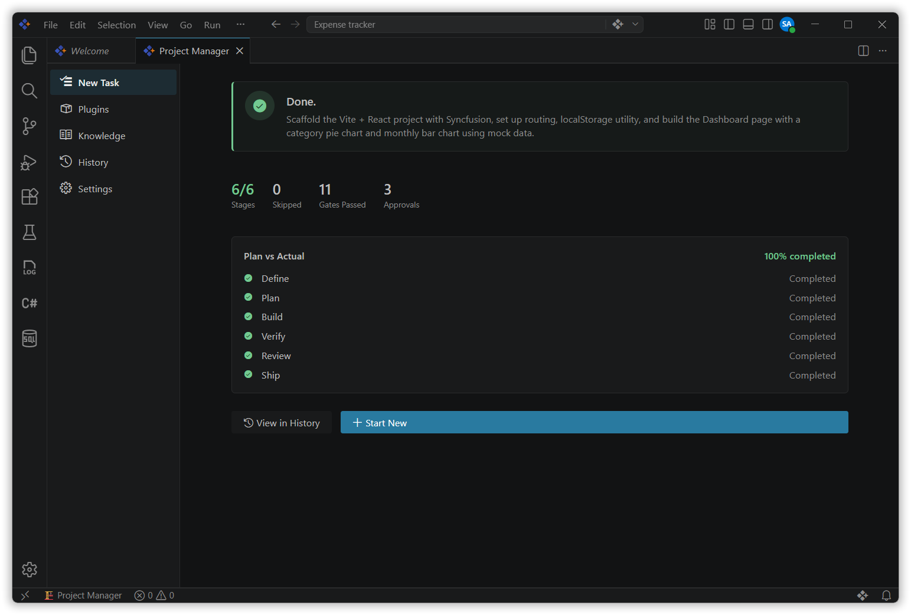

---

## Plugins

The **Plugins** tab is the Project Manager plugin marketplace. A plugin can bundle any combination of skills, custom agents, and MCP servers that work together for a specific framework or domain. Installing a plugin gives the agent the right tools and knowledge to work effectively in your project.

 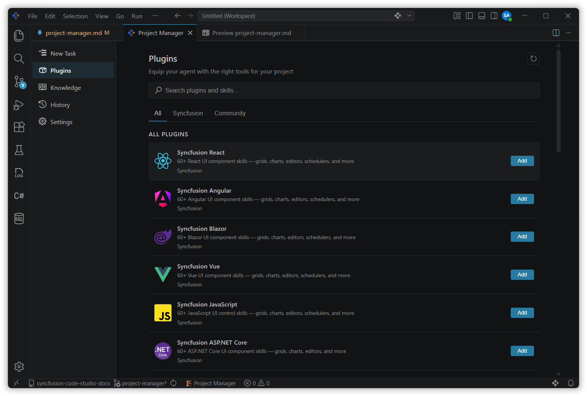

### Plugin Categories

| Tab | Description |
| --- | --- |
| **All** | Shows every available plugin across all categories |
| **Syncfusion** | Official Syncfusion plugins (React, Angular, Blazor, etc.) |
| **Community** | Community-contributed plugins |

### Installing a Plugin

**Step 1:** Browse or search for a plugin in the marketplace.

**Step 2:** Click **Add** next to the plugin you want to install.

**Step 3:** The plugin downloads and becomes available immediately for use in new tasks.

 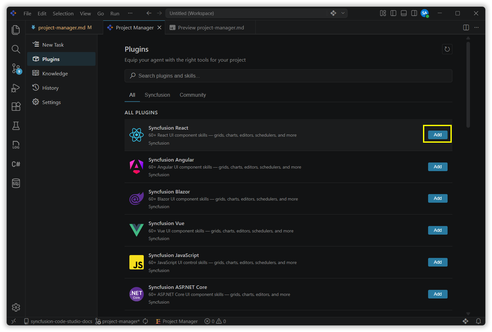

### Using Plugins in a Task

When starting a new task in the **New Task** tab, a **Plugins** selector appears below the text area once your objective is long enough. It lists all the plugins you have installed and lets you choose which ones the agent should use for that specific task.

- Use the **Search installed plugins** box to quickly find a plugin by name.
- Click the **+** button next to a plugin to add it to the current task.
- You can add more than one plugin if your task spans multiple frameworks or domains.
- The selected plugins load their skills, agents, and MCP servers into the agent's context before the task starts.

> **Note:** Click the **Refresh** button (top-right of the Plugins tab) to reload the plugin registry and check for updates.

 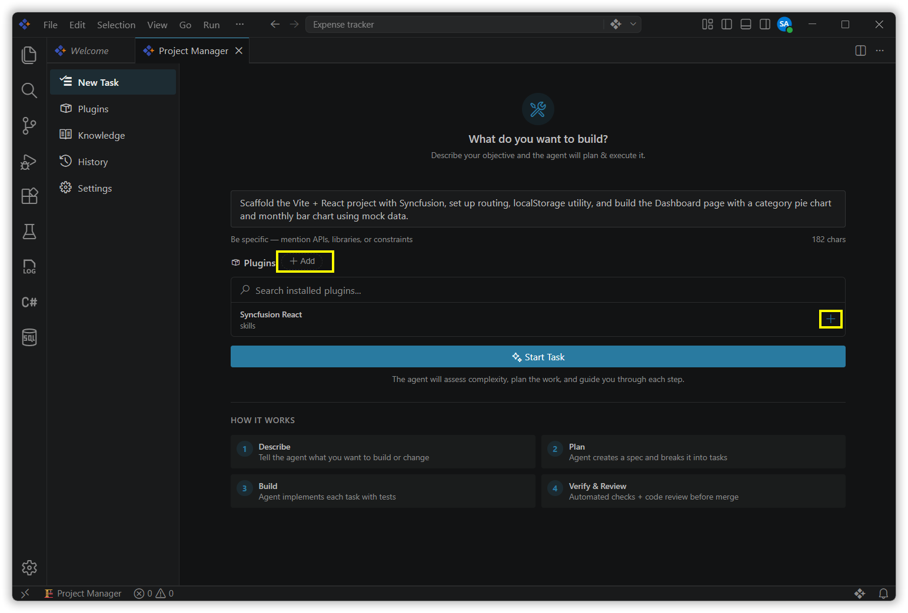

---

## Knowledge

The **Knowledge** tab shows the AI-generated knowledge files for the current project. These files help the agent understand your project before making any changes.

### Knowledge Files

| File | Contents |
| --- | --- |
| `architecture.md` | Module boundaries, data flow, layered structure, and key design decisions |
| `stack.md` | Languages, frameworks, dependencies, build tools, and npm scripts |
| `conventions.md` | Naming, formatting, file organization, testing patterns, and documentation style |
| `boundaries.md` | Always-do / Ask-first / Never-do rules for the agent in this project |
| `codestudio-instructions.md` | Project-specific agent instructions used in every workflow |

 

### Generating Knowledge

If no knowledge files exist yet, click **Generate Knowledge**. The agent scans your workspace and writes all five files to `.codestudio/knowledge/`.

 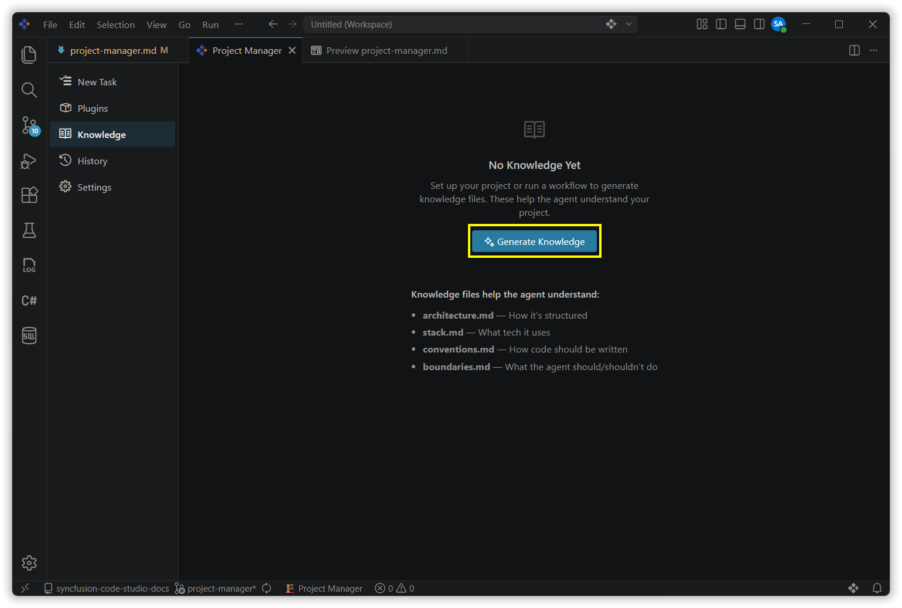

If knowledge files already exist, a **Refresh** button lets you regenerate them. Use this after significant changes to the project, for example, after adding a new framework, restructuring folders, or updating major dependencies.

 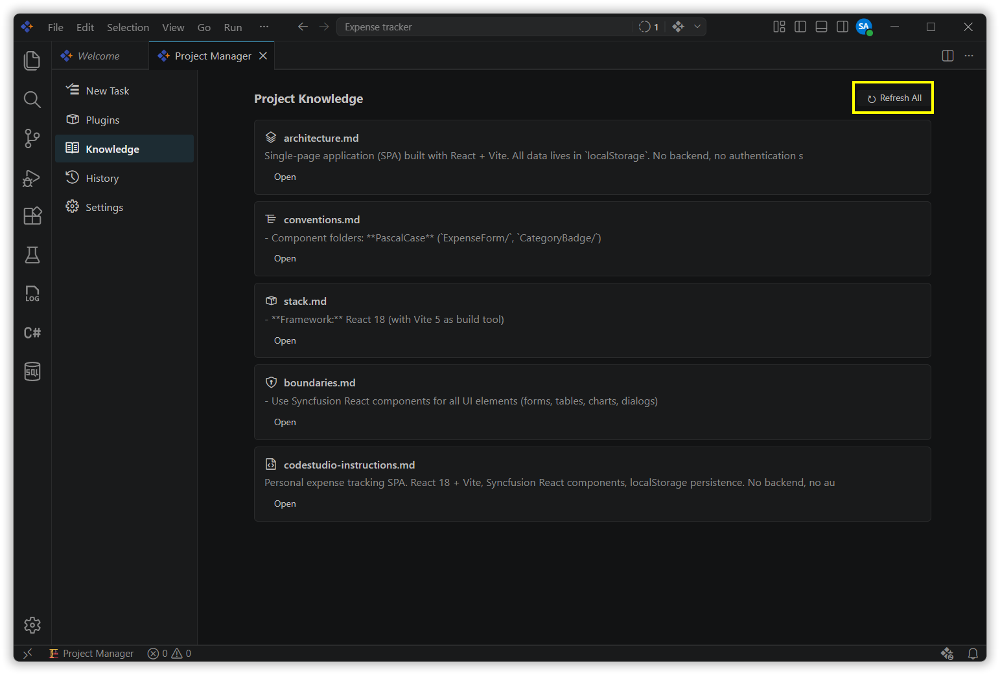
---

## History

The **History** tab shows a searchable list of all tasks completed or cancelled in the current workspace.

### History Table

Each row in the history table shows:

| Column | Description |
| --- | --- |
| **Task** | The objective entered when the task was started |
| **Type** | Work type: feature, bugfix, refactor, infrastructure, documentation, or security |
| **Level** | The process level used: Quick, Standard, Thorough, or Maximum |
| **Stages** | How many stages were completed out of the total (e.g., `3/3`) |
| **Completed** | The date the task was finished or cancelled |

 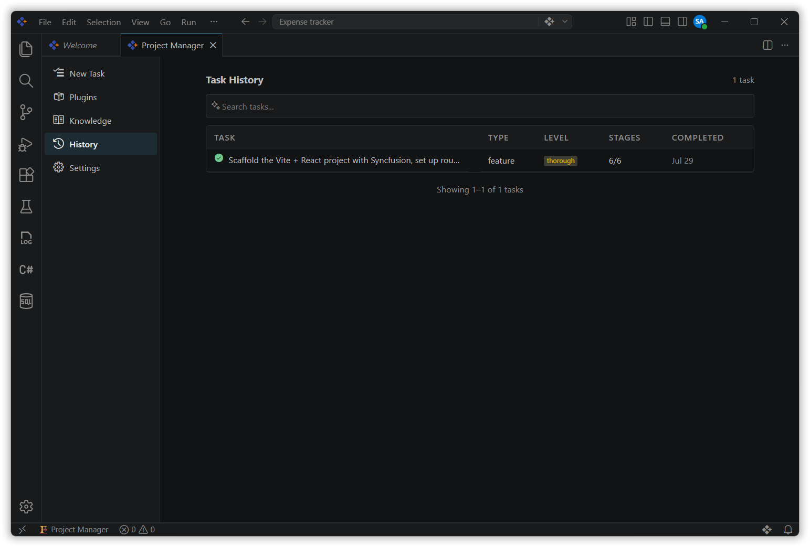

### Task Detail View

Click any row to open the **Task Detail View**, which shows:

- The full workflow definition used for that task
- All artifacts produced (spec, plan, report, review)
- Stage-by-stage status and quality gate results

Use the **Back** button to return to the history list.

 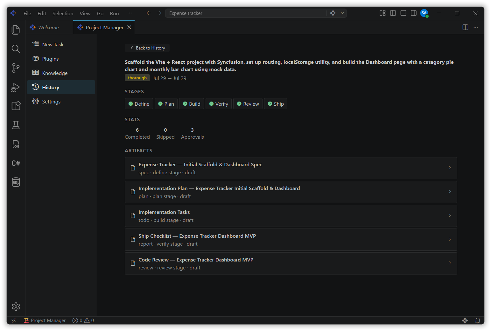

---

## Settings

The **Settings** tab provides three configuration options that control how Project Manager behaves for all future tasks.

 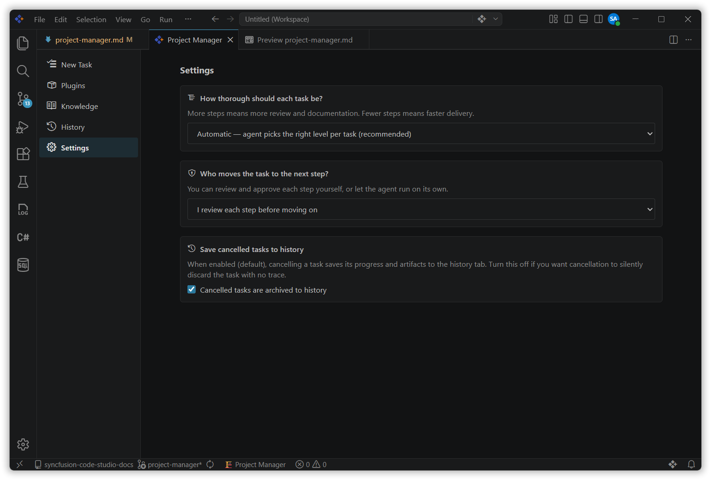

### How Thorough Should Each Task Be?

Controls the default process level applied to new tasks.

| Option | Description |
| --- | --- |
| **Automatic** *(recommended)* | The agent picks the right process level per task based on complexity and risk signals |
| **Quick** | Always use Quick: Plan, Build, and Verify (3 stages). |
| **Standard** | Always use Standard: Define, Plan, Build, Verify, and Review (5 stages). |
| **Thorough** | Always use Thorough: all stages including the Ship checklist (6 stages). |
| **Maximum** | Always use Maximum: all stages with extra safety gates. |

### Who Moves the Task to the Next Step?

Controls whether you review each stage or let the agent advance automatically.

| Option | Description |
| --- | --- |
| **I review each step before moving on** | Project Manager pauses at every stage boundary and waits for your approval |
| **Agent runs automatically** | The agent advances through stages on its own; you review only at the end |

### Save Cancelled Tasks to History

When enabled (the default), cancelling a task saves its progress and any generated artifacts to the **History** tab. Disable this option if you want cancelled tasks to be permanently discarded with no trace.

---

## Related Features

- [Agent Mode](/code-studio/features/agent): The AI engine that executes each workflow stage autonomously.
- [Plan Mode](/code-studio/features/plan): Use Plan Mode to design and refine an implementation plan before the agent writes code.
- [Custom Instructions](/code-studio/customization/custom-instructions): Add project-level instructions that the agent reads on every task.
- [Skills](/code-studio/customization/skills): Learn how individual skills are structured and how to author your own.
