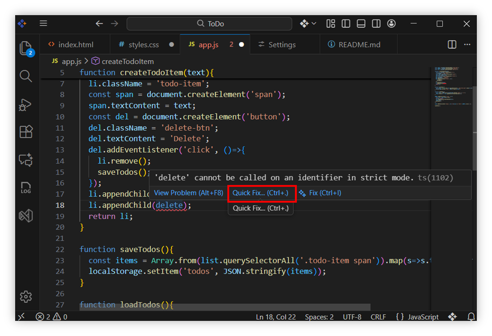
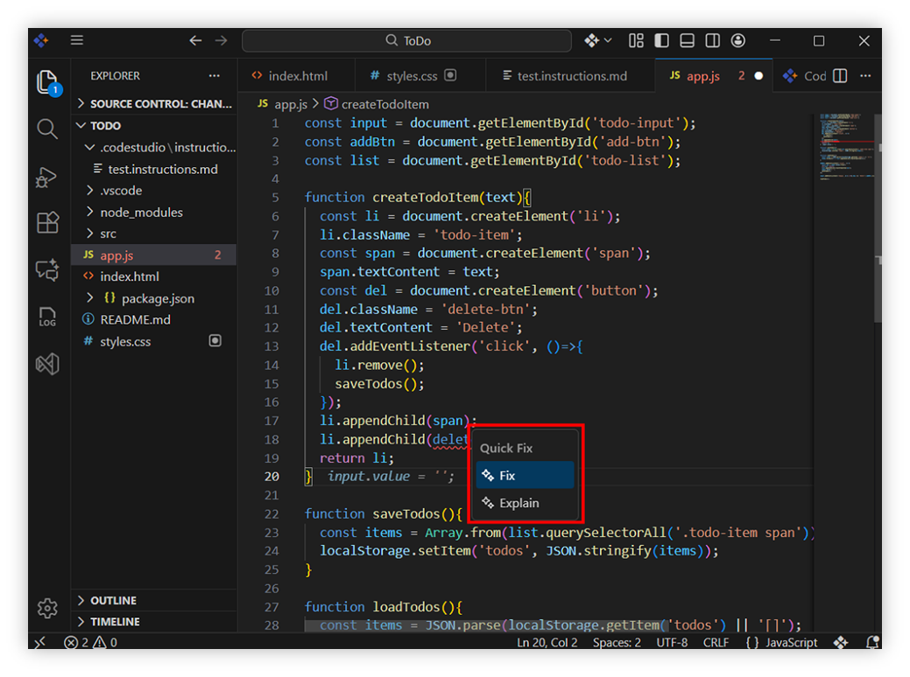
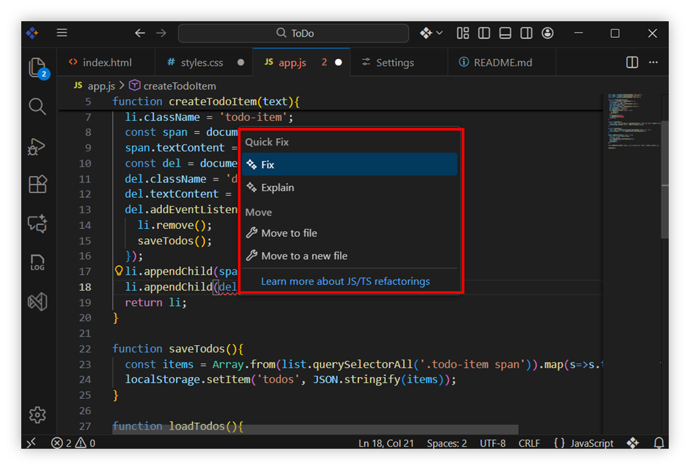
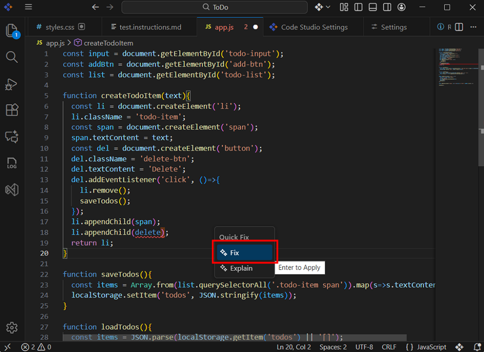
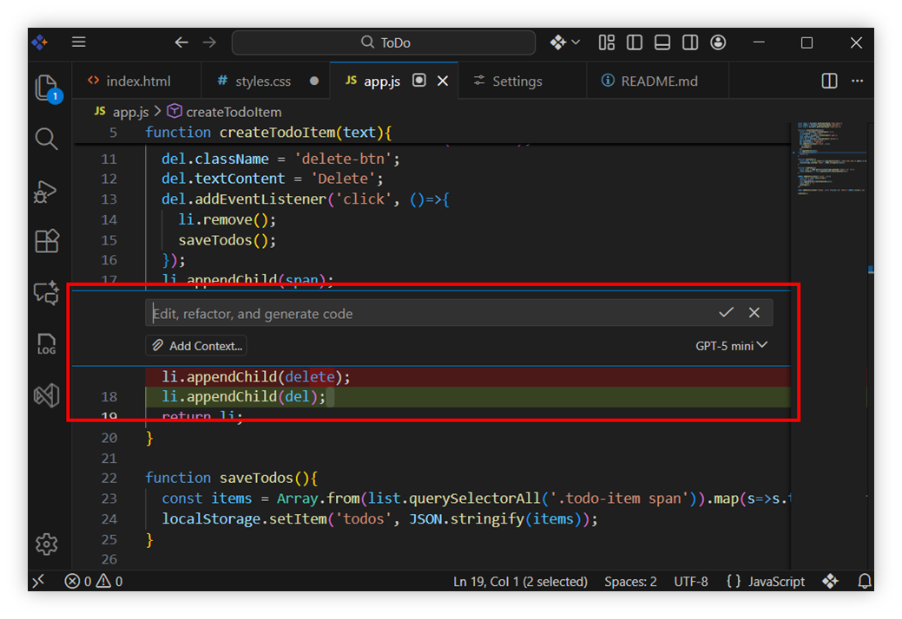
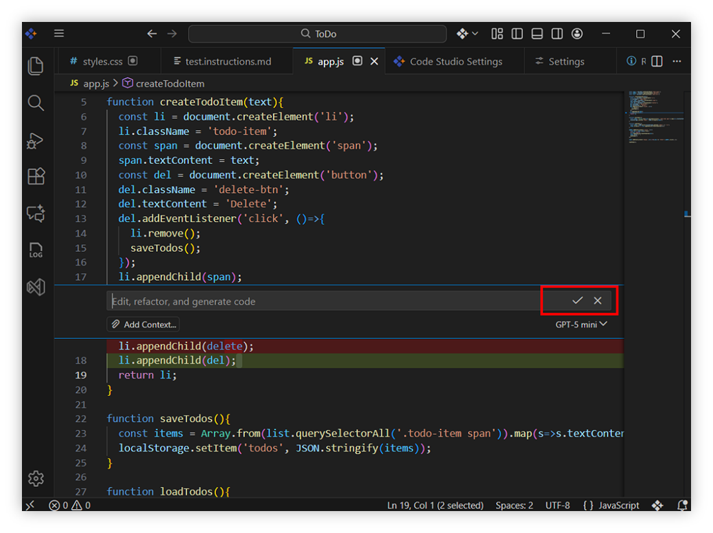
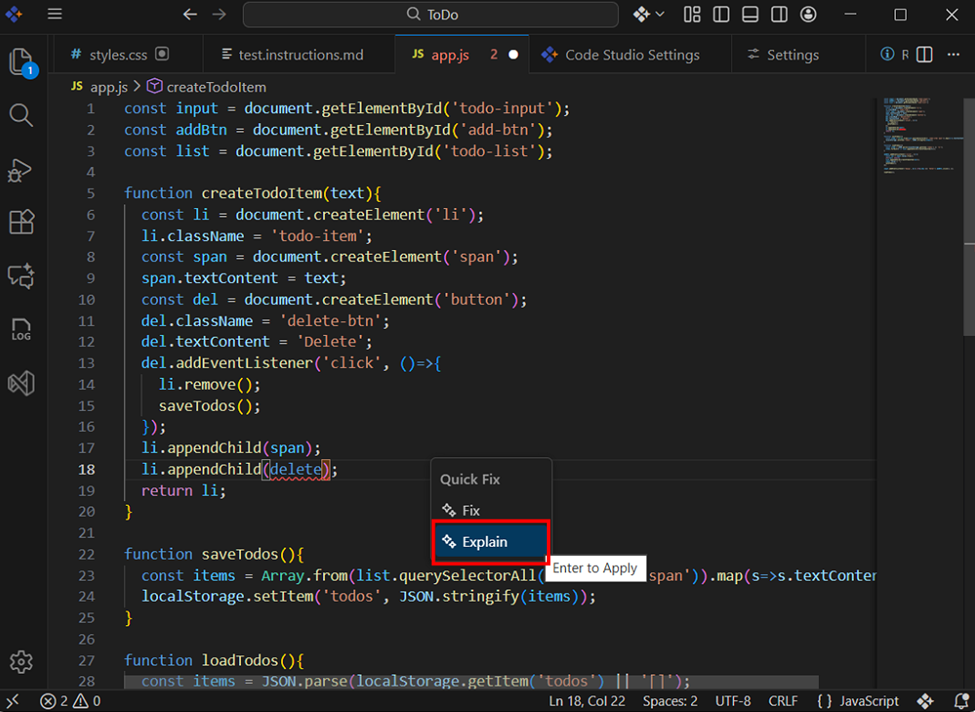
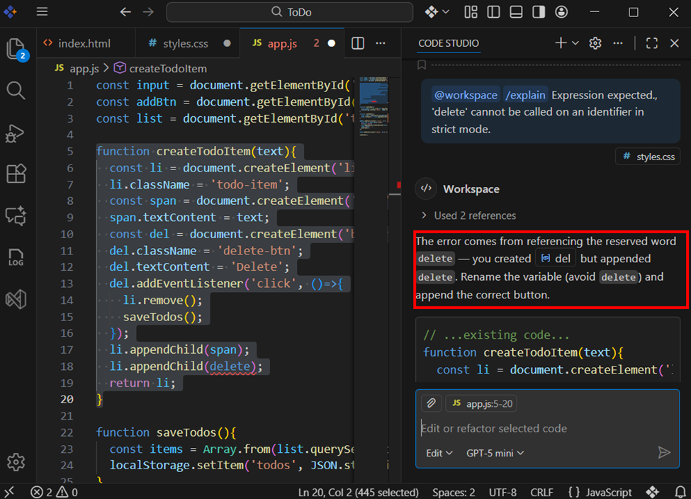
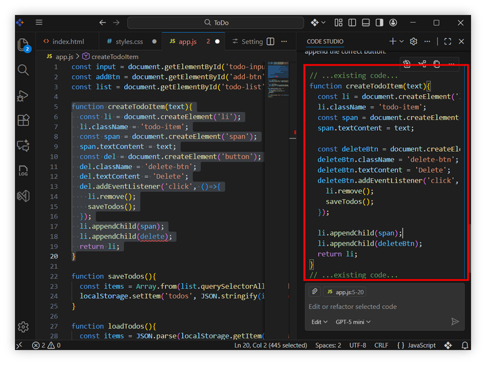

# Quick Fix

Quick Fix is an intelligent, AI‑assisted error‑resolution feature built directly into your code editor. Whenever your code contains an error, warning, or suggestion, Quick Fix helps you correct it instantly—without needing to search online, rewrite code manually, or understand every detail of the error yourself.

## Why Quick Fix?

- Quick Fix exists to help developers resolve coding errors **quickly, accurately, and with minimal interruption** to their workflow.  
- It is designed to make debugging faster, easier, and less disruptive by providing targeted, **context‑aware solutions** right where you need them.

## Key Benefits

**Instant Error Detection** - The moment an error appears, Quick Fix becomes available. No need to open logs or manually track down the issue.

**Inline Fix Preview** - Quick Fix shows exactly what will change before updating your file—**you stay in control**.

**Context‑Aware AI Suggestions** - It understands your current file, the surrounding code, and coding patterns to offer accurate, relevant fixes.

## How Quick Fix Works

Quick Fix can be triggered in two ways:

**1. Hover** - Move your mouse over the error underline. A tooltip appears with the **“Quick Fix”** option.

Click **Quick Fix** to open the context menu.

**2. Shortcut** - Place your cursor on the error and press **"Ctrl + ."** (Control + Period)

This instantly brings up the Quick Fix actions.

## Use Context Options

### **1. Fix**
Use **Fix** when you want a quick, focused correction in place.

**What happens on selecting Fix?**

- An inline suggestion appears near the error, showing the **proposed code changes**.
- You can review the diff before applying.

#### Your choices:

- ✔ **Apply** — Accept the suggestion and update your code immediately.  
- ✖ **Close** — Dismiss the suggestion (no changes applied).  
- **Give prompt** — Provide additional instructions (e.g., “keep variable names unchanged”, “use async/await”) to refine the fix.

### **2. Expand**
Use **Expand** when you want a deeper explanation or a more comprehensive fix.

**What happens on selecting Expand?**

The AI opens the chat panel, runs a prompt tailored to the error, and:

- Explains the likely **root cause**  
- Shows a **corrected code snippet**  
- Describes why the fix works, including **trade‑offs or impacts**

#### How to proceed?

- Review the explanation and proposed code  
- Copy/paste or apply the recommended changes  

## Best Practices

1. **Use Fix for small, quick errors**  - If it’s a typo, missing import, or wrong parameter, use **Fix** to stay in flow.

2. **Use Expand for learning or complex issues**   - When the error is confusing or affects multiple files, choose **Expand** for a full explanation.

3. **Always review the suggested diff**   - Ensure the changes match your expectations—especially in collaborative or critical files.

