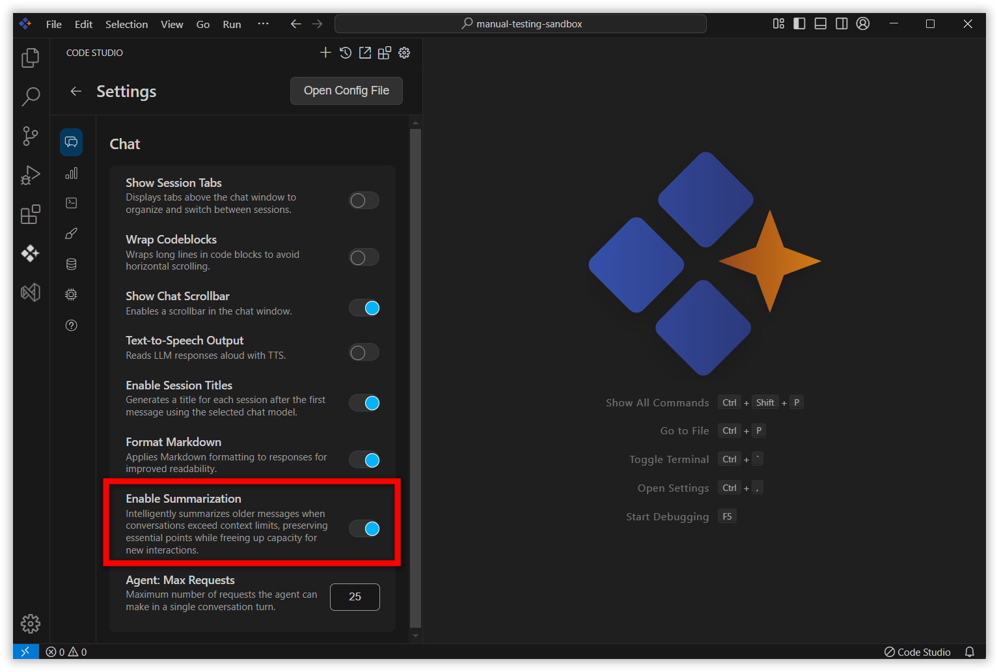

# Summarization 

## Purpose
The Summarization feature ensures that, as conversations grow and exceed the AI’s model context window, older messages are intelligently summarized. This process preserves the essential points and technical history while freeing up capacity for new interactions.

## When to Use
- When coding sessions or AI-assisted conversations extend over many messages and risk exceeding the AI’s context window.
- When you want Code Studio to remember only the crucial points, requirements, and decisions, while freeing up space for ongoing development chats.

## Prerequisites
 - Syncfusion Code Studio open with a workspace.
 - Summarization feature enabled in settings (can be toggled on/off based on user preference)

## Steps 
### 1.Enable/Disable Summarization:
- Users can toggle summarization based on their project needs and preferences.
- Navigate to the settings and you can toggle on/off summarization.

### 2.Automatic Monitoring:
-  Code Studio tracks the length of each conversation and the usage of context tokens.

### 3.Triggering Summarization: 
- Once the chat approaches the context window limit, the system automatically summarizes earlier messages.
- Only essential details — technical decisions, requirements, and actions taken — are retained in concise summary format.
- By compressing older conversation content, Code Studio ensures space for current and future interactions.

## Validation
- Ensure the summarization should happen only when the context length exceeds over 50%.
- Ensure the summarization should not happen after turning off in settings.

## Troubleshooting
-**Summarization Not Occurring**: Confirm that the feature is enabled in Code Studio settings.Ensure the mode is agent mode, as summarization does not occur in chat mode.
