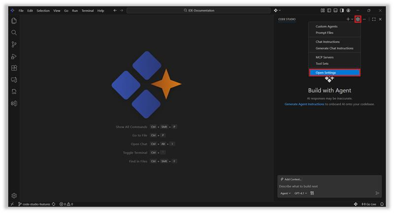
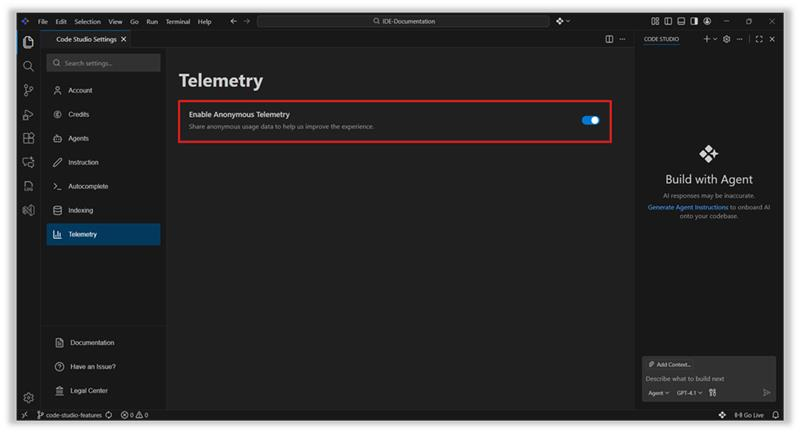

# Telemetry

Syncfusion Code Studio collects anonymous usage data to improve product quality and user experience. This data helps the development team understand feature usage, identify performance issues, and prioritize enhancements.

Telemetry collection is optional and can be disabled at any time by the user.

## Analytics Platform

Telemetry data is collected and stored using [PostHog](https://posthog.com/), an open-source product analytics platform.

## Data Collection Policy

Syncfusion Code Studio collects a limited set of **anonymous usage metrics** to help improve product performance and user experience. We ensure that **no personal data or user-generated content** (such as code, prompts, or files) is ever collected or stored.

## Collected Data Types

The following categories of data are collected:

- **System Configurations**: Information about your operating system and development environment.
- **Model and Command**: The specific AI model and command used.
- **Token Usage**: The number of tokens generated during interactions.
- **Autocomplete Feedback**: Whether you accepted or rejected the suggestions provided.

> **Note:** No user-generated content (e.g., code, files, or personal data) is collected.

## Disabling Telemetry

Telemetry can be disabled through the application settings at any time.

### Steps to Disable Telemetry:

1. Open **Settings** in Syncfusion Code Studio.  

2. Navigate to the User Settings page.
3. Locate the option **"Enable Anonymous Telemetry”** and toggle it **off**.
Changes take effect immediately and can be reversed at any time.

