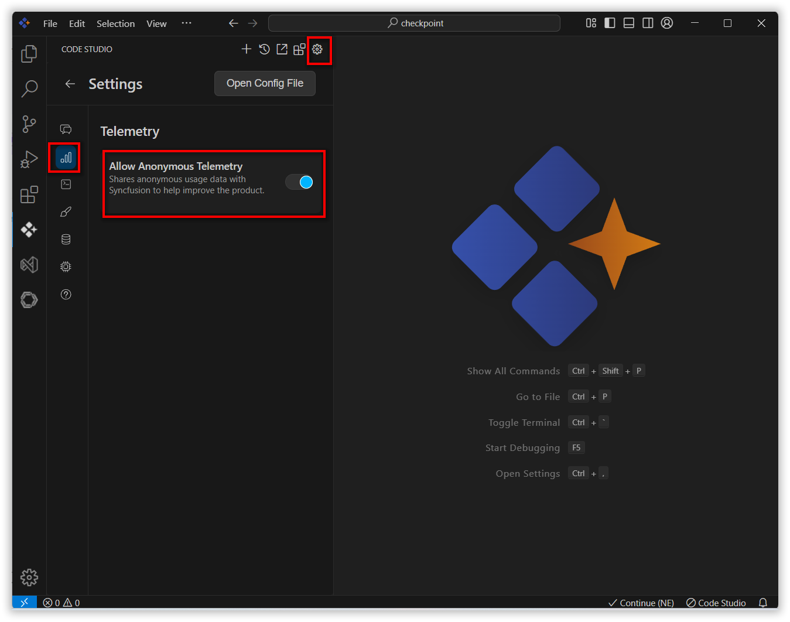

# Telemetry

## Purpose
Syncfusion Code Studio collects anonymous usage data to improve product quality and user experience. This data helps the development team understand feature usage, identify performance issues, and prioritize enhancements.

## When to Use
- You want to help improve Code Studio performance and user experience by sharing anonymous usage metrics.  
- You’re okay with event data being sent to Syncfusion’s internal analytics for reliability, performance tuning, and feature prioritization.  
- You need a clear privacy toggle to opt in or out at any time.

## Prerequisites
- Syncfusion Code Studio installed with default telemetry settings (anonymous collection is on by default and can be turned off any time).

## Steps

### 1. Collected Data Types When Enabled
Syncfusion Code Studio collects a limited set of anonymous usage metrics to help improve product performance and user experience. No personal data or user-generated content (such as code, prompts, or files) is ever collected or stored.

- **System Configurations**: Information about your operating system and development environment  
- **Model and Command**: The specific AI model and command used  
- **Token Usage**: The number of tokens generated during interactions  
- **Autocomplete Feedback**: Whether you accepted or rejected the suggestions provided  
- **User account details when logged-in**: User's login name and email will be collected  
> **Note**: No user-generated content (e.g., code, prompts, files) is collected.

### 2. Privacy Toggles
- To disable telemetry:  
  Go to **Settings > Allow Anonymous Telemetry** → toggle off.  
- Changes take effect immediately and can be reversed any time.  

## Validation
- Ensure the telemetry toggle button in settings by turn off and turn on.

## Troubleshooting
- **Unsure if telemetry is enabled**: open **Settings** and turn on **Allow Anonymous Telemetry**.  
- **Concern about content capture**: telemetry never includes code, prompts, or files. If you still prefer zero event capture, keep telemetry disabled.
