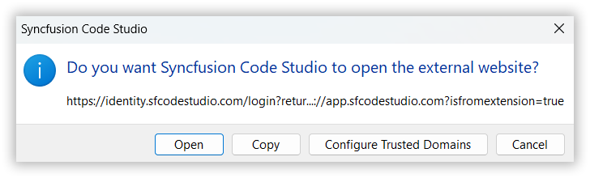
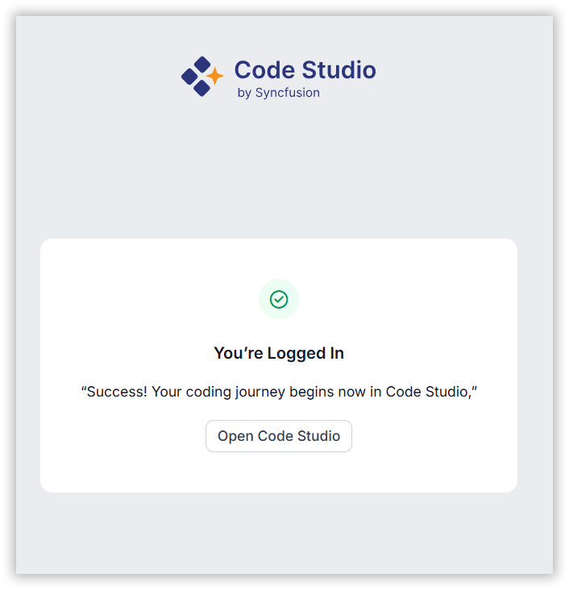
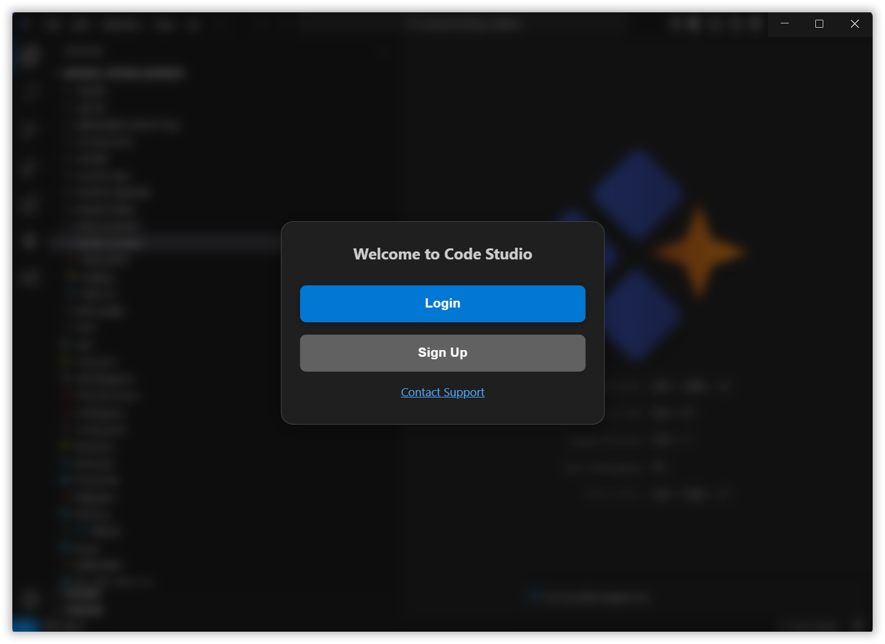

# Code Studio Signing In

Signing in connects you to powerful enterprise AI models for advanced code generation, analysis, and developer assistance. This guide will help you sign in step by step

## Step-by-Step Sign-In Guide

### Step 1: Open Code Studio
After installing Code Studio, you’ll land on a welcome page where you can:
- **Sign Up** to create a new account
- **Log In** if you already have an account
- **Skip & Continue** to use Code Studio purely as a code editor without using the enterprise models. You may also connect your own local models by supplying your own API key (**BYOK**).

### Step 2: Open Authentication page
When you click on the login or signup button, a dialog box will appear asking for your permission to open an external website.

- Click **"Open"** to continue to the authentication page.

### Step 3: Choose Your Sign-In Method
You will be redirected to the official Code Studio sign-in page in your web browser. You have three convenient options to sign in:  
• **Sign in with Microsoft:** Use your personal, work, or school Microsoft account.
• **Sign in with GitHub:** Use your GitHub account.
• **Sign in with Syncfusion:** Use your existing Syncfusion account.

**Note:** If you don't have an account, you can create one by clicking "**SIGN UP**".

### Step 4: Confirm Login and Return to Code Studio
After successful authentication, you’ll see a confirmation screen.

- Click **"Open Code Studio"** to go back to the application.

### Step 5: Access Enterprise Models
You are now signed in. Your account info will be visible in Code Studio.
The chat panel will display the available **Enterprise Models** ready for you to use on your coding projects.

Now you can take full advantage of Code Studio’s AI tools.

## Using Code Studio Without Signing In

If you skip the sign-in, you can still hook up your own AI model by providing an API key in the chat model.

At any time, click the **Login** or **Sign Up** buttons in the top-right corner of the Code Studio window to:
- Switch to enterprise models
- View or update your account settings
