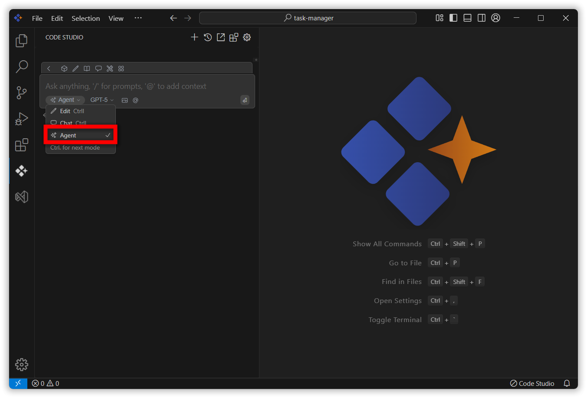
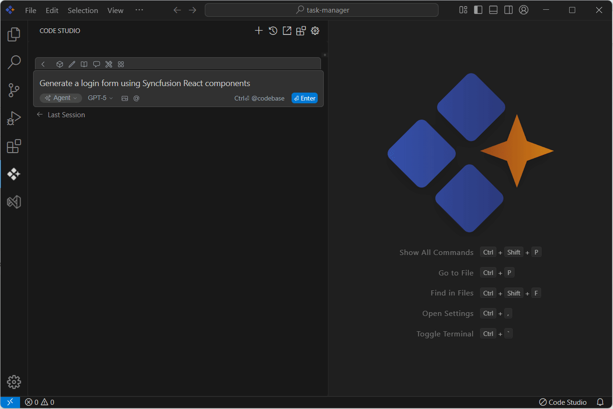

# Overview
Agent mode in Syncfusion Code Studio is a powerful AI assistant that autonomously explores your codebase, plans updates, and executes complex tasks with minimal input. This tutorial walks you through using Agent mode to refactor a module, with checkpoints and budget guardrails to ensure safe, trackable changes.

## Prerequisites
Before starting, make sure:

- Your project is open and contains a module ready for refactoring
- You understand how to switch to Agent mode using the mode selector below the chat input box
- You’re ready to approve tool usage when prompted

## What You’ll Build
By the end of this tutorial, you’ll have:

- Enabled Agent mode and configured guardrails
- Automatic code changes in the existing files and new file creation and tool usage
- Received a summary of all changes made

## Steps

### 1. Enable Agent Mode
- Open the chat input box in Code Studio.
- Use the mode selector to switch to **Agent mode**.
- Agent mode activates autonomous coding capabilities.

### 2. Run the Prompt
- Describe the refactor task in the chat (e.g., `"Generate a login form using Syncfusion React components"`).
- Agent will:
  - Understand your request
  - Explore the codebase
  - Plan changes
  - Request permission before using tools

 You’ll see a permission prompt before Agent uses any tool. Click **Continue** to approve or **Cancel** to deny.

### 3. Review Diffs
- Agent will present a diff view showing proposed changes.

### 4. Accept or Revert
- Use the chat buttons to approve or reject each change.
- Agent will proceed based on your input and adjust the plan if needed.

### 5. Summarize
- Once complete, Agent will provide a summary of all changes made.
- You’ll regain full control of the editor.

## Verify
To confirm success:

- Ensure Agent mode was activated and tool permissions were granted
- Review the final summary and verify that the intended module was refactored
- Check that all accepted changes are reflected in your codebase