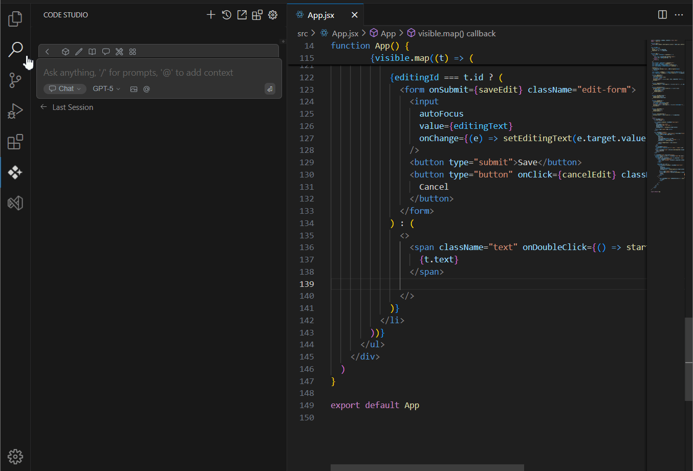

# Overview
In this guide, you’ll learn how to set up a workspace, connect a model, and use Chat + Autocomplete to improve your code. This is ideal for developers looking to streamline their workflow with inline AI assistance.

## Prerequisites
Before you begin, make sure you have:

- A repository cloned locally

## What You’ll Build
You’ll enhance an existing function using:

- Chat-based suggestions
- Inline edits powered by your connected LLM
- Context-aware autocomplete

## Steps
1. **Open your project folder in Code Studio**
2. **Connect a language model provider**
3. **Add context**  
   Choose a specific file or the entire codebase and ask for improvements, refactoring, or bug fixes.  
   The autocomplete will suggest the code based on the context.
4. **Verify the AI suggested code and apply the changes to your current file.**

## Verify
- Ensure the updated function behaves as intended
- Check for any new issues in the Problems panel or terminal output