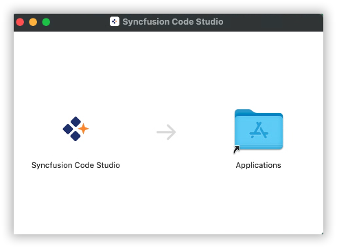
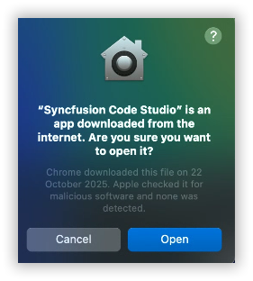
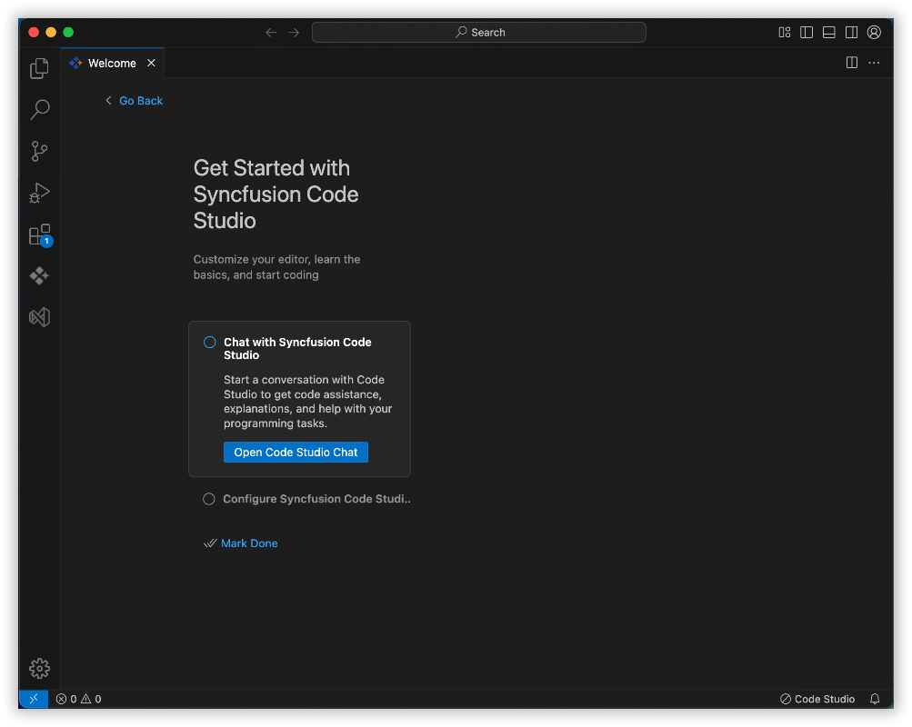
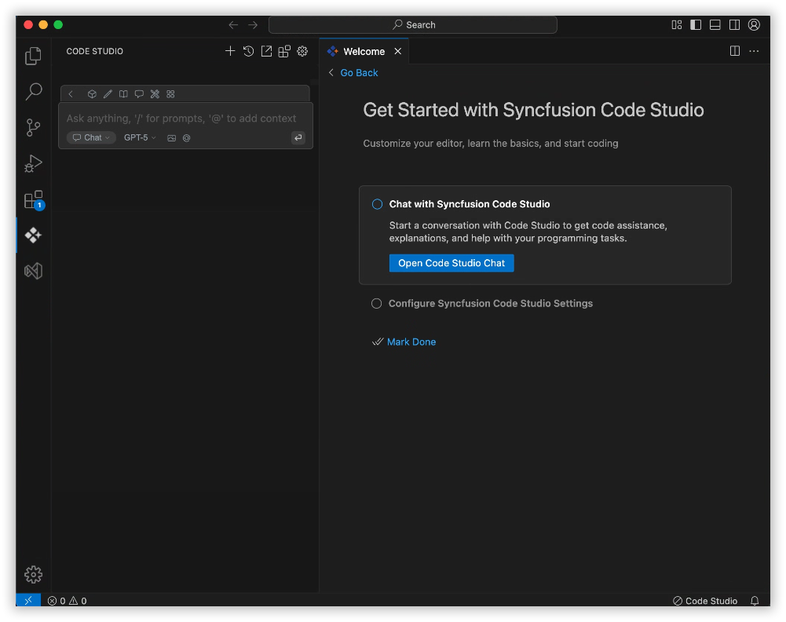
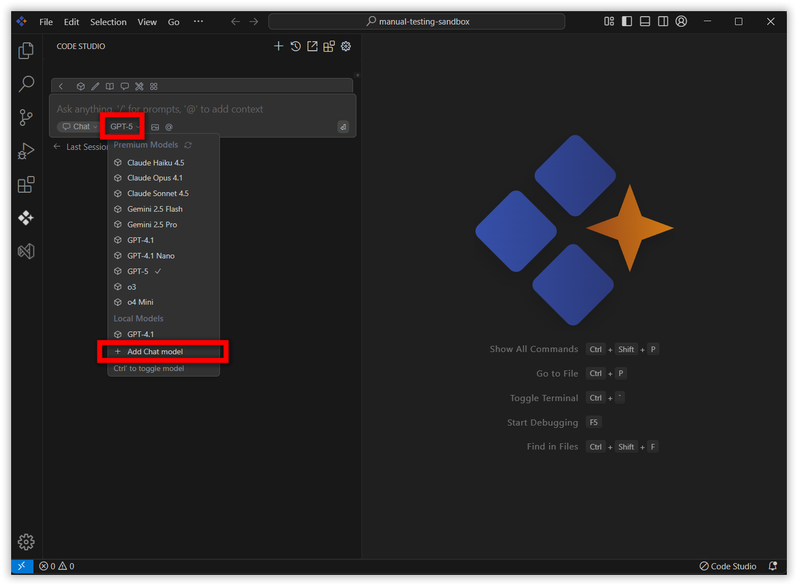
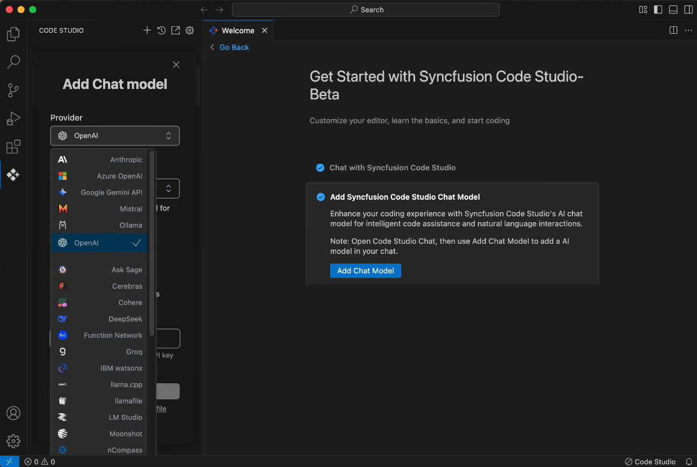
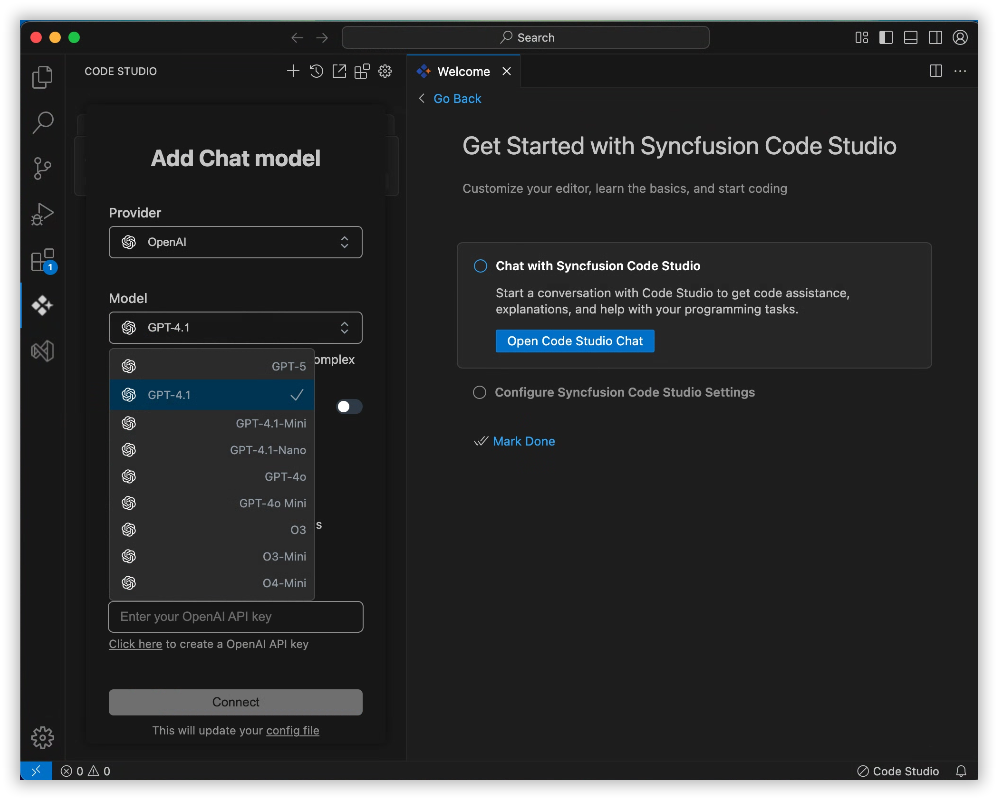
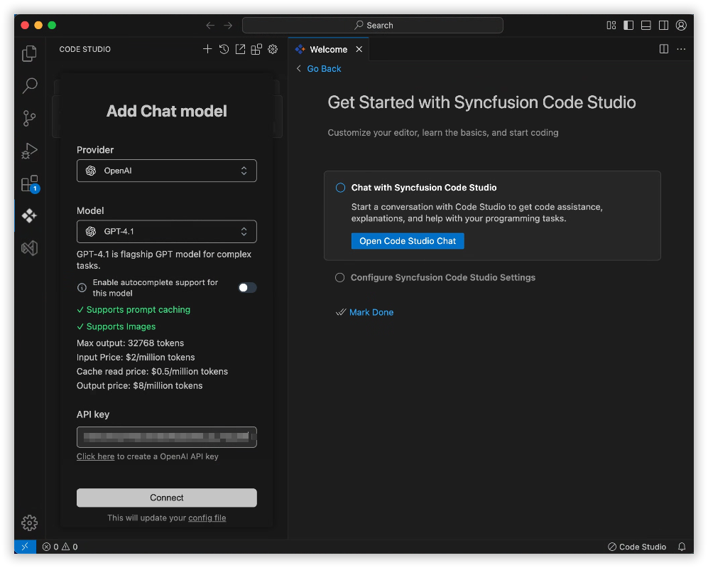
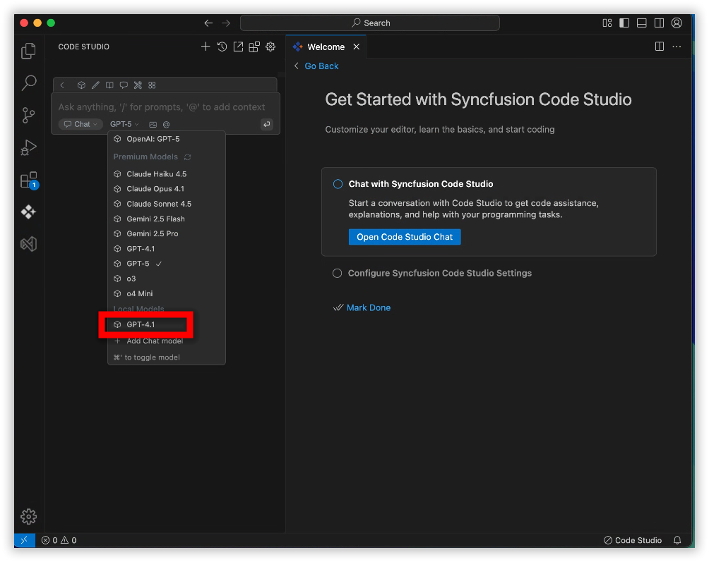
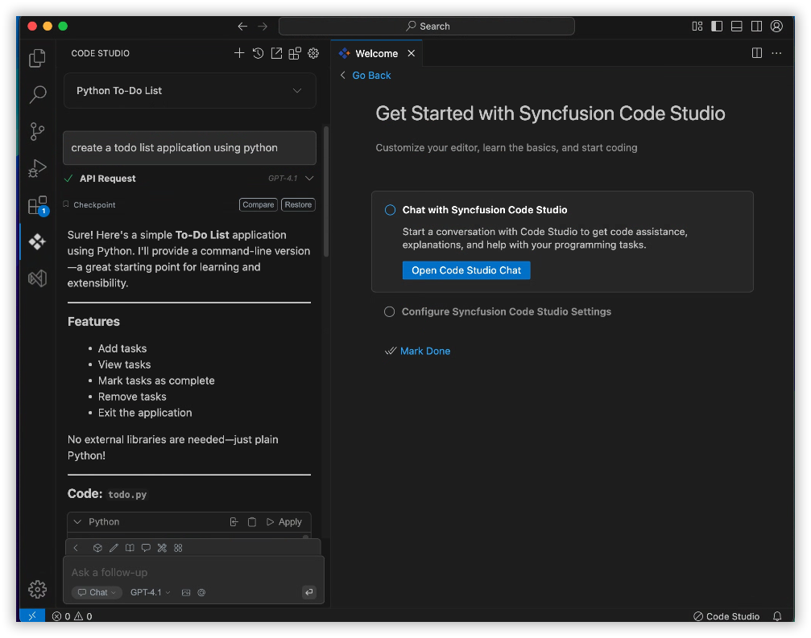

# Installation on macOS

The installation process for **Syncfusion Code Studio IDE** on macOS is straightforward and user-friendly. Simply download the installer from the official Syncfusion website, follow the on-screen instructions, and then launch the IDE. Once installed, you can start using Syncfusion Code Studio immediately to enhance your development experience.

## System Requirements

- **Operating System**: macOS 11 (Big Sur) or later
- **Processor**: Apple Intel OR Silicon (M1/M2) (minimum)
- **RAM**: 8GB (minimum), 16GB (recommended)
- **Disk Space**: 2GB of available space
- **Internet Connection**: Required for downloading the installer and receiving updates

> **Note:** For both Silicon and Intel, follow the same steps outlined below.

##  Steps to Install Syncfusion Code Studio IDE on macOS

###  Step 1: Start Installation

- Visit the official website: [Syncfusion Code Studio](https://www.syncfusion.com/code-studio)
- Click the **Get Started Now** button.
  
- Follow the instructions to sign in with [Syncfusion Code Studio](/code-studio/enterprise-server/getting-started)
- Click on the download Code Studio ide.
  
- A list of download options will appear.
  
- Click the **Download Code Editor** option to begin downloading the IDE to your machine.
  
- Double-click the downloaded `.dmg` file.

###  Step 2: Install the App

- A new window will open showing the **app icon** and a **shortcut to the Applications** folder.
- **Drag the app icon** into the **Applications** folder.
- Close the window.

###  Step 3: Launch the App

- The app is now installed.
- Open it from **Applications** or use **Spotlight** (`⌘ + Space`) to search for it.

###  Step 4: macOS Security Prompt

- The first time you open the app, macOS may display a warning:
  > “App was downloaded from the internet. Are you sure you want to open it?”
- Click **Open** to proceed.

> **Note:** Code Studio offers a built-in auto-update mechanism to ensure you're always using the latest version. When a new release becomes available, a notification will appear prompting you to update. Simply click “Update Now”, and the latest version will be downloaded and installed automatically—no manual steps required.

##  Step 5: Launch and Configure

After launching, the IDE displays a **Welcome Page** to help you get started.

###  Open Chat Page

- Start a new chat session to interact with **Syncfusion Code Studio** directly.

### Add Chat Model

- Open a popup to configure your AI model, including provider, model name, and API key. 

- You can select the provider from the dropdown

- You can select the Model from the dropdown

- Enter the API key to connect the model with the selected provider and click connect button.

- Now, the selected model has been added and is displayed in the chat box

- Ready for integration within your development environment

