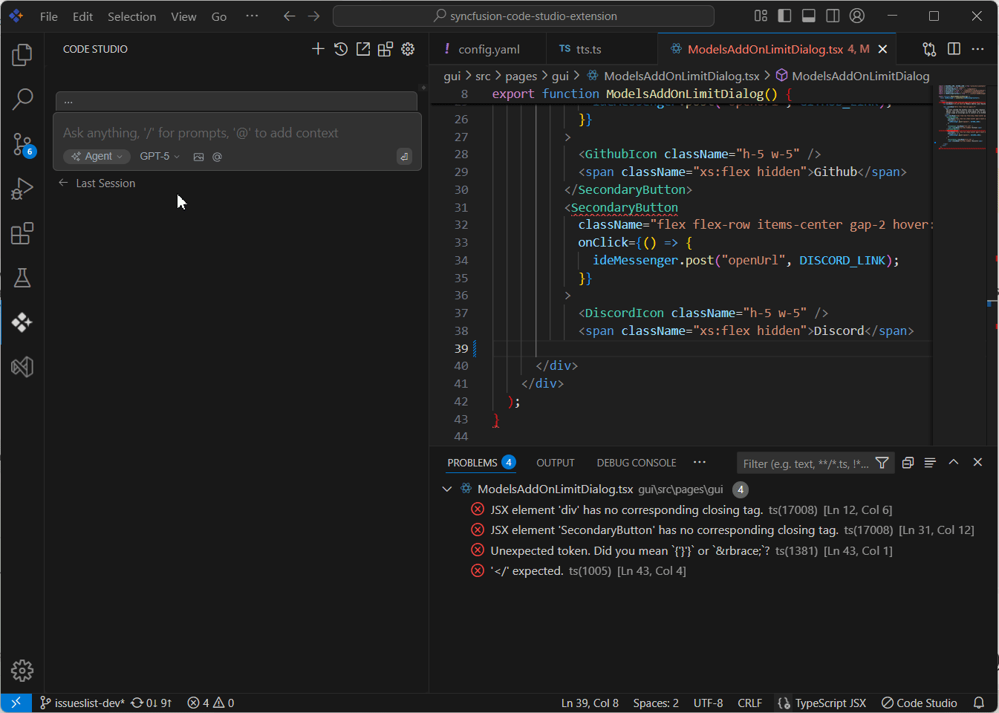

---
title: Using Context Providers in Syncfusion Code Studio
description: Learn how to use Context Providers in Syncfusion Code Studio to reference code, errors, and terminal output directly in chat for guided bug fixing with AI assistance.
platform: syncfusion-code-studio
keywords: context-providers, bug-fixing, AI-assistance, syncfusion, code-studio, troubleshooting, guided-workflow
---

# Overview
Context Providers in Syncfusion Code Studio allow you to reference specific parts of your development environment—code, diffs, errors, and terminal output—directly in chat. This tutorial walks you through using these providers to fix a bug with AI assistance, ensuring a guided, trackable workflow.

## Prerequisites
Before you begin, ensure:

- Your project is open.
- You’re ready to engage with the AI assistant to troubleshoot and resolve issues.

## What You’ll Build
By the end of this tutorial, you’ll have:

- Used Context providers to fix the issues.
- Experienced a full-cycle bug fix flow powered by AI.

## Step-by-Step Instructions

### 1. Diagnose the Bug and Select Context Providers
- Click the **@** button in the chat to select a context provider.
- Use the **Terminal** context to capture the runtime errors flagged by the IDE.
- Use the **Problems** context to capture the compile-time errors.

### 2. Guided Fix
- Make sure the file containing the issue is open in your VS Code editor. This ensures the model can access the relevant error data.
- Click the **Syncfusion Code Studio** icon in the left-hand toolbar to open the chat model window.
- In the chat window, click the **@** button to open the context menu. From the list, select **Problems**.
- Type your question or describe the issue in the chat window, then press **Enter**.

The AI will:
- Analyze the Problems panel data from your open file
- Suggest fixes or explanations for the errors
- Help you resolve issues without switching contexts

 

### 3. Verify the Fix
- Save the changes.
- Verify that the bug has been resolved by checking the Problems panel or any error indicators in the editor window.

## Verify
To confirm the bug was resolved:

- Ensure all relevant context providers were used.
- Review the AI’s guidance and verify that the issue is fixed.
- Confirm that all accepted changes are reflected in your codebase.