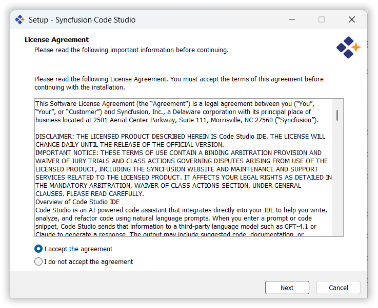
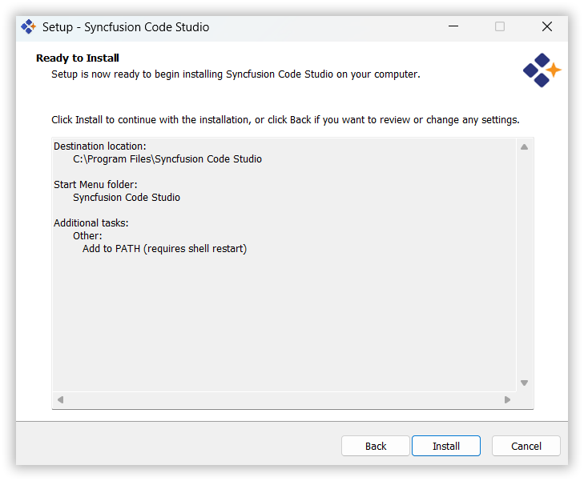
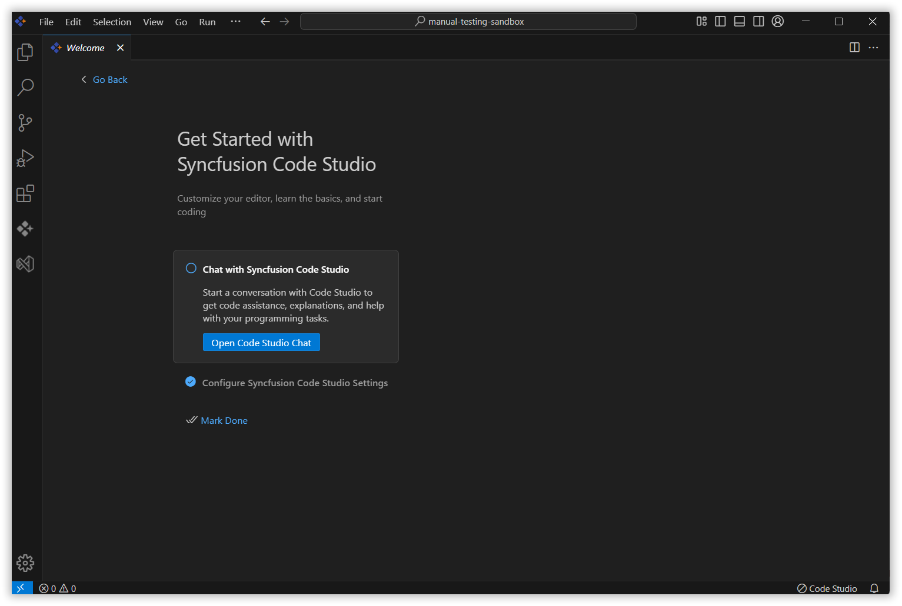
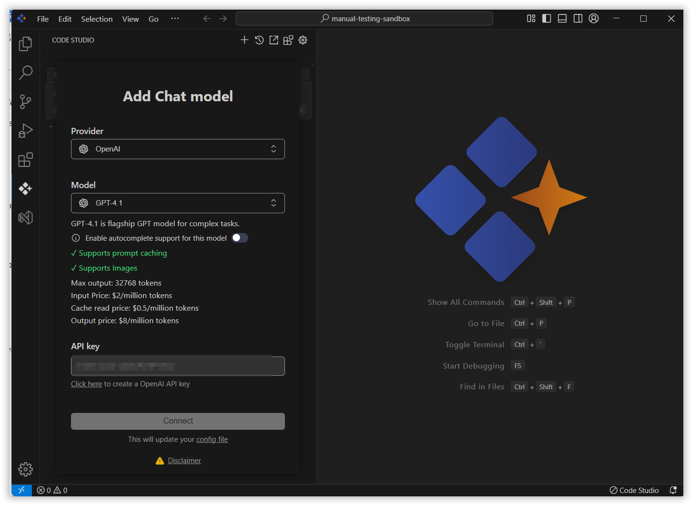
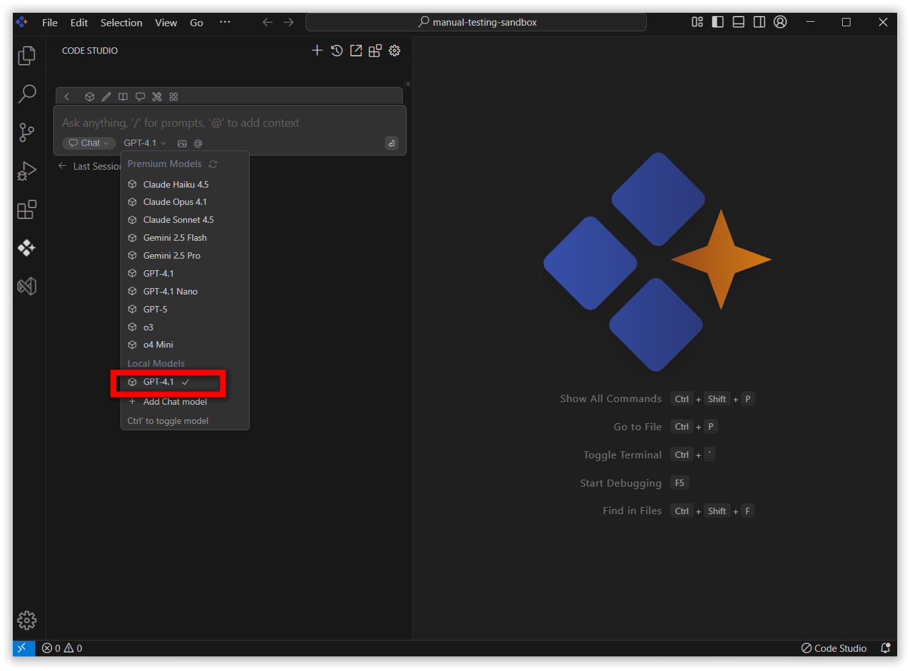

# Installation on Windows

The installation process for **Syncfusion Code Studio IDE** is straightforward and user-friendly. Simply download the installer from the official Syncfusion website, follow the on-screen instructions to complete the installation, and then launch the IDE. Once installed, you can start using Syncfusion Code Studio immediately to enhance your development experience.

## System Requirements

- **Operating System**: Windows 10 or later
- **Processor**: Intel Core i5 or equivalent (minimum)
- **RAM**: 8GB (minimum), 16GB (recommended)
- **Disk Space**: 2GB of available space
- **Internet Connection**: Required for downloading the installer and receiving updates

##  Steps to Install Syncfusion Code Studio IDE

### Step 1: Start Installation

- Visit the official website: [Syncfusion Code Studio](https://www.syncfusion.com/code-studio)
- Click the **Get Started Now** button.
  
- Follow the instructions to sign in with [Syncfusion Code Studio](/code-studio/enterprise-server/getting-started)
- Click on the download Code Studio ide.
  
- A list of download options will appear.
  
- Click the **Download Code Editor** option to begin downloading the IDE to your machine.
  
- Double-click the installer to begin the installation process.
- The installation wizard will appear on the screen.

###  Step 2: Accept the Agreement

- Carefully read the **License Agreement**.
- To proceed, select the **"I accept the agreement"** checkbox and click **Next**.

###  Step 3: Choose the Installation Folder

- By default, the IDE will be installed in the `Program Files` directory.
- To change the location, click **Browse** and select your preferred folder.
- Click **Next** once done.

### Step 4: Set Start Menu Folder

- You can specify the folder name that will appear in the **Start Menu**.
- You can also choose **not** to create a Start Menu folder by selecting the checkbox.
- Click **Next** to continue.

### Step 5: Select Additional Tasks

- You may be prompted to create a **desktop shortcut** or enable additional features.
- Select the tasks you want and click **Next**.

### Step 6: Install the IDE

- Review your chosen settings and click **Install** to start the process.
- A progress bar will indicate the installation status.

###  Step 7: Completion

- Once the installation is complete, you will see a confirmation screen.
- Click **Finish** to exit the wizard and launch the IDE.

> **Note:** Code Studio offers a built-in auto-update mechanism to ensure you're always using the latest version. When a new release becomes available, a notification will appear prompting you to update. Simply click “Update Now”, and the latest version will be downloaded and installed automatically—no manual steps required.

##  Step 8: Launch the IDE

After installation, the IDE launches with a **Welcome Page** to help you get started.

###  Open Chat Page

- Start a new chat session to interact with **Syncfusion Code Studio** directly.

### Add Chat Model

- Open a popup to configure your AI model, including provider, model name, and API key. 

- You can select the provider from the dropdown

- You can select the Model from the dropdown

- Enter the API key to connect the model with the selected provider and click connect button.

- Now, the selected model has been added and is displayed in the chat box

- Ready for integration within your development environment

