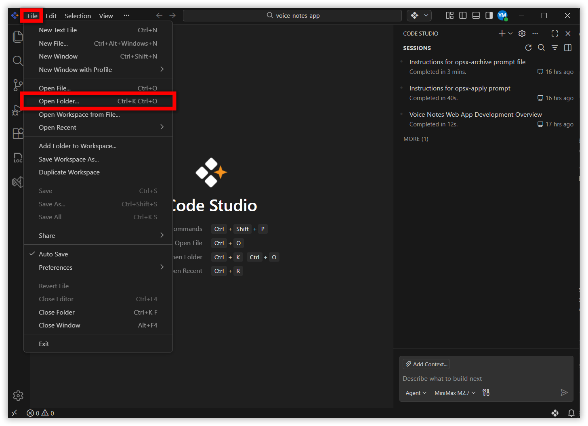
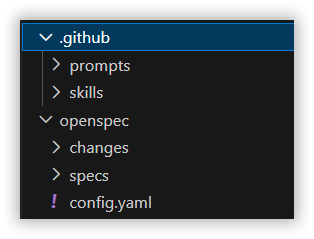
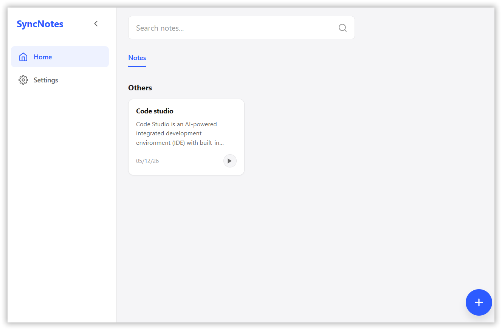
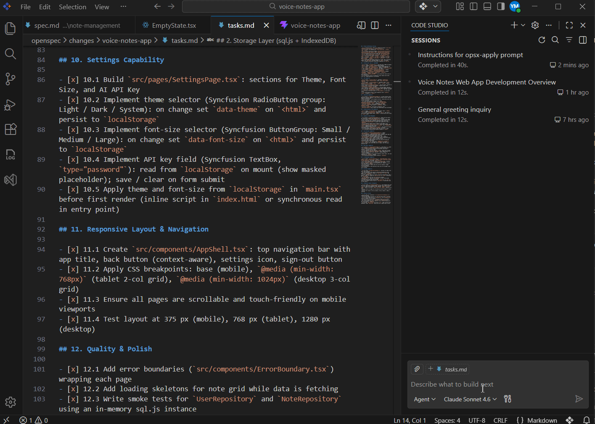

# Build Your First App in Code Studio

## Overview

Ready to build your first app? In this guide, you'll create a **Voice Notes web app** directly in **Syncfusion Code Studio** using a simple, step-by-step approach. Code Studio guides you through planning, building, and organizing your project using clear commands that make the whole process stress-free.

You'll move from idea to working application by following **Spec-Driven Development (SDD)** — a beginner-friendly approach where you describe what you want to build, and Code Studio generates the code for you. No complex setup. No guesswork. Just clear instructions and working code.

## Prerequisites

Before getting started, make sure that:

1. **Syncfusion Code Studio is installed**  
   If it’s not installed, refer to the [installation guide](/code-studio/getting-started/install-and-configuration) to set it up properly.

2.	Node.js >= 20.19.0 is installed.

## What You'll Learn

By the end of this tutorial, you'll know how to:
- Understand what Spec-Driven Development (SDD) is and why it matters for AI-powered development
- Understand what OpenSpec is and how it helps you build software predictably
- Set up your development environment and install OpenSpec
- Create a detailed project plan using the `/opsx-propose` command
- Review the generated proposal, design, specifications, and tasks
- Implement your plan using the `/opsx-apply` command to generate code
- Test and run your completed Voice Notes web application
- Finalize and organize your project using the `/opsx-archive` command

## Understanding SDD and OpenSpec

### What is Spec-Driven Development (SDD)?

Spec-Driven Development (SDD) is a methodology that emphasizes creating clear, structured specifications before writing any code. Instead of jumping straight into coding and hoping everything works out, you first write down exactly what you want to build, how it should behave, and what it should do.

**Why it matters:**
- **Reduces confusion** — Code Studio knows exactly what to build
- **Better quality** — Clear requirements lead to fewer mistakes and less rework

Here's the key idea: instead of writing code and hoping it does what you want, you write down what you want first. 

### What is OpenSpec?

OpenSpec is a tool built for Spec-Driven Development. It helps you organize your specifications, proposals, designs, and tasks all in one place within your project folder. When you use OpenSpec with Code Studio:

1. **You describe what to build** — Write your app requirements in plain English
2. **OpenSpec organizes it** — Creates a structured plan (proposal, design, specs, tasks)
3. **Code Studio builds it** — The AI reads your organized specs and generates the code

Think of OpenSpec as the planning and organization system that makes SDD work smoothly. It keeps everything clear and prevents miscommunication between you and the AI.

For more information about OpenSpec, visit our [Using OpenSpec in Code Studio](/code-studio/tutorials/using-openspec-inside-syncfusion-code) guide.


## Build Your First App in Code Studio

### Step 1: Set Up Your Environment

Before building your Voice Notes app, ensure your Code Studio environment is ready:


1. **Create a new workspace**:
   - Create a new folder named `voice-notes-app` on your machine
   - Open Code Studio on your machine
   - Open that 'voice-notes-app'  as your workspace in code studio by clicking **File** -> **Open Folder**

   

### Step 2: Install OpenSpec


1. **Open the Terminal** in Code Studio (`Terminal` → `New Terminal`)
2. **Install OpenSpec** by running this command:
   ```
   npm install -g @fission-ai/openspec@latest
   ```
3. **Initialize the spec structure** in your project folder:
   ```
   openspec init
   ```
   A prompt will appear asking you to select an AI tool. Choose **GitHub Copilot** from the options to connect OpenSpec with Code Studio.
   
     

   This creates an `openspec/` folder in your project. This folder will store all your planning documents — proposals, designs, specifications, and task lists. Think of it as your project's planning hub where everything for SDD stays organized in one place.

   

**What folders just got created:**

When you run `openspec init`, OpenSpec creates these folders in your project:

- **`openspec/specs/`** — Stores your finalized specifications 
- **`openspec/changes/`** — Stores your **Proposal**, **Design**, and **Tasks** files 
- **`openspec/config.yaml`** — Settings and configuration file for OpenSpec
- **`.github/`** — Contains all the skills and prompts that OpenSpec uses to communicate with Code Studio and generate your plans and implement it.


   

### Step 3: Create the Project Plan

Now that your environment is set up, you'll create a detailed project plan. This plan helps Code Studio understand exactly what you want to build before writing any code. You describe your app in simple language, and Code Studio generates a structured plan that includes the proposal, design, specifications, and tasks.

To create your project plan, use the `/opsx-propose` command in the Code Studio Chat Panel. Follow the command with a detailed description of what you want to build. Code Studio will read your description and generate:

- A **proposal** explaining what you're building and why
- A **design** describing how it will work
- **Specifications** for each part of the app
- **Tasks** — a checklist of all the work needed

All of these are saved as markdown files in your `openspec/changes/` directory that you can read and edit.

Example prompt:

```
/opsx-propose

Build a Voice Notes Web App with:

Features:
- Record voice → auto-transcribe to text (Web Speech API)
- Search notes by keywords, pin/edit/delete notes
- Optional AI enhancement (GPT-4.1 via OpenRouter)
- Settings: theme (Light/Dark/System), font size

Pages: Auth (signup/signin), Onboarding (4-slide carousel), Dashboard (search + note grid), Voice Recorder, Note Editor, Settings

Tech Stack:
- React 18 + TypeScript, Vite
- Syncfusion React Components
- SQLite (sql.js) + IndexedDB persistence
- Web Speech API (Chrome/Edge preferred)

Key Requirements:
- Client-side only, no backend/server
- Local-first storage in browser
- Auto-save after 2s inactivity
- Responsive: mobile-first (768px tablet, 1024px desktop)
- CRITICAL: Voice audio NOT stored, only transcribed text

Out of Scope v1:
- Cloud sync/backup, audio editing, multiple languages
- Export/import, sharing, advanced AI features
```

Review the generated files in your `openspec/changes/` directory carefully before proceeding to the next step. You can modify the markdown files directly if needed. These files follow OpenSpec's structured approach:

- **Proposal** — A summary document describing what you want to build
- **Design** — Technical details about how it will be built
- **Tasks** — Step-by-step checklist of work to complete
- **Specs** — Detailed specifications for each file or component
- **Change folder** — The directory containing all these files for this specific change

   

### Step 4: Implement the Plan (Apply)

After you've reviewed and approved your project plan from Step 3, it's time to build the actual application. In this step, Code Studio reads all your specifications and tasks, then automatically writes the code for your Voice Notes app. The AI works through each task one by one, creating files and writing code that matches your plan exactly.

To start the implementation, run the `/opsx-apply` command in the Code Studio Chat Panel:

```
/opsx-apply
```

The AI will begin executing tasks one by one. You'll see progress updates in the chat as each task completes, and files will be generated in your project folder. Your detailed plan from Step 3 is now becoming actual working code.

   

### Step 5: Run Your Application

Launching your completed app and verify it works end-to-end:

1. **Start the development server**:
   ```
   npm run dev
   ```

2. **Open your app** in a web browser (usually `http://localhost:3000`)

3. **Perform a full user walkthrough**:
   - Record and transcribe
   - Save and retrieve notes
   - Verify all features work smoothly

4. **Celebrate!** You've successfully built an app using Spec-Driven Development.

   

### Step 6: Finalize and Organize (Archive)

Now that your Voice Notes app is built and tested, it's time to organize your project. The archiving step moves your finalized specifications to a permanent location and stores your working files in an archive folder. This keeps your project clean and makes it easy to find your specifications if you want to make changes or build new features later.

To finalize and organize your project, run the `/opsx-archive` command in the Code Studio Chat Panel:

```
/opsx-archive
```

The command updates your project structure as follows:

- Spec files moved to `openspec/specs/` (where all finalized specifications are stored)
- Change folder archived to `openspec/changes/archive/` (keeping your completed work organized)
- Your project is now clean and ready for the next feature

   


Congratulations! You've successfully built a Voice Notes web app using Spec-Driven Development approach. By following this workflow — planning with detailed specifications, implementing with AI assistance, and organizing your work — you've experienced how SDD makes AI-powered development predictable and maintainable. You can now use this same methodology to build other applications with confidence, knowing that clear specifications lead to better code and fewer surprises.
