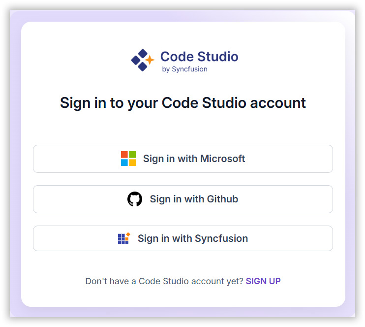
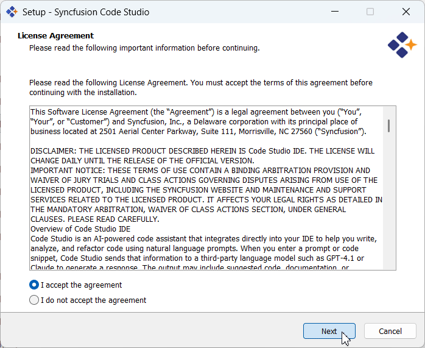
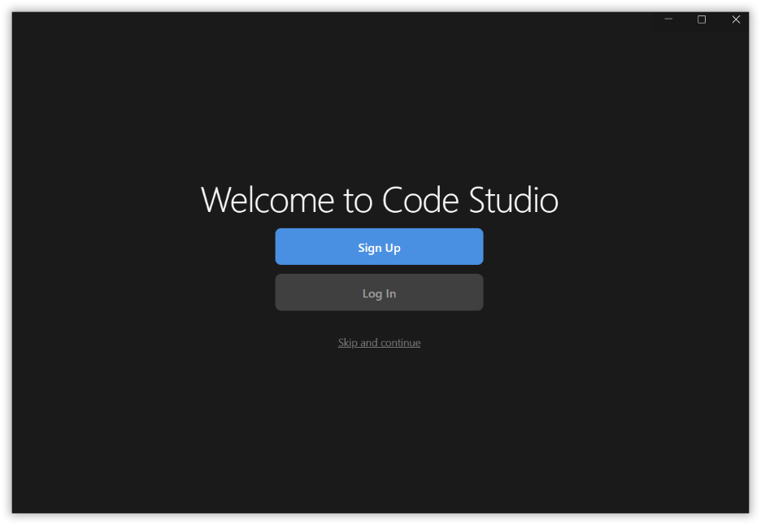
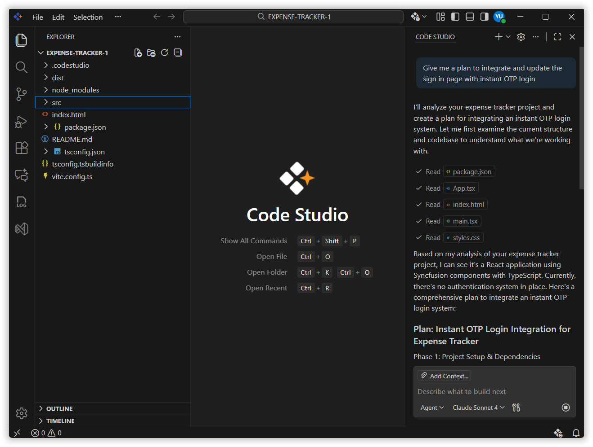
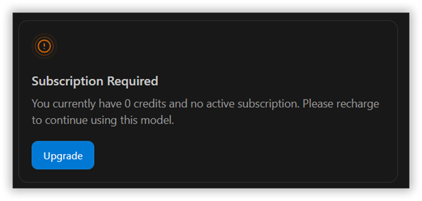
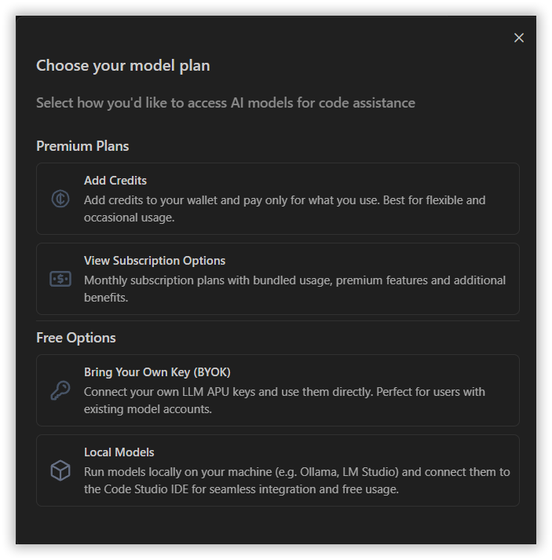

# Install and Configure

## Overview
Getting started with Syncfusion Code Studio is quick and easy. This guide will show you, how to download, install, and set up the IDE on both Windows and macOS. Whether you’re new to Code Studio or setting it up on a fresh system, this simple walkthrough will help you get everything ready in just a few minutes—so you can start building right away!

## Prerequisites

<table> <thead> <tr> <th>Requirement</th> <th>macOS</th> <th>Windows</th> </tr> </thead> <tbody> <tr> <td>Operating System</td> <td>macOS 11 (Big Sur) or newer</td> <td>Windows 10 or newer</td> </tr> <tr> <td>Processor</td> <td>Apple Silicon or Intel</td> <td>Intel Core i5 or similar</td> </tr> <tr> <td>RAM</td> <td>8 GB minimum (16 GB recommended)</td> <td>8 GB minimum (16 GB recommended)</td> </tr> <tr> <td>Disk Space</td> <td>2 GB</td> <td>2 GB</td> </tr> </tbody> </table>

## What You’ll Learn
By the end of this tutorial, you’ll learn how to:
- Create your Syncfusion Code Studio account.
- Download and install Syncfusion Code Studio IDE.
- Sign in and start using the IDE.

## Installation Steps (For both macOS & Windows)

### Step 1: Download the Installer
- Visit the official [Syncfusion Code Studio website](https://www.syncfusion.com/code-studio/).
- Click **“Get Started Now”** to open the Code Studio enterprise page.

> **Note**: The enterprise page is for organizations to monitor and manage AI usage.
- If you already have Syncfusion Code Studio Account, choose one of these sign-in options to sign-in with Code Studio Enterprise server or else click **“SIGN UP”** to create one:
   - **Microsoft Account:** Use your personal, work, or school Microsoft credentials.
   - **GitHub Account:** Sign in with your GitHub credentials.
   - **Syncfusion Account:** Create a new account using your email and password.
   
- Click **Code Studio IDE**.

- Choose your preferred operating system, and then select **Download Code Editor**.

- The setup file will be downloaded to your local system.

### Step 2: Install the Application

#### macOS:
- Double-click the **.dmg** file.
- On first launch, you may see a security prompt:
  **“App was downloaded from the internet. Are you sure you want to open it?” → Click Open.**
- Drag the app icon into the **Applications** folder.

#### Windows:
- Double-click the **.exe** setup file.
- Standard UAC prompt → **Click Yes**.
- Accept the **License Agreement**.
- Choose installation folder path (default: Program Files).
- Click **Install** and wait for completion.

### Step 3: Sign In with Code Studio IDE
- After installing Syncfusion Code Studio IDE, the **Welcome Page** will appear.

- To activate your account and enable all features, you’ll need to sign in inside the IDE. Choose one of these sign-in options:
  - **Microsoft Account:** Use your personal, work, or school Microsoft credentials.
  - **GitHub Account:** Sign in with your GitHub credentials.
  - **Syncfusion Account:** Create a new account using your email and password.

### Step 4: Start Using Code Studio
After installing Code Studio, you can start using it immediately.
- Open the Code Studio IDE and access the Code Studio chat box, which acts as your built-in assistant for coding tasks.
- Type your first query in the chat panel.

- If Code Studio responds, your subscription is active.
- If the Code Studio IDE chat box does not respond, you will see a message prompting you to subscribe to a plan for full access to features.
- Select **Upgrade**.

- Choose the subscription plan you prefer.

To know more about the Code Studio Subscription plans, click on **View Subscription Options**.
