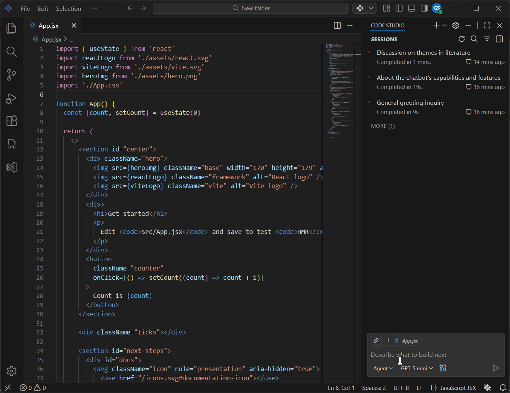

# Welcome to Syncfusion Code Studio

## Overview

- Syncfusion Code Studio is an AI-powered integrated development environment (IDE) with built-in assistance to support modern software development workflows. It understands your codebase and provides context-aware suggestions to help you design, implement, and refine features—while keeping developers in control.

- Deeply integrated with Syncfusion’s component library, Code Studio helps teams build robust, scalable applications by automating common tasks such as UI generation, bug fixing, and documentation.

## What can you do with Code Studio 

- **Generate code:** Drafts code snippets and scaffolding to reduce repetitive work.
- **Implement features:** Turn ideas into complete, working solutions with AI‑assisted development. 
- **Find and fix errors:** Detects common issues and proposes fixes to help you resolve problems quickly.
- **Explain code:** Breaks down code line by line or function by function to improve understanding and maintainability.

By combining these capabilities, Code Studio helps you write cleaner, more accurate code while staying focused and productive.

## Key Features

Working with Code Studio will give you hands-on experience in the following areas: 

-  **Autocomplete Mode**: AI‑powered code suggestions as you type, based on your current project.  
Learn more on the [Autocomplete](/code-studio/features/autocomplete) page.

-  **Ask Mode**: Get quick answers, explanations, and ready-to-use code snippets through simple questions in the IDE—no project files required.  
Learn more on the [Ask](/code-studio/features/ask) page.

-  **Edit Mode**: Use AI prompts to modify source code with previewed changes, letting you keep or undo each edit for precise control and high accuracy.  
Learn more on the [Edit](/code-studio/features/edit) page.

-  **Agent Mode**: The AI agent understands your codebase and autonomously performs multi‑step tasks. It can read files, reason about logic, and use built‑in tools (like file search, code edit, or UI generation) to complete complex workflows end‑to‑end.  
Learn more on the [Agent](/code-studio/features/agent) page.

-  **Plan Mode**: Research tasks, identify requirements, and break work into clear, reviewable steps before writing any code—ensuring safer and more reliable implementation.  
Learn more on the [Plan](/code-studio/features/plan) page.

-  **Provide Context to Chat**: Attach files, folders, code symbols, errors, screenshots, or tool outputs so the AI understands what you’re working on and gives accurate, relevant guidance.  
Learn more on the [Context](/code-studio/features/add-context) page.

-  **UI Builder**: An AI‑powered tool that analyzes your development needs and automatically delivers targeted UI guidance with code examples, component documentation, and layouts specifically for Syncfusion components. By understanding your project context, it provides precise, platform‑specific assistance instead of generic advice.  
Learn more on the [UI Builder](/code-studio/ui-builder) page.

-  **Enterprise Server**: Centralized administration for organizations, including users and teams, providers and models, budgets, alerts, and dashboards.  
Learn more on the [Enterprise Server](/code-studio/enterprise-server/getting-started) page.

-  **Built‑in Tools**: Perform file edits, searches, terminal commands, and more directly from the agent.  
See [Tools](/code-studio/reference/configure-properties/toolssupport).

-  **Checkpoints**: Automatically capture, compare, and restore your workspace state to track changes and recover easily.  
Learn more in [Checkpoints](/code-studio/features/checkpoints).

-  **Inline Chat**: Apply AI‑powered fixes, optimizations, and docs right from the editor’s context menu.  
See [Inline Chat](/code-studio/features/inlinechat).

-  **Telemetry**: Anonymous usage analytics to improve product quality; can be disabled anytime.  
See [Telemetry](/code-studio/features/telemetry).

-  **Generate Code**: Automate common coding tasks like fixing issues, reviewing code, generating documentation, and creating tests—directly inside your editor for faster, higher‑quality development.
Learn more on the [Generate Code](/code-studio/features/generatecode) Generate Code page.

-  **Quick Fix**: Instantly detect and resolve errors with context‑aware AI suggestions, inline previews, and explanations—so you can fix issues without leaving your editor.  
Learn more on the [Quick Fix](/code-studio/how-to-guides/quick-fix-error) page.

-  **MCP Integration**: Discover and manage servers via the [MCP Marketplace](/code-studio/reference/configure-properties/mcp/marketplace) or connect [Custom Servers](/code-studio/reference/configure-properties/mcp/customservers) including NPM package,pip package, docker image, HTTP, command.

-   **Custom Agent**: Pre‑configured AI agents for specific tasks that follow fixed rules, tools, and behaviors—ensuring consistent, repeatable workflows across teams. Learn more on the [Custom Agent](/code-studio/reference/configure-properties/custom-agents) page.

-  **Custom Instructions**: Custom instructions define reusable guidelines that shape how AI generates code and performs development tasks, eliminating the need to repeat context in every prompt. They can be applied automatically to all chats, targeted to specific files, or manually attached to individual prompts. Learn more on the [Custom Instructions](/code-studio/reference/configure-properties/custom-instructions) page.

-  **Custom Prompts**: Prompt files are on‑demand, reusable Markdown prompts that standardize specific development tasks like code generation and reviews. Learn more on the [Custom Prompt](/code-studio/reference/configure-properties/custom-prompt) page.

## Get started

Ready to try Code Studio?

- Go to the [Quick Start](/code-studio/getting-started/quick-start) page to set up Code Studio and create your first code snippet with AI assistance.