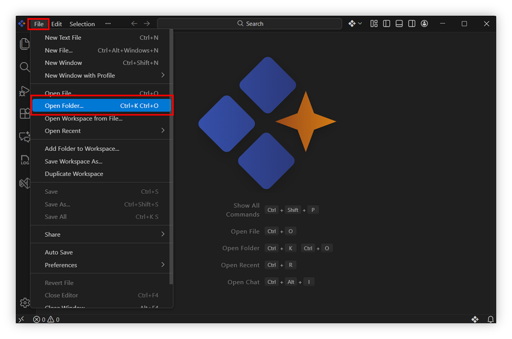
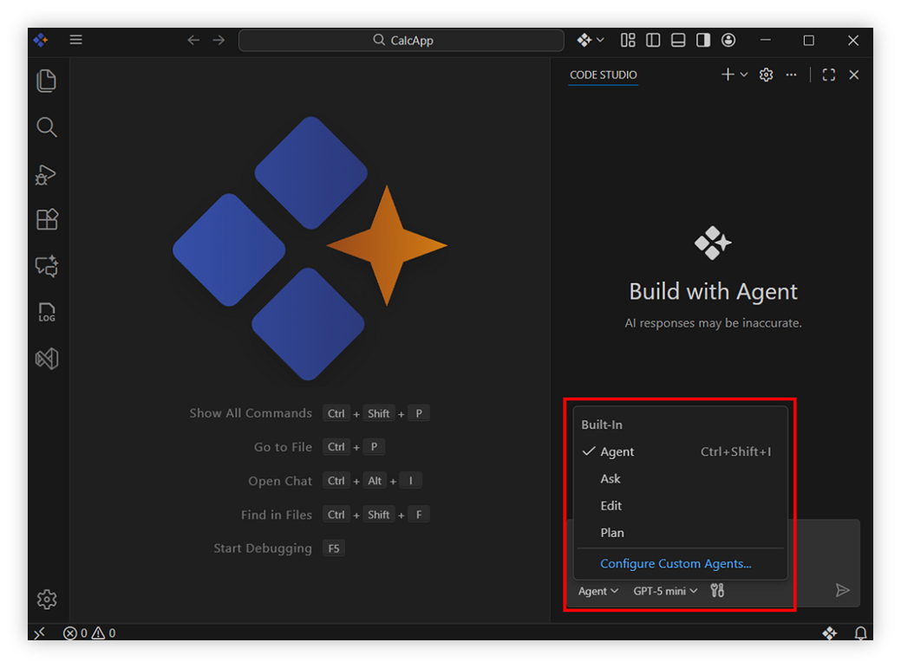
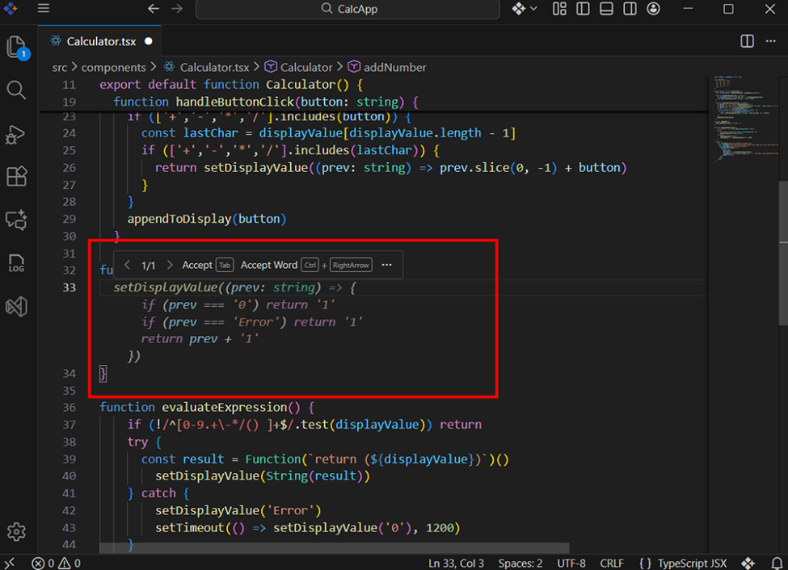
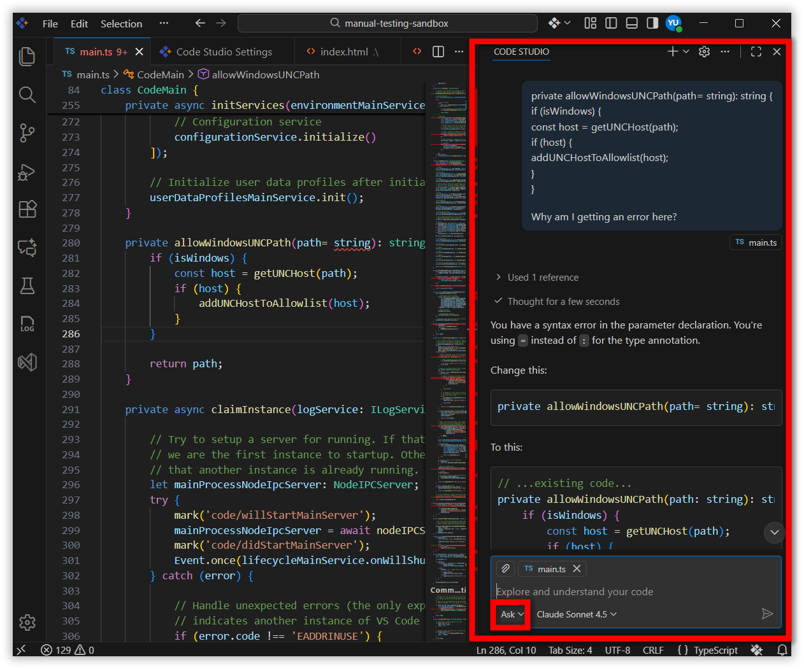
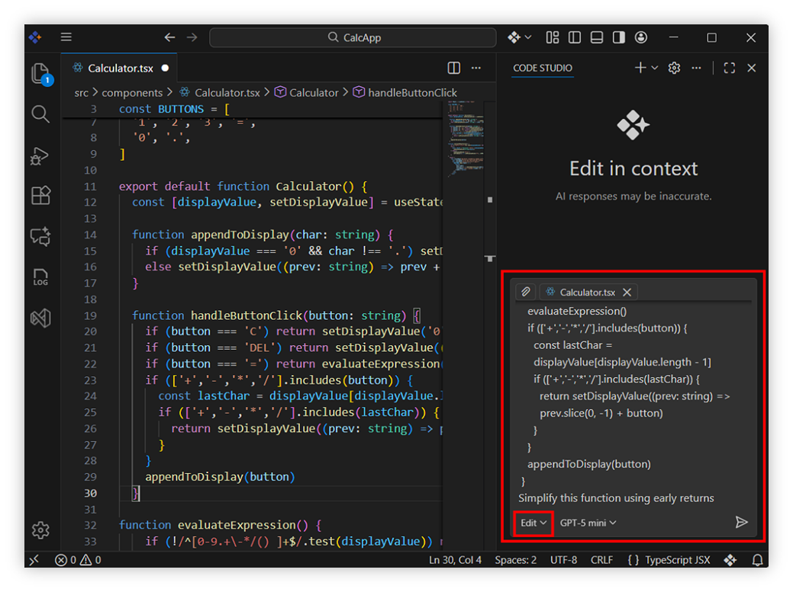
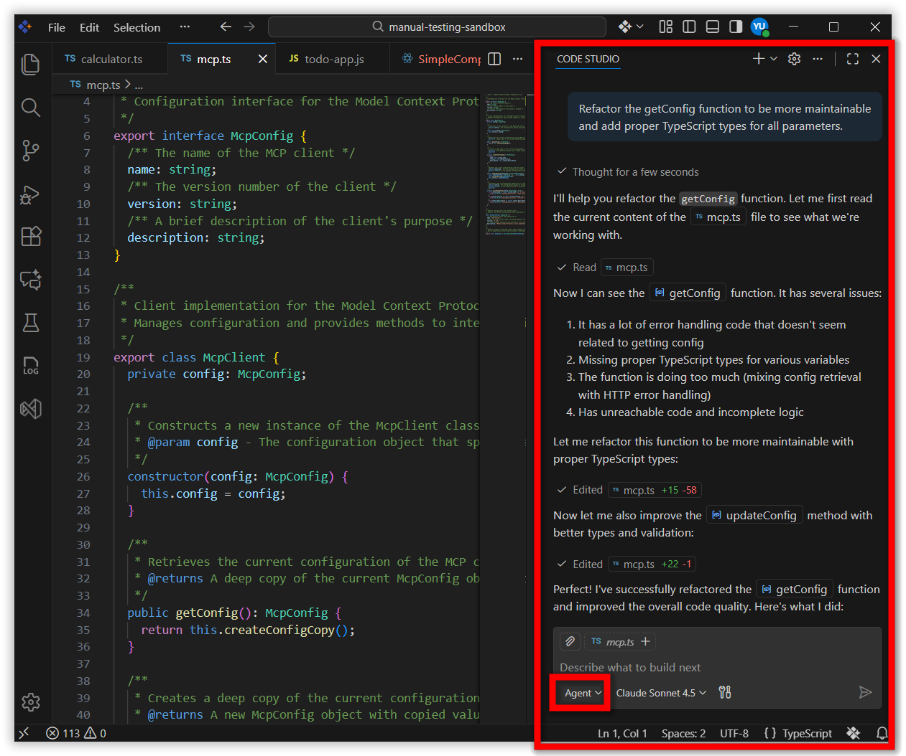
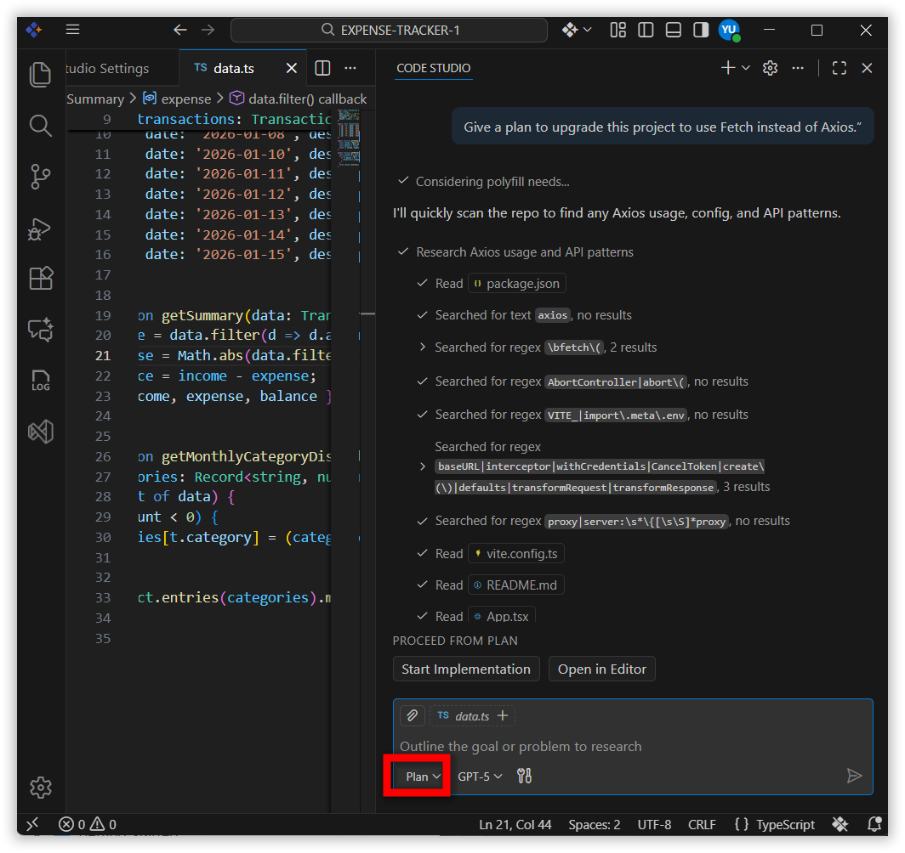
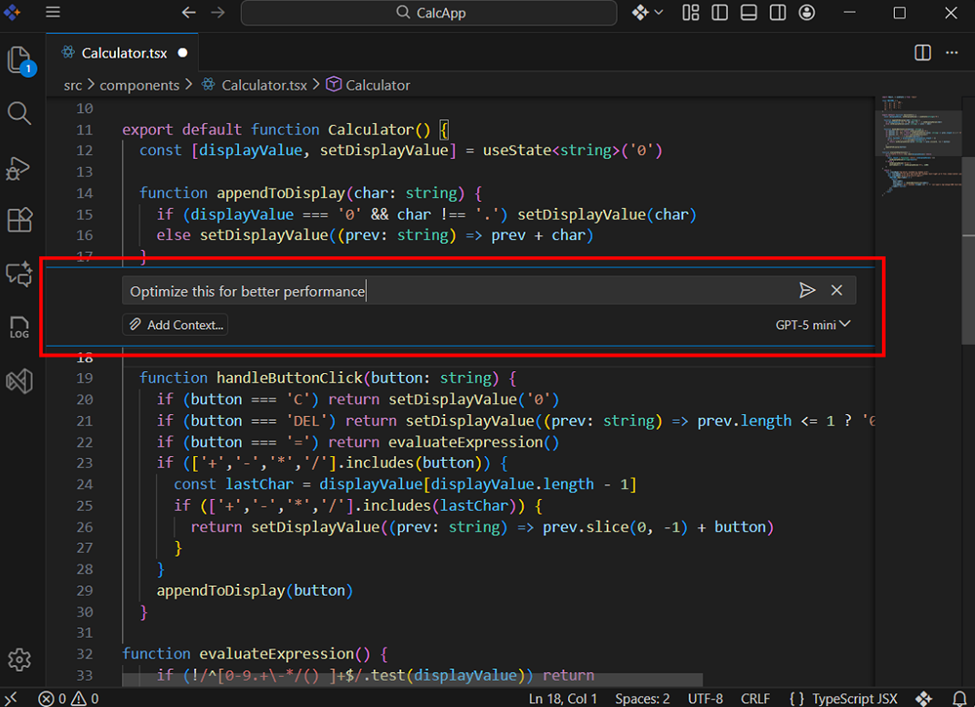
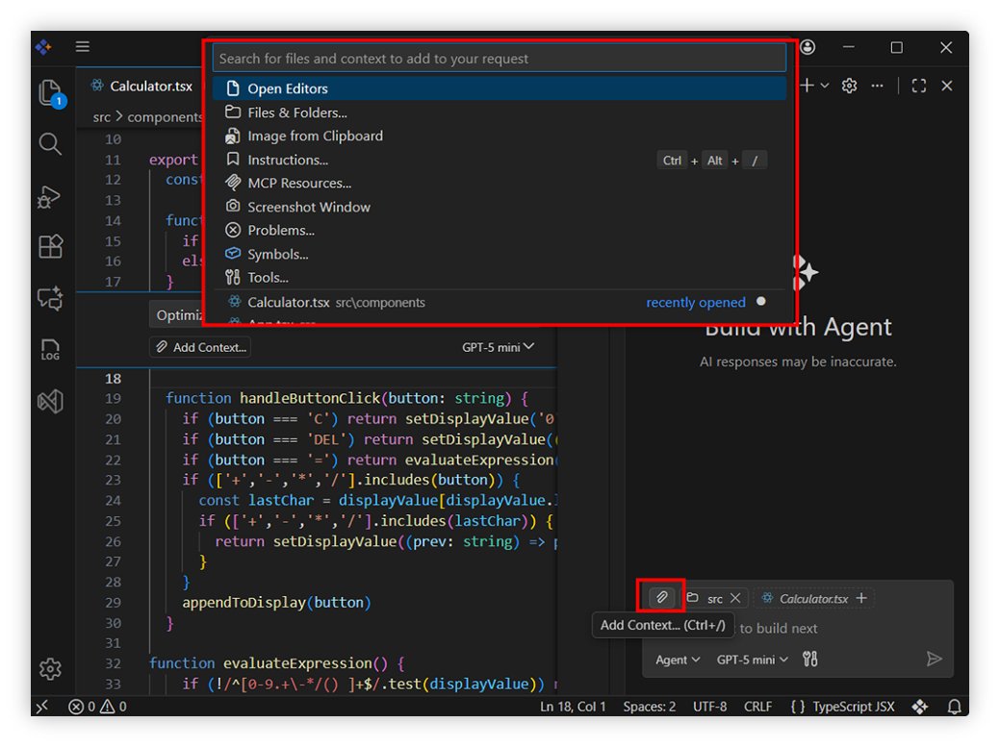

# Quick Start Guide about Syncfusion Code Studio

**Syncfusion Code Studio** is an intelligent, AI‑powered coding companion designed to make your development process faster and easier. Instead of writing every line manually or searching for solutions, Code Studio works alongside you—understanding your intent, offering meaningful suggestions, and helping you learn as you build.

## Prerequisites

Before getting started, make sure that:

1. **Syncfusion Code Studio is installed**  
   If it’s not installed, refer to the [installation guide](/code-studio/getting-started/install-and-configuration) to set it up properly.

2. **A local project folder is ready**  
   Code Studio works best with an existing project or a fresh folder for coding.

3. **Basic familiarity with writing code**  
   You don’t need to be an expert—just comfortable editing files and understanding simple programming concepts.

## What You’ll Learn
By the end of this quick start guide, you’ll learn how to:

- Open an existing project folder in the IDE, then navigate and edit files using the Explorer sidebar and built-in editor
- Access and use the core AI-powered coding features: Autocomplete, Ask, Edit, Agent, and Plan
- Generate, explain, refactor, and fix code using natural language instructions
- Perform targeted code improvements with Inline Chat directly in the editor
- Add extra files or folders from your workspace as context to make AI suggestions more accurate and project-aware

## Step 1: Open a Project in Code Studio

Follow the steps below to open your project and start working inside the Code Studio environment.

1. **Open the application based on your OS**
   - **Windows:**  Go to the **Start Menu**, search for **Syncfusion Code Studio**, and launch it.
   - **macOS:** Open **Applications** or **Launchpad**, find **Syncfusion Code Studio**, and open it.

2. **Access the File Menu** - At the top menu bar, click **"File"**.

3. **Select “Open Folder”**

4. **Choose your project folder**

5. **Or you can directly open your project folder using 'Open Folder' button under the Code Studio logo**

**Note: Open folder directly from File Explorer / Finder using terminal**
- **Windows**  
  In File Explorer → type `cmd` in the address bar → Enter → then run:  
  `sfcode .`
- **macOS**  
  Right-click inside folder → Services → New Terminal at Folder → then run:  
  `sfcode .`

### Result:
Your selected project will open in the editor where you can:

- Browse files in the Explorer sidebar  
- Edit and create source files  
- Use AI-powered features like **Chat**, **Autocomplete**, **Agent**, **Edit**, and **Quick Fix**

## Step 2: Explore Core Features

### Built-in Agent Modes
Code Studio provides five built‑in agents   **Autocomplete**, **Ask**, **Edit**, **Agent**, **Plan** .
You can also create [custom agents](/code-studio/reference/configure-properties/custom-agents) for specialized workflows.

### 1. Autocomplete

- Autocomplete helps you write code faster by predicting the next part of your logic as you type.

- It analyzes the structure of your file, understands your coding patterns, and suggests additions that match the flow of your project.  
This reduces typing effort and ensures consistency.

**For Example:** *“When you begin typing a function call”*, Autocomplete may fill in arguments, return handling, or common patterns automatically.

*Learn more about [Autocomplete](/code-studio/features/autocomplete)*

### 2. Ask Mode

- Ask mode allows you to communicate with the AI using natural language and receive accurate, context‑aware help.

- You can request explanations, code examples, best practices, or clarifications for unfamiliar concepts.

**For Example:**  Ask, *“Why am I getting an error here?”* and the AI will inspect your code, explain the cause, and propose a fix.

*Learn more about [Ask](/code-studio/features/ask)*

### 3. Edit Mode

- Edit Mode allows you to modify existing code simply by describing the changes.

- You can update logic, restructure components, clean up syntax, or improve performance without editing manually.  
Code Studio shows suggested changes clearly, letting you apply or undo them step by step.

**For Example:**  Give, *“Simplify this function using early returns”* as prompt, Edit Mode rewrites it neatly while preserving behavior.

*Learn more about [Edit](/code-studio/features/edit)*

### 4. Agent Mode

- Agent Mode handles larger tasks that span multiple files.

- It can plan, update, and refine complex project structures while giving you full control over the process.  
Ideal for scaffolding features, refactoring modules, or managing structured workflows.

**For Example:**  *“Set up user authentication.”*  The Agent will outline steps, update backend routes, create frontend components, and explain changes.

*Learn more about [Agent](/code-studio/features/agent)*

### 5. Plan Mode

- Use Plan Mode when you want full visibility before making changes.

- Plan Mode creates a clear sequence of steps the AI will follow—helping you understand scope and reduce surprises.

**For Example:**  *“Give a plan to upgrade this project to use Fetch instead of Axios.”*  The AI will generate an ordered list of required updates across files.

*Learn more about [Plan](/code-studio/features/plan)*

## Inline Chat

-  Inline Chat allows localized edits directly next to your code.  
- Highlight text and ask for improvements, optimizations, or rewrites without switching views.

**For Example:**   Select a loop and ask, *“Optimize this for better performance.”*  
You’ll see improved code inline with **Accept** and **Dismiss** options.

*Learn more about [Inline Chat](/code-studio/features/inlinechat)*

## Add Context

- Add Context lets Code Studio understand more of your project by including additional files or folders from your workspace in the request.

- This leads to smarter, interconnected suggestions.

**For Example:**  While editing a UI component, you may add related API client and type definition files so the AI produces improvements fitting your entire structure.

*Learn more about [Add Context](/code-studio/features/add-context)*

## Next Steps

- Now that you've explored the basics:

- Learn how to create your first automated change with [Agent](/code-studio/features/agent).  

