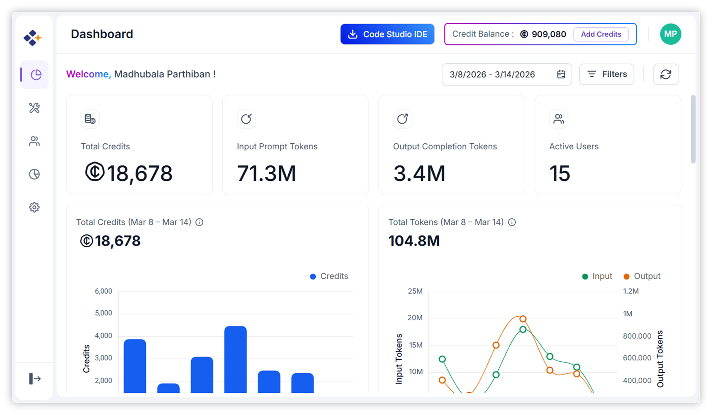
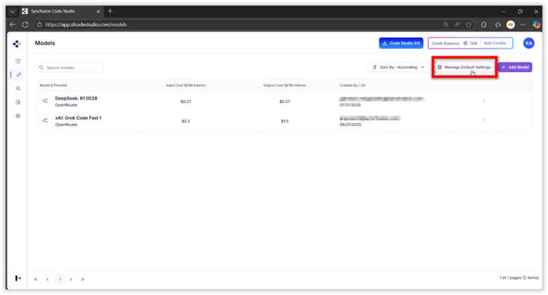
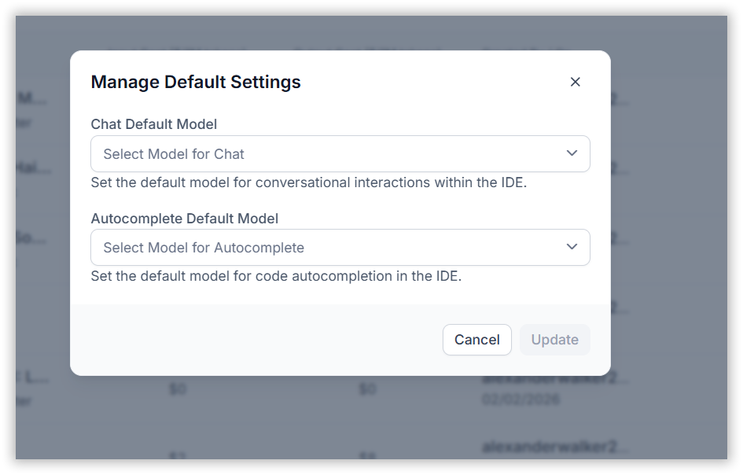
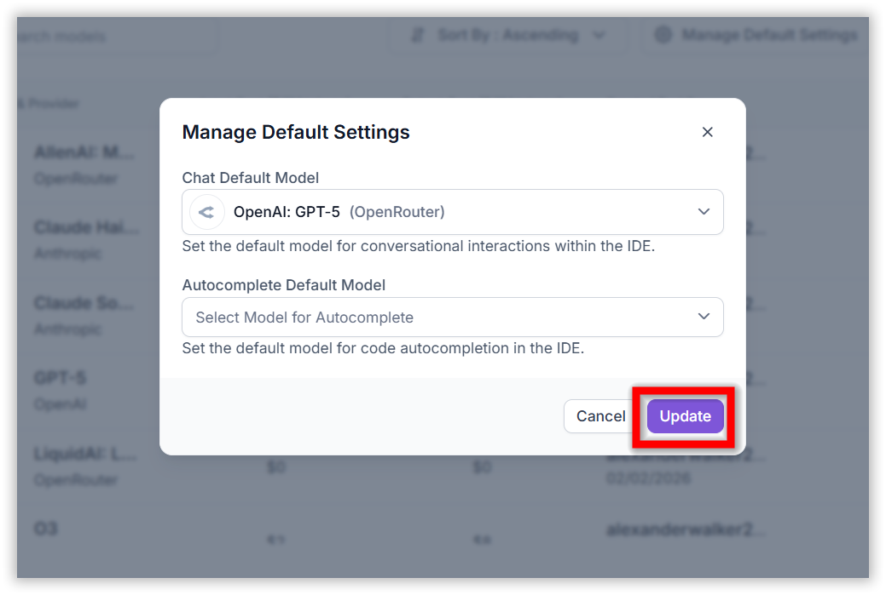
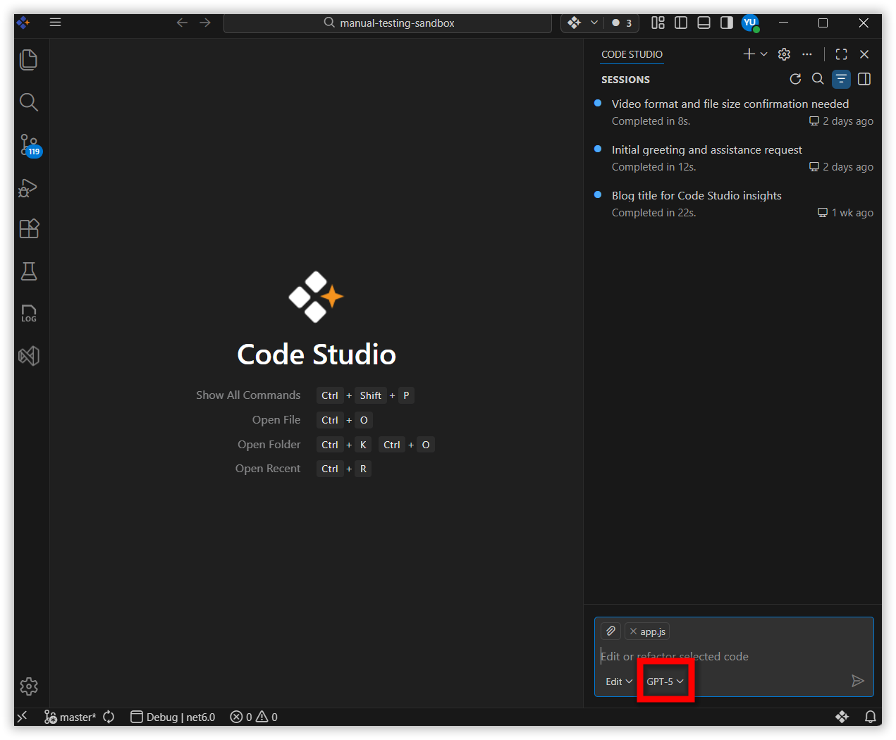

# Configuring Default Models

## Overview

This guide explains how to configure default models using API keys (BYOK – Bring Your Own Key) from your chosen provider into Code Studio Enterprise. You'll learn how to set default models for different modes to streamline your workflow.

## When to Use Default Models

Setting a default model ensures that your preferred model appears as the pre-selected option in the model dropdown whenever Code Studio IDE opens or reopens. While you can switch to another model during a session, the default model will be automatically restored the next time you start Code Studio.

## Prerequisites

Before starting, ensure:

* Syncfusion Code Studio is installed and configured on your system. If you have not yet downloaded Code Studio, refer to the [Syncfusion Code Studio Install and Configure](https://help.syncfusion.com/code-studio/getting-started/install-and-configuration)
* You have a valid API key from the chat model provider you want to use (e.g., [OpenAI](https://platform.openai.com/api-keys), [Anthropic](https://console.anthropic.com/dashboard), [OpenRouter](https://openrouter.ai/settings/keys)).

## Steps for Configure Default Models

### Step 1: Open Code Studio Enterprise Server dashboard

* Open [Code Studio Enterprise Server](https://app.sfcodestudio.com/dashboard)

### Step 2: Set Default Models

* Go to the [Models](https://app.sfcodestudio.com/models) section and click Manage Default Settings.

 >**Note**: If you have not configured your model, please refer to [Configure LLM Providers and Models in Syncfusion Code Studio]( https://help.syncfusion.com/code-studio/enterprise-server/providersandmodels ) for guidance on adding models.
    
    

* After selecting Manage Default settings, a popup appears with options to configure the default models for Chat and Autocomplete.

    

* Choose a default model for each mode:
  * Chat Mode

    

  * Autocomplete Mode
   

* Click Update to save your default model preferences.

    

* You have successfully configured your default models! Your selected models will now appear automatically when you launch Code Studio IDE. 
    
    

* You can change these defaults at any time by repeating Step 2.
