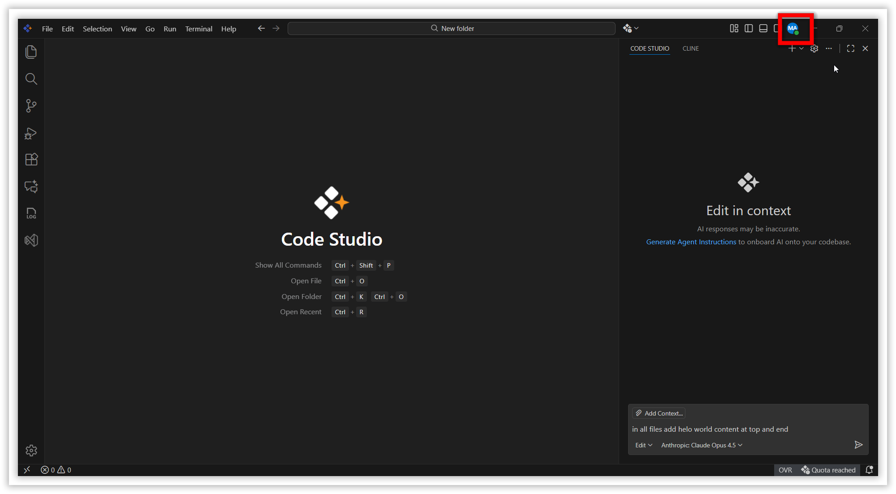
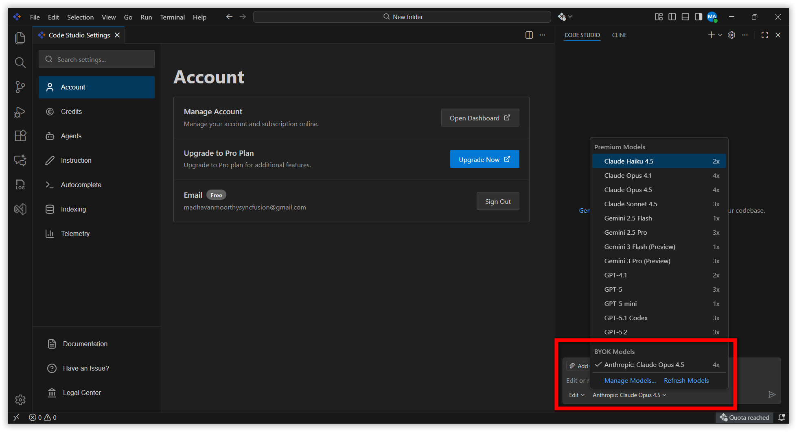

# Add BYOK Model

## Overview

This guide provides step-by-step instructions for administrators to configure Large Language Model (LLM) providers within Code Studio using the **Bring Your Own Key (BYOK)** feature.

> **Note:** Only administrators can configure LLM providers.

## When to Use

Use this guide when you need to:

- Connect new LLM providers (e.g., OpenAI, Anthropic,Openrouter) to Code Studio.
- Add custom models from your preferred AI providers for your organization.
- Manage API keys for enterprise-level AI integrations.

## Prerequisites

Before you begin, ensure you have the following:

- An active administrator account on Code Studio.
- A valid API key from your LLM provider (e.g., OpenAI, Anthropic).
- *(Optional)* An OpenRouter API key for accessing multiple models through a single integration. Follow the detailed instructions [here](/code-studio/enterprise-server/freemodel) to obtain an OpenRouter API key and view the list of recommended free models.

## Steps

### Step 1: Open the Dashboard

1. Open **Code Studio** in your machine.

2. Click the **Account** tab in the left top of application.
   

3. Click **Open Dashboard** to access the  dashboard.

   

---

### Step 2: Add an LLM Provider

Follow these steps to add a new LLM provider to Code Studio:

1. Navigate to the **LLM Keys** page under the **BYOK** section in the admin dashboard.

   

2. Click the **Add LLM Key** button.

   

3. In the dialog box, enter the following details:

   | Field | Description |
   |-------|-------------|
   | **Provider Name** | Enter the name of the LLM provider (e.g., OpenAI, Anthropic,  Openrouter). |
   | **API Key** | Paste the API key provided by your LLM service. |

4. Click **Add** to save the provider configuration.

   

5. Once added successfully, the provider becomes available for model selection.

---

### Step 3: Add a Model

After configuring your LLM provider, follow these steps to add a model:

1. Navigate to the **Models** page under the **BYOK** section.

   

2. *(Optional)* Use the search bar to find a specific model by name.

3. Click the **Add Model** button.

   

4. In the form, configure the following options:

   | Field | Description |
   |-------|-------------|
   | **Provider** | Select from the list of configured LLM providers. |
   | **Model** | Choose a model from the dropdown list. Each model displays its input and output token costs. |
   | **Modes** | Select the usage modes: **Chat**, **Autocomplete**, or both. This is a multi-select field. |

5. Click **Add** to include the model in your BYOK model list.

---

### Step 4: Verify the Model in Code Studio IDE

After adding the model, verify that it appears in the Code Studio IDE:

1. Open the **Code Studio IDE**.

2. Click the **model selection dropdown** in the chat or editor panel.

3. Scroll to the **BYOK Models** section to find your newly added model.

   

4. If the model is not listed, click **Refresh Models** to sync the latest configurations.

> **Tip:** After refreshing, your BYOK model should appear and be ready for use in Chat based on your configuration.

---

## Related links

- Learn how to [configure default models](/code-studio/how-to-guides/Configure-default-model) for your team.
- Explore [provider and model management](/code-studio/enterprise-server/providersandmodels) for advanced configurations.
- [Free Models with OpenRouter](/code-studio/enterprise-server/freemodel)
- [User and Team Management](/code-studio/enterprise-server/userandteams)
