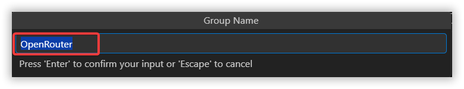
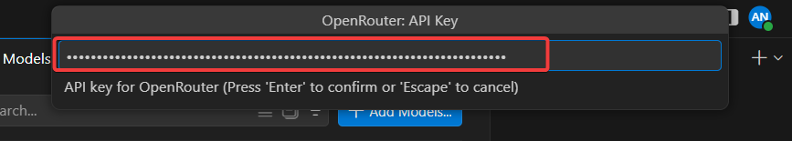
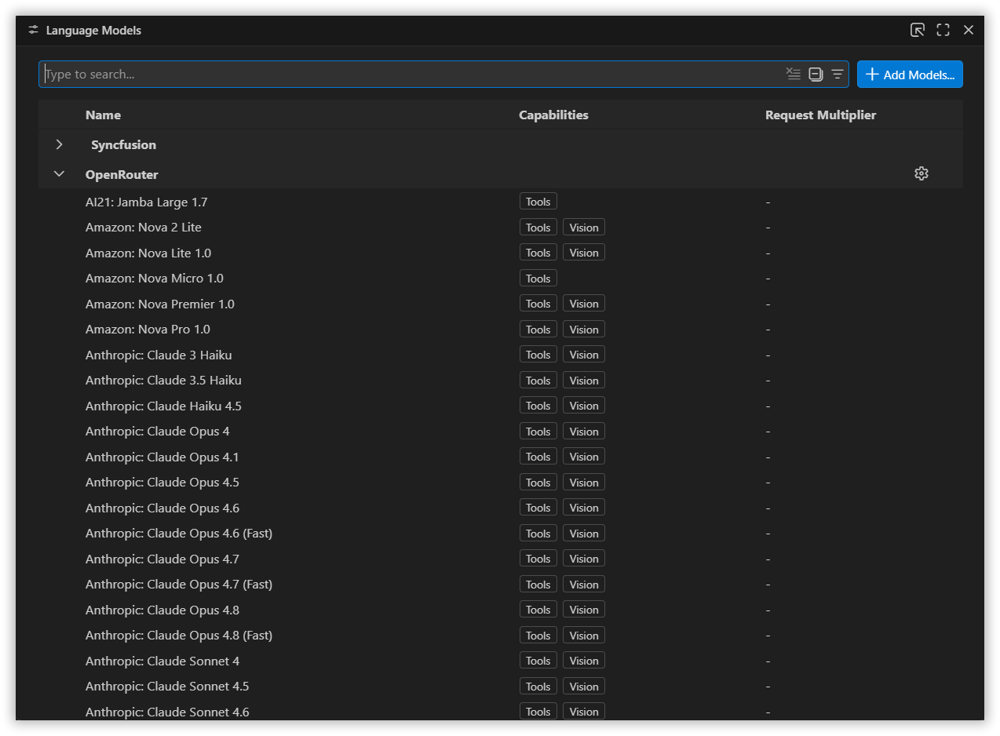
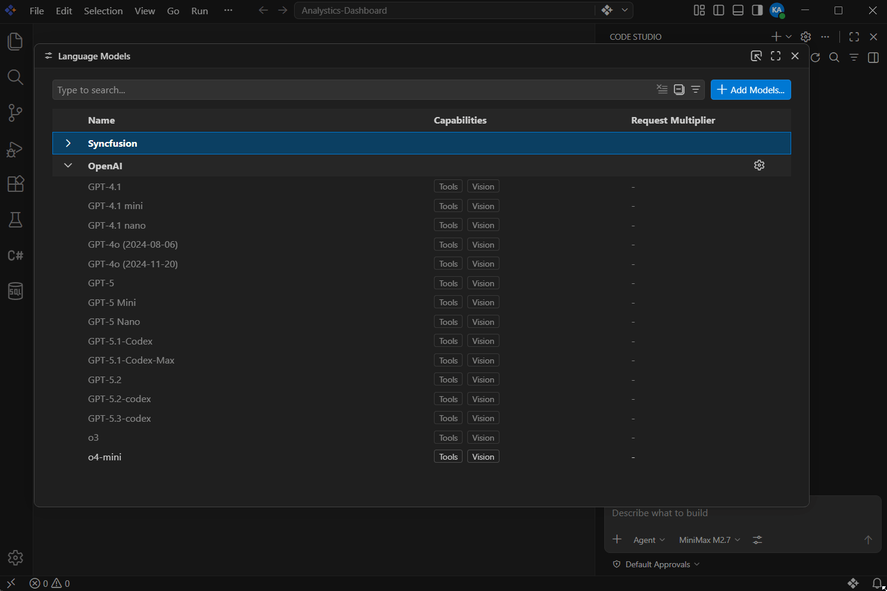
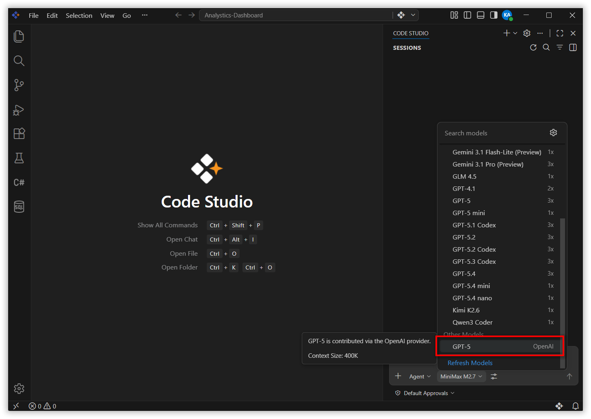
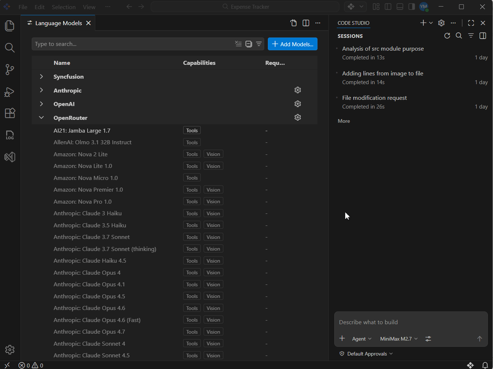
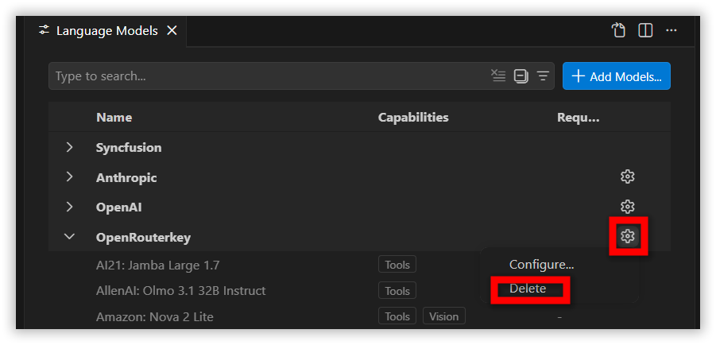

# How to Add Personal API Key Models in the IDE

## Overview

Code Studio allows you to integrate AI models from various providers directly in the IDE chat view using your own personal API keys. This feature gives you access to specific models that may not be available in your organization's configuration. You can add, manage, and use these models alongside your organization's models for enhanced flexibility and experimentation.

> **Note:** This feature is available in the IDE chat view only. It is not available in the Code Studio Enterprise Server dashboard.

## When to Use

Use Personal API Key Models models when you need to:

- Experiment with specific models for personal projects
- Access models when they are not available in your organization’s configuration
- Compare different providers and model capabilities
- Match models to unique coding or cost requirements

## Prerequisites

- Valid API keys from your chosen provider (e.g., OpenAI, Anthropic)
- Active provider account with sufficient credits or quota

## How To Add a Personal API Key Models Model?

1. Click the model’s section dropdown and select `Manage Models`.

   

2. A Language Models page will open. This page provides information about the configured Providers and their models in CodeStudio.

   

3. Click the **Add Models** button. Choose your preferred provider from the list (for example: OpenAI, Anthropic).

   

4. Enter the Group Name. The group name is used to organize and display a set of models under a specific provider, based on the associated API key.

   

5. Enter your API Key for the selected provider.

   

   > **Note:** Ensure the API key is valid and correct.

6. After adding the API key, the available models will be listed. 

   

7. To add models to the Chat Model Picker:

   1. Hover over the model name on the left side.
   2. An eye icon will appear.
   3. Toggle the eye icon to add or remove the model from the Chat Model Picker.

      

8. The added models will appear under `Other Models`. You can use them in the same way as any built-in or organization-configured model.

   

## How to edit the Group Name and API Key for a configured provider?

1. Click the Settings icon.
2. Select Configure. A UI will appear where you can edit the Group Name and API Key.

   

## How to Remove a Provider?

1. Click the Settings icon.
2. Select the Delete option. A confirmation popup will appear — click Yes to complete the removal.

   

## Tips

- Use separate API keys for personal and organizational work
- Prefer lightweight models for small tasks to manage costs
- Keep API keys secure and never commit them to repositories
- Test models on small tasks first to understand behavior
- Remove unused models to keep the workspace organized
