# Set Budget Alerts

## Overview

Administrators can set up alerts for a team or a specific user to get notified when budget usage exceeds a defined threshold. Team alerts are emailed to the recipient you choose; individual user alerts are emailed to that user’s email address.

## When to use

Use budget alerts when you want an email notification as soon as spending crosses a defined threshold.

- **Team budgets:** Use this when a team shares a budget and you want alerts to go to a chosen recipient who can take further action.
- **Individual user budgets:** Use this when you want the individual user to be notified about their own budget usage so they can adjust their usage, ask queries efficiently and appropriately, and avoid unnecessary credit usage.

## Prerequisites

- **Code Studio account:** You must have a Code Studio account. If you don’t have one, sign up using the [Getting Started](/code-studio/getting-started/install-and-configuration) guide.
- **Admin access:** Only administrators can create, edit, and assign budgets.
- **Team/user available:** Ensure the team or individual user is part of the organization, so you can assign the budget and set the alert.
- **Budget configured:** Refer to the [Create Budget](/code-studio/enterprise-server/createbudget) guide to create and assign a budget for the team or the individual user before setting an alert.

## Steps to Configure Budget Alerts for Teams and Individual Users

### Steps to Configure Budget Alerts for Teams:

Step 1: Go to the **Budget tab** in CodeStudio dashboard. Team budgets are displayed on a table, with a **three-dot (More options)** menu on the right side of each row.

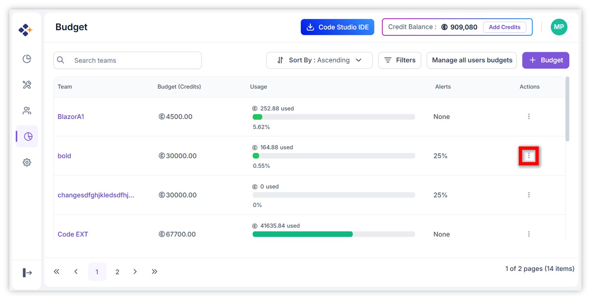

Step 2: Click the **three-dot (More options)** icon. The following options are displayed: **Edit Budget, Set Alert, and Delete**.

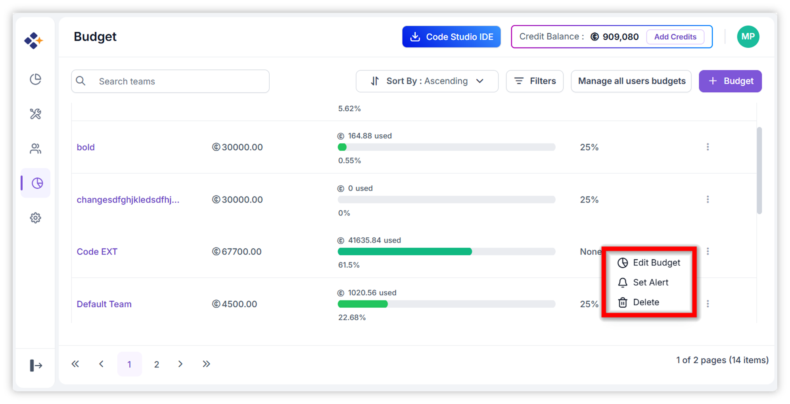

Step 3: Click **Set Alert**.

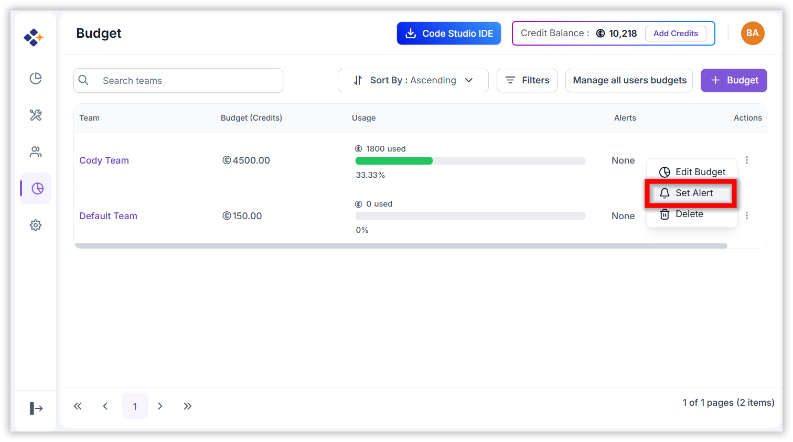

Step 4:
The **Set Alert** dialog box opens. You can configure alerts to be triggered when budget usage reaches **25%, 50%, 75%,** or **100%** of the budget limit you created.

Now, let’s create a budget alert for the **Frontend team** that triggers when **50%** of the team’s budget limit is reached. Follow the steps below.

1. Turn the toggle **On**. Two input fields are displayed; enter the required values in both fields.

   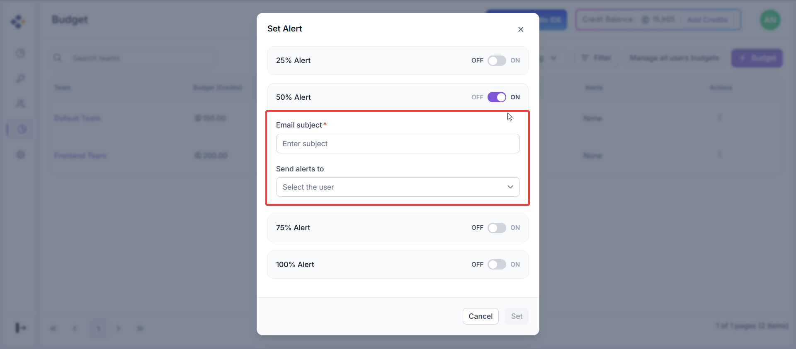

   - **Email subject:** Enter the email subject line that will appear in the alert email.
   - **Send alerts to:** Select the users in the team who should receive the alert email.

   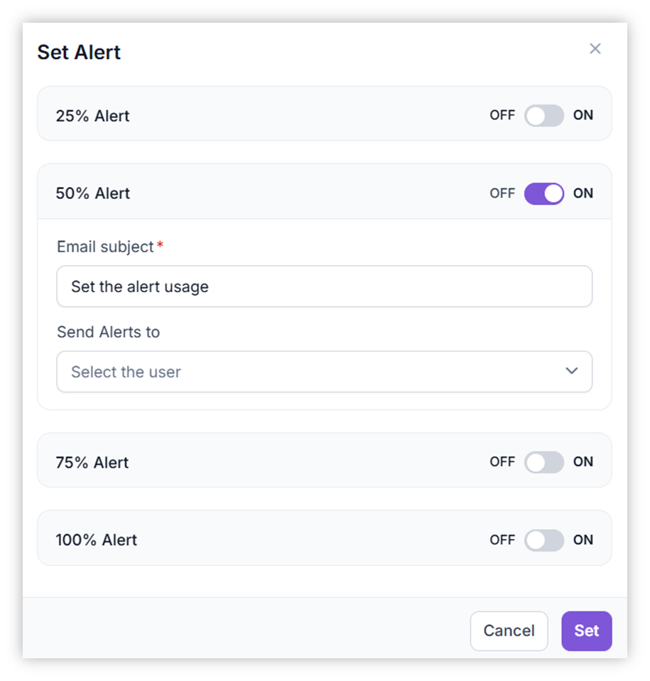 

2. Click **Set**.

### How to Verify and Manage Budget Alerts?

To verify that a budget alert is created and to modify an existing alert, follow these steps,

- In the **Budget** tab, hover over the team name. A **navigate** icon appears—click it to open the team’s **Budget** details window.

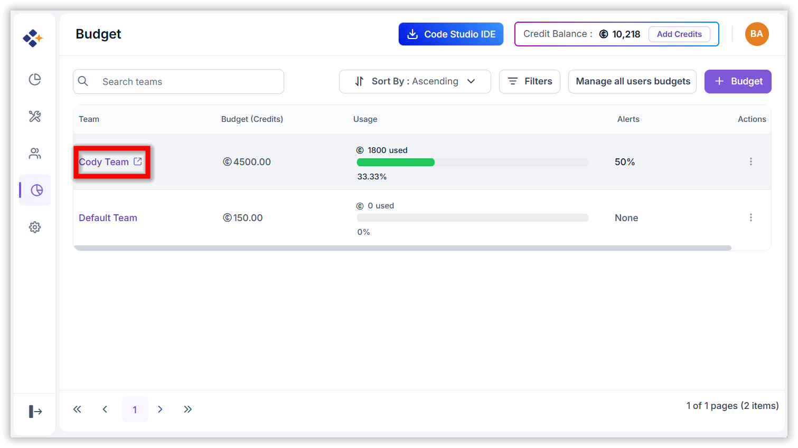

- In the team’s Budget window, view the configured **Usage Alerts**. When you hover over an alert percentage, the UI displays the user(s) who will receive the alert email.

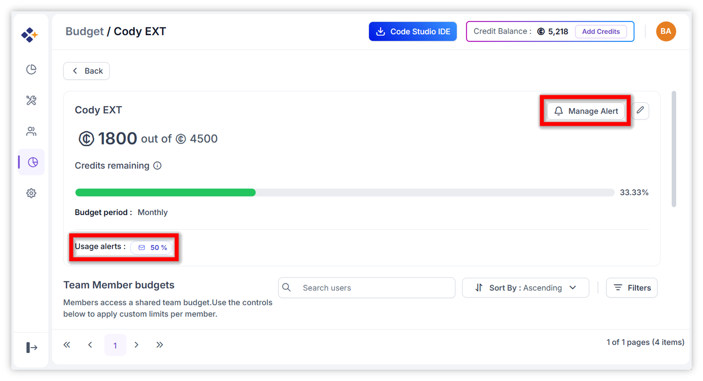

- To modify an alert, click **Manage Alert**, update the alert details (for example, add another recipient), and then click **Update** to save the changes.

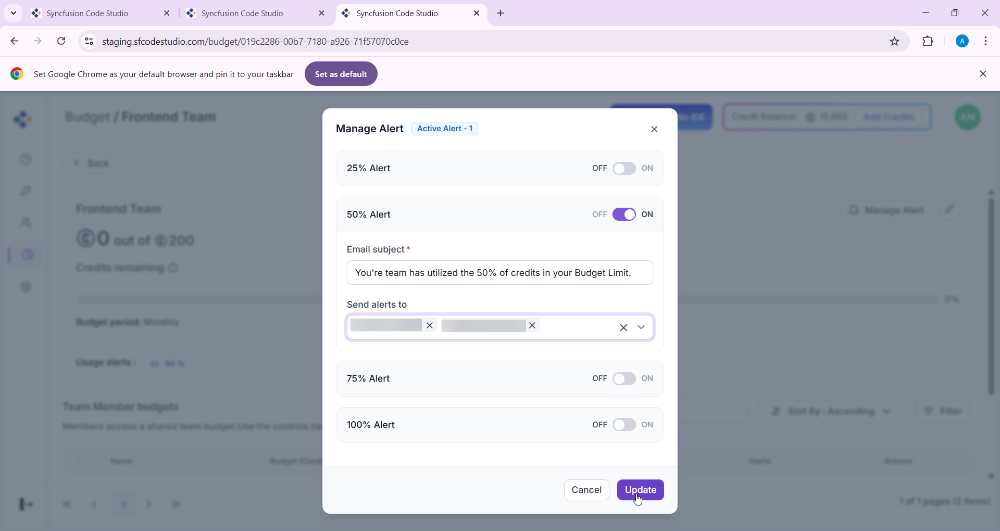

### Steps to Configure Budget Alert for Individual Users in a team:

Step 1: In the **Budget** tab, hover over the team name. A **navigate** icon appears—click it to open the team’s **Budget** details window.

Step 2: The **Team Member Budgets** section lists the team members and the budgets assigned to each member.

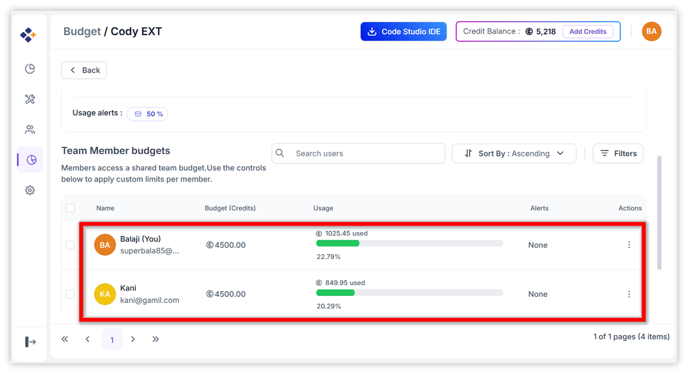

Step 3: Follow the same steps as setting a team budget alert (Steps 1–2). Enter the **Email subject**; the **Send alerts to** field is automatically prefilled with the individual user’s email.

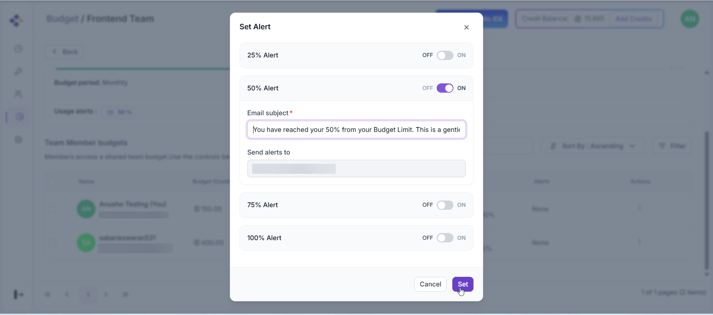

Step 4: After you click **Set**, the budget alert is created.

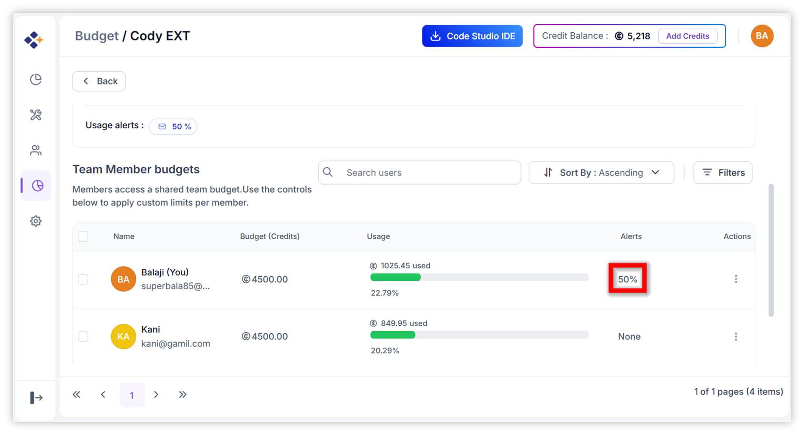

### How to Manage Budget Alerts for Individual Users?

1.	Click the three-dot (More options) menu on the right side of the user’s row in **Team Member Budgets** section.

   

2.	Click the three-dot (More options) icon. The following options are displayed: **Edit Budget** and **Manage Alert**.

   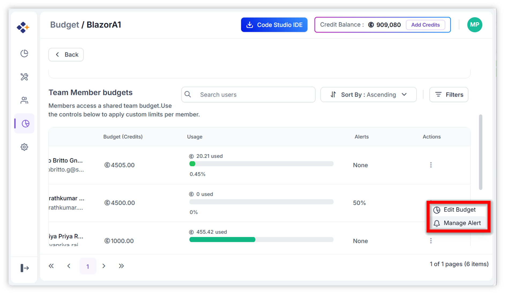

3.	Click **Manage Alert**. Update the alert settings (for example, turn **50% Off** and turn **75% On**), enter the required values in the input fields, and then click **Update** to save the changes.

   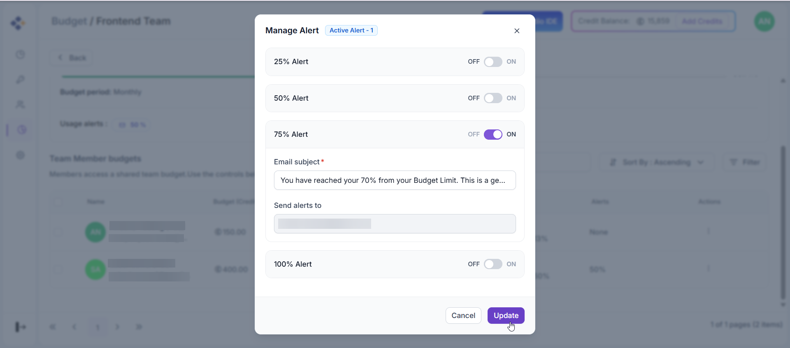

### Finally, you will receive the alert email as shown in the images below,

**Team Budget Alert Email:**

**Individual User Budget Alert Email:**

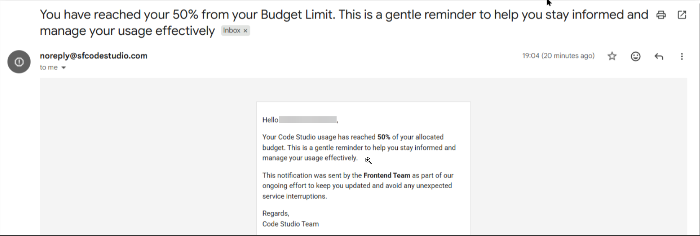

