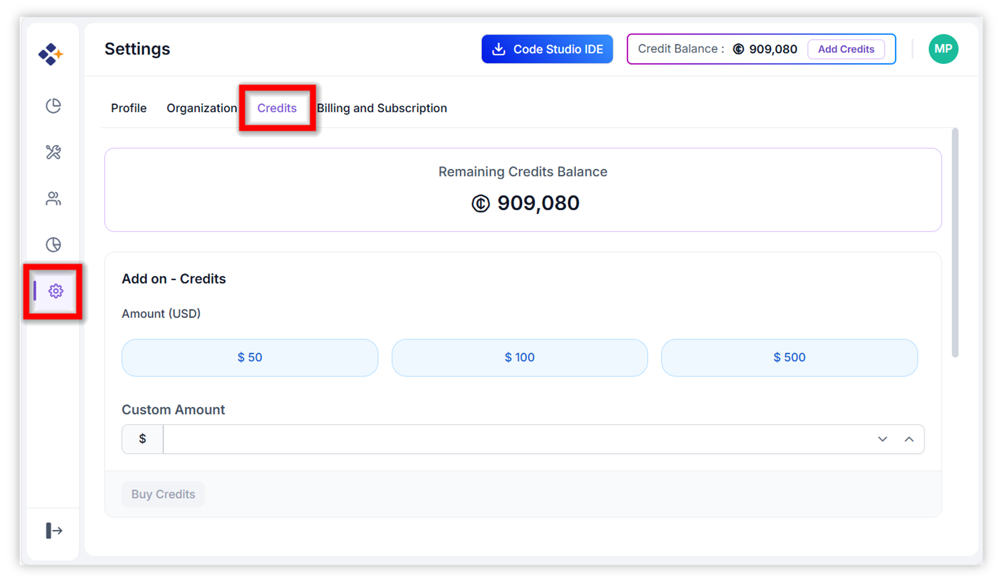
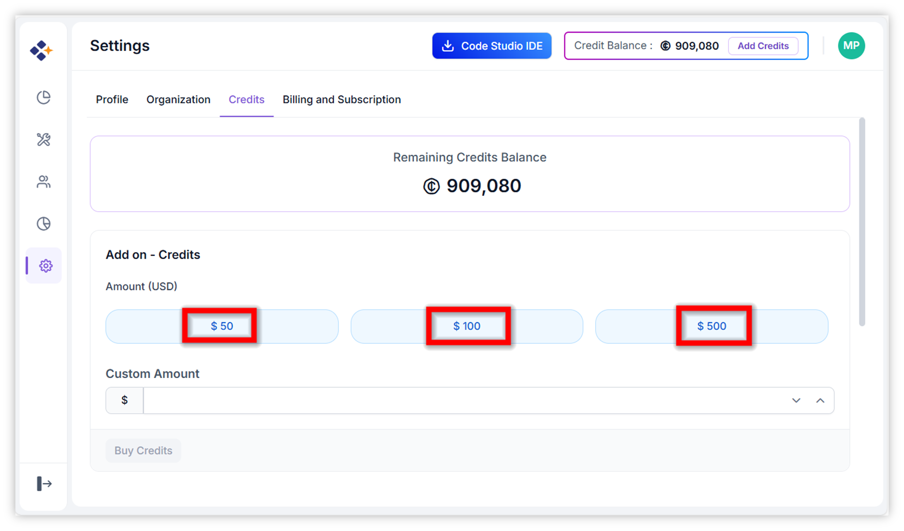
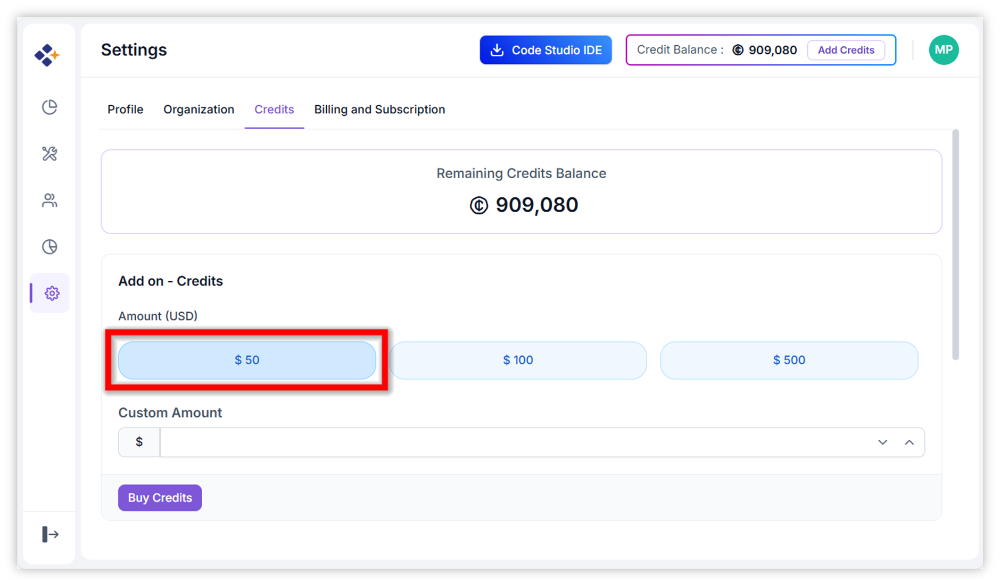
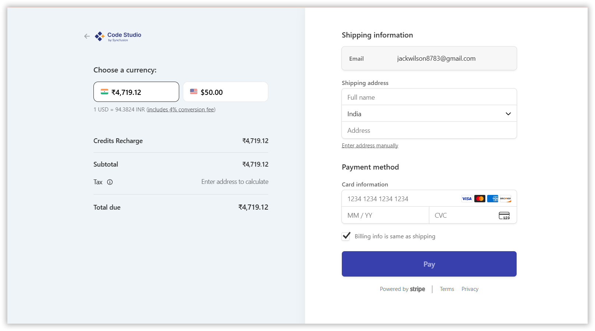
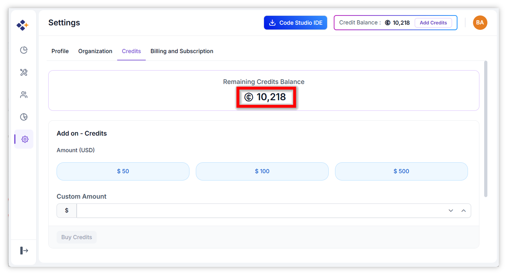

# Buy More Credits in Code Studio

## Overview

Credits in Syncfusion Code Studio Enterprise are add-on units that fund AI model usage across your organization. They provide flexibility beyond the standard [subscription plans](/code-studio/enterprise-server/settings), allowing you to scale your AI-powered coding operations as needed. Once purchased, credits are immediately applied to your account after successful payment, and your current balance is visible at the top of the [dashboard](https://app.sfcodestudio.com/dashboard).

## When to Use

Purchase additional credits when:

- Your organization’s monthly AI usage has exceeded the credits included in your current subscription plan
- You want to avoid any interruption in AI model access during peak development periods
- Your current credit balance is running low and you want to top it up quickly

## Prerequisites

- You must have administrative access to the Settings area in Code Studio Enterprise, this access typically available to organization admins.
- Ensure you have a valid payment method.

## Steps to Buy Credits

1. **Navigate to the Credits Tab:** From the Code Studio dashboard, click on "Settings" in the left sidebar, then select the "Credits" tab.

2. **Choose Purchase Amount:** Select a preset amount ($50, $100, or $500) or enter a custom dollar value in the provided field.

3. **Initiate Purchase:** Click the "Buy credits" button to be redirected to the secure payment page.

4. **Complete Checkout:** Enter or confirm your payment details and finalize the transaction.

5. **Verify Application:** After successful payment, the new credits will be automatically added to your organization's balance. Refresh the page if needed to see the updated total.

