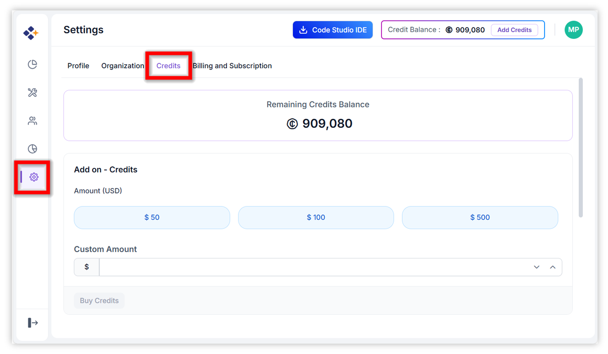
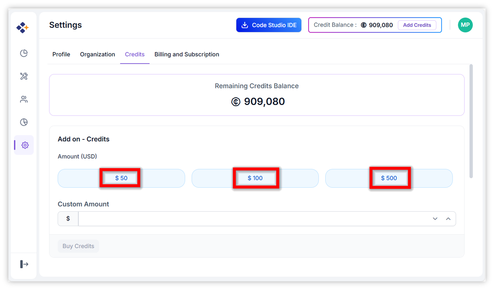
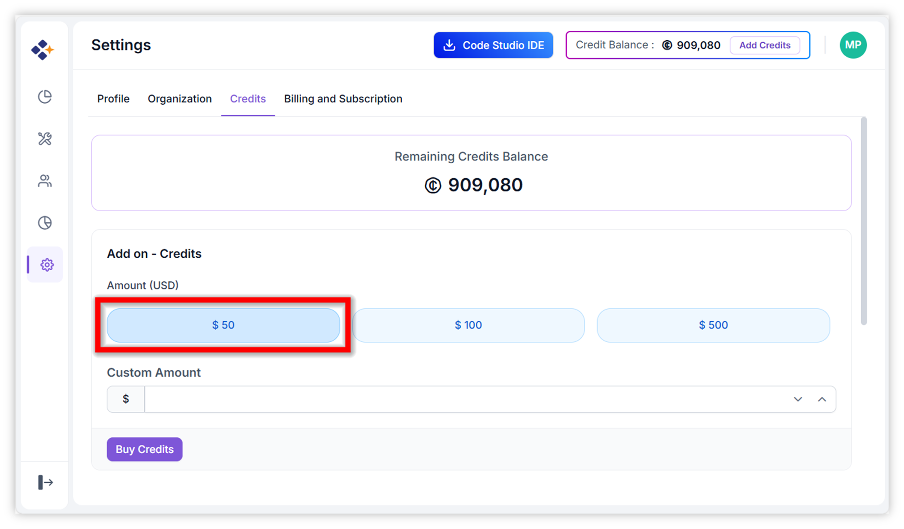
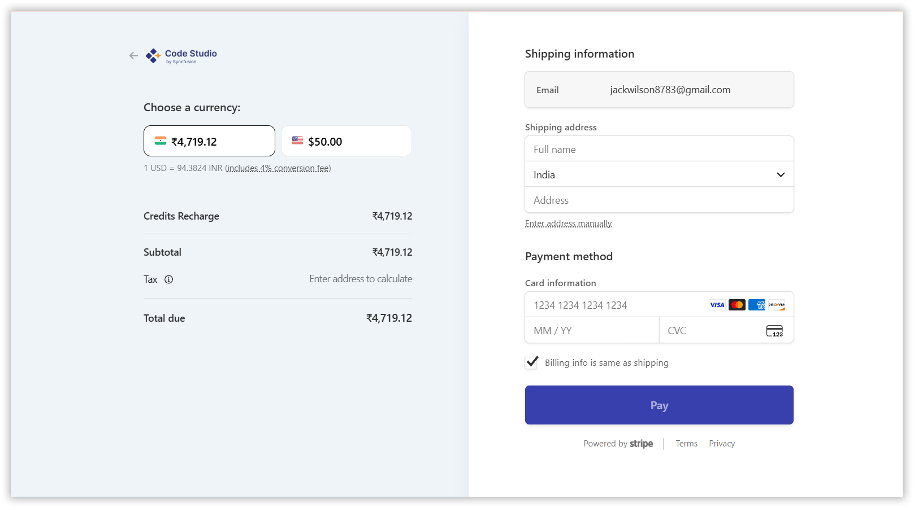
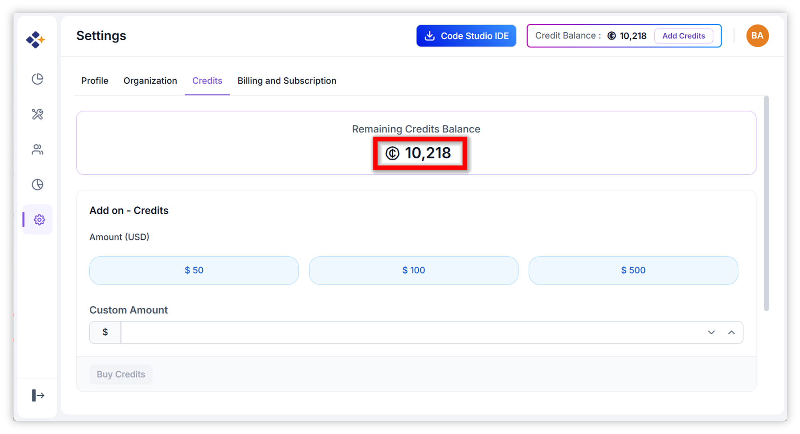

# Buy More Credits in Code Studio

## Overview

Credits in Syncfusion Code Studio Enterprise are add-on units that fund AI model usage across your organization. They provide flexibility beyond the standard [subscription plans](/code-studio/enterprise-server/settings#4-billing--subscription), allowing you to scale your AI-powered coding operations as needed. Once purchased, credits are immediately applied to your account after successful payment, and your current balance is visible at the top of the [dashboard](https://app.sfcodestudio.com/dashboard).

## When to Use

Purchase additional credits when:

- Your organization’s monthly AI usage has exceeded the credits included in your current subscription plan
- You want to avoid any interruption in AI model access during peak development periods
- Your current credit balance is running low and you want to top it up quickly

## Prerequisites

- **Code Studio account:** You must have a Code Studio account. If you don’t have one, sign up using the [Getting Started](/code-studio/getting-started/install-and-configuration) guide.
- **Admin access:** Only administrators are authorized to buy credits.
- **Valid payment method:** Ensure a valid payment method is available in your account.

## Steps to Buy Credits

1. **Navigate to the Credits Tab:** From the Code Studio dashboard, click on "Settings" in the left sidebar, then select the "Credits" tab.

    

2. **Choose Purchase Amount:** Select a preset amount ($50, $100, or $500) or enter a custom dollar value in the provided field.

    

3. **Initiate Purchase:** Click the "Buy credits" button to be redirected to the secure payment page.

    

4. **Complete Checkout:** Enter or confirm your payment details and finalize the transaction.

    

5. **Verify Application:** After successful payment, the new credits will be automatically added to your organization's balance. Refresh the page if needed to see the updated total.

    