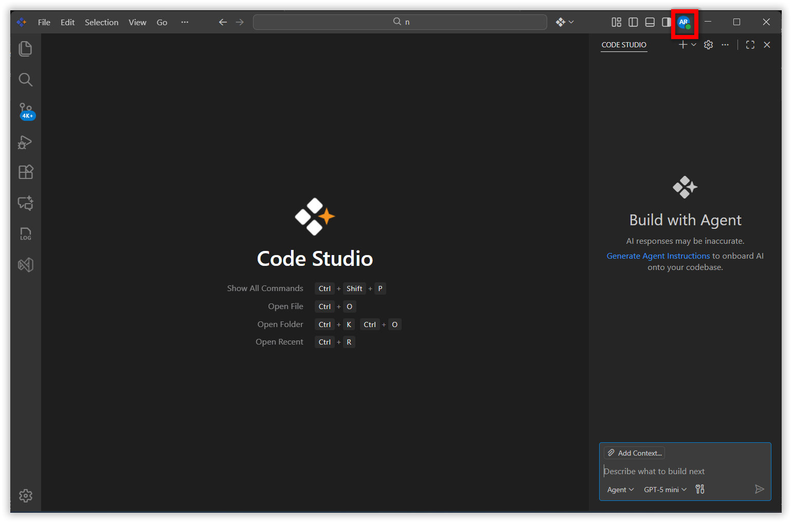
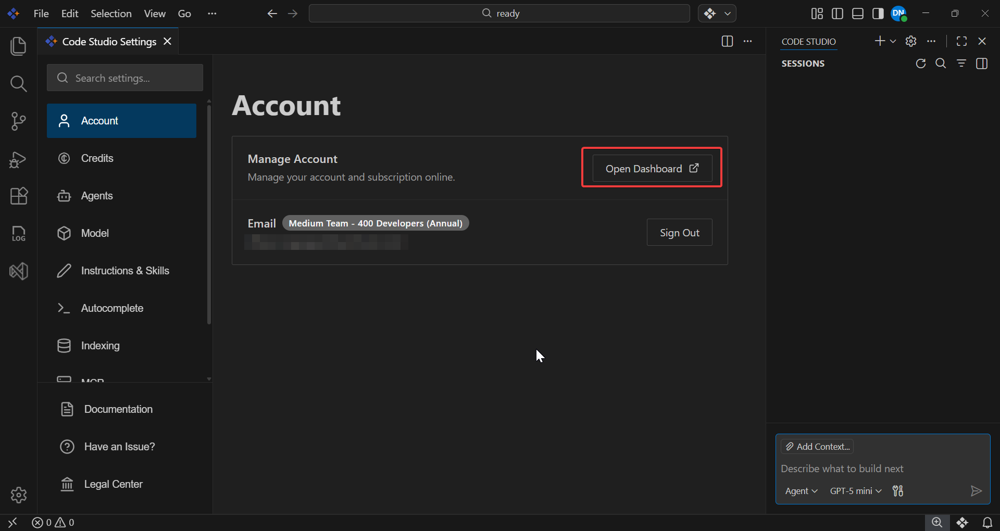
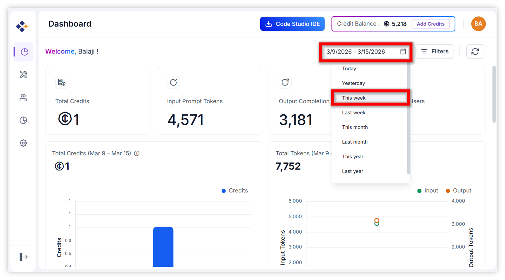
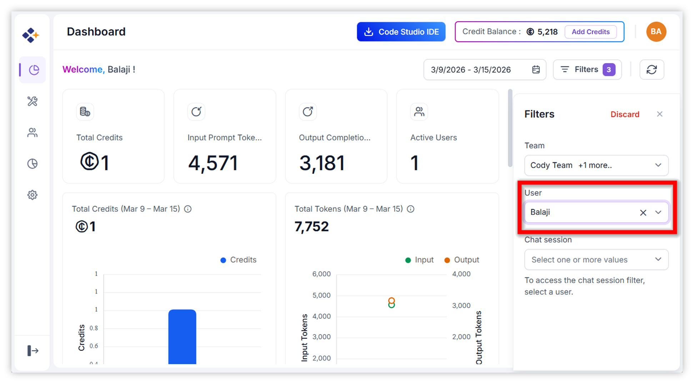
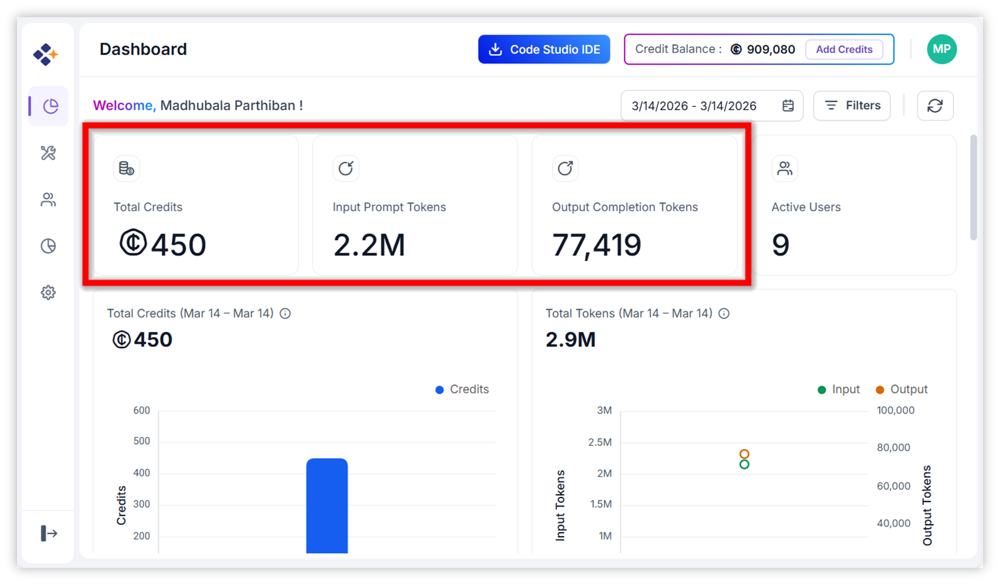
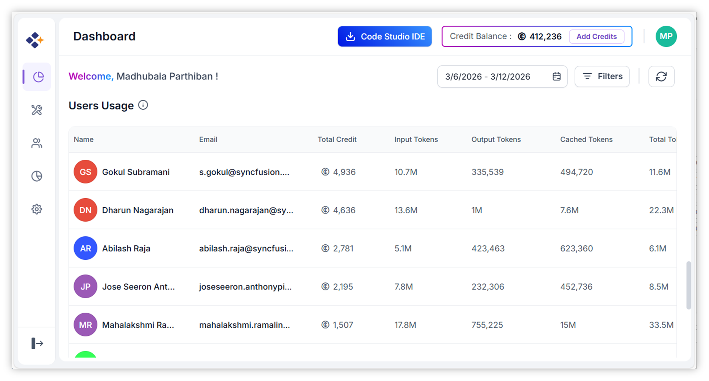
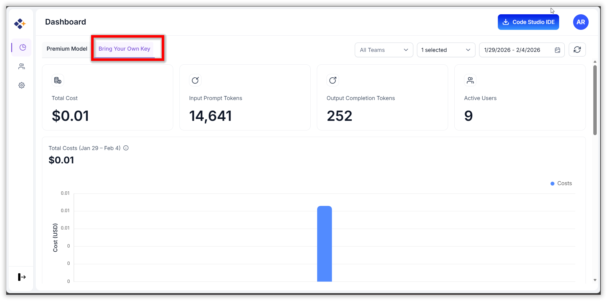

# Daily Cost Usage

## Overview
Daily cost and token tracking helps you understand how much AI you use and how much it costs.
It shows you:
- How many tokens you used today in total.
- How much that usage costs.
- Whether your usage is normal or unusual.
- How to control or reduce costs.

This helps you save money, improve prompts, and stay within budget limits.

## When to Use
Use this tracking process when:
- You need to monitor AI usage costs on a daily basis.
- You're deploying LLM-based applications that may generate unpredictable or dynamic usage.
- You want to optimize prompt efficiency or identify expensive operations.

## Prerequisites
Before tracking daily cost and token usage for activity performed in Code Studio, ensure the following:
- You are logged in to Code Studio.
- You can navigate to the Dashboard from Code Studio.
- You can view the Usage, Cost, and Tokens sections.

## Steps to Check Daily Cost and Token Usage
Follow these steps to view your daily cost and token usage in Code Studio:

Step 1: **Open Code Studio**
- Launch Code Studio from your workspace or project environment.
- Ensure you are logged in with the correct user credentials.

Step 2: **Open Account Settings**
- In the top-right corner of Code Studio, click your **avatar**.
    

- This opens the Account tab within the Settings page.

Step 3: Navigate to the **Dashboard**
- In the Account section, click **Dashboard**.

- You are redirected to the web dashboard where cost and usage information is displayed.

Step 4: Select **Today’s Date**
- In the dashboard, locate the date filter at the top of the page.
- Click the date field and select **Today**.

Step 5: Select your name in the **User** field.

- The dashboard refreshes to show today’s cost usage.

Step 6: View **Daily Cost Usage**
- After setting the date to **Today**, you see the total cost incurred today.
- This section represents your daily cost usage.

Step 7: Scroll down to view **Token Usage**
- Scroll down the dashboard page.
- Below the cost summary, you will find the Token Usage section.

Here is what you can track:
    - Token usage across different models you used today (hover over a model name).
    - Input vs. output token breakdown.
    - Total tokens consumed.
    - Model-specific token consumption trends.

To calculate **BYOK** model costs and token usage, select the BYOK option at the top of the dashboard (as shown below) and repeat steps 4–7.
